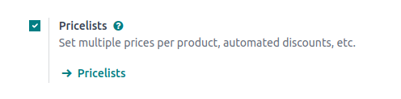
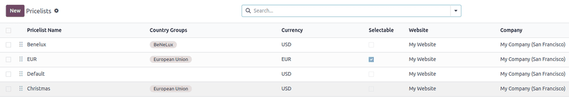
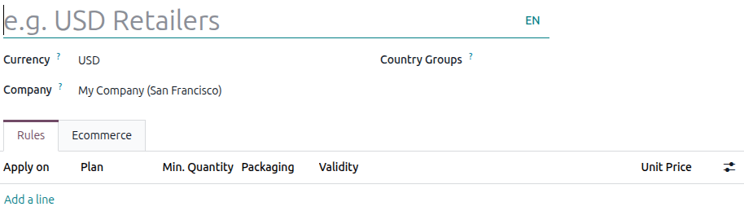
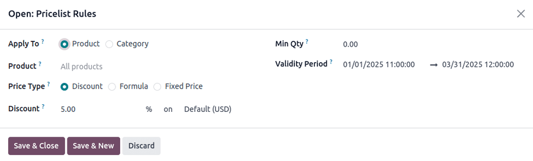
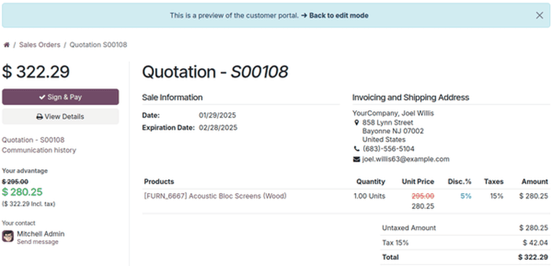
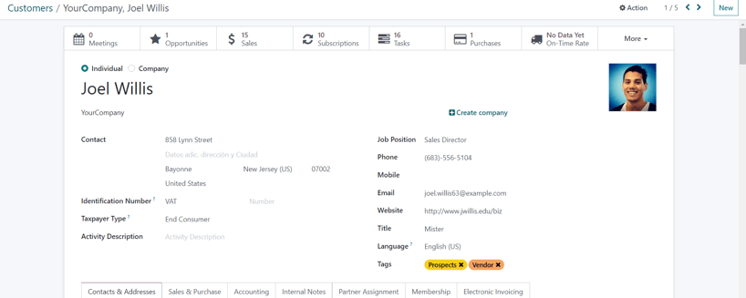
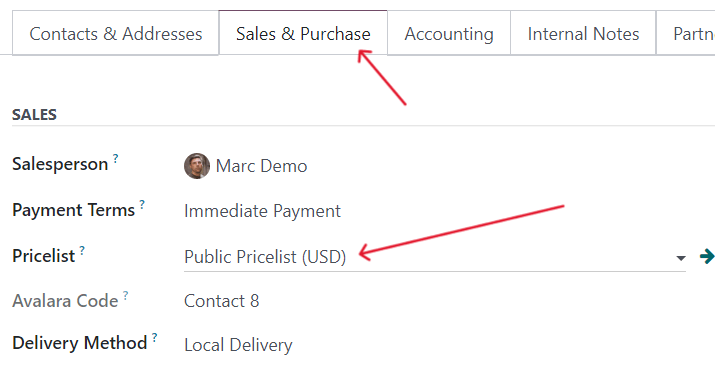

==========
Pricelists
==========

A *pricelist* is a method of dynamic pricing that applies a list of prices (or price rules) that
overrides the sales price on a product's product form. This adjustment can set to apply to all
products sold or tailored to only apply to specific customers, customer groups, sales orders, time
periods, etc., and is useful for creating pricing strategies and optimizing sales margins.

Odoo **Sales** has a useful pricelist feature that can be tailored to fit any unique pricing
strategy. Pricelists suggest certain prices, but they can always be overridden on the sales order.

.. seealso::
   - :doc:`/applications/sales/sales/products_prices/prices/currencies`
   - :doc:`/applications/websites/ecommerce/configuration/prices`
   - :doc:`../../../subscriptions`

.. _sales/products/pricelist-configuration:

Configuration
=============

To enable pricelists in the Odoo **Sales** app, first navigate to :menuselection:`Sales app -->
Configuration --> Settings`. In the *Pricing* section, enable the checkbox next to the
:guilabel:`Pricelists` feature, and click :guilabel:`Save` to save all changes.

Access the *Pricelists* page by either clicking the :icon:`oi-arrow-right` :guilabel:`Pricelists`
link (beneath the :guilabel:`Pricelists` feature on the *Settings* page), or navigating to
:menuselection:`Sales app --> Products --> Pricelists`.

Either option reveals the *Pricelists* page, in which pricelists can be created and modified at any
time.

.. important::
   If there is no specific pricelist configured on a sales quotation, the :guilabel:`Default`
   pricelist is applied. The :guilabel:`Default` pricelist is the first pricelist found in
   :menuselection:`Sales app --> Products --> Pricelists` without an assigned :guilabel:`Country
   Group`. Odoo reads the :guilabel:`Pricelist Name` column from top to bottom to determine the
   :guilabel:`Default` pricelist.

.. note::
   The :guilabel:`Selectable` column is only applicable to Odoo **eCommerce**. This option allows
   website visitors to choose a pricelist when shopping in the **eCommerce** website.

.. _sales/products/create-edit-pricelists:

Creating and editing pricelists
-------------------------------

From the *Pricelists* page, either select the pricelist to edit or click :guilabel:`New` to create
a new pricelist, which reveals a blank pricelist form that can be configured to suit the business's needs.

When creating a new pricelist, start by adding a name for the pricelist in the blank field at the
top of the form. Next, select which :guilabel:`Currency` should be used.

If working in a multi-company environment, select which company this pricelist should apply to in
the :guilabel:`Company` field. If this field is left blank, the pricelist is automatically applied
to all companies in the database.

If working in a multinational company, select the countries where this pricelist applies to under
the :guilabel:`Country Groups` field.

.. _sales/products/price-rules:

Adding price rules
------------------

In the *Rules* tab, each line creates specific pricing rules. When the pricelist is used on a sales order, Odoo applies those rules to calculate the prices.This can be used to create complex pricing
structures, such as progressive discounts when greater quantities of a product are purchased.

To create a new price rule, click :guilabel:`Add a line`, which opens a *Create Pricelist
Rules* pop-up form.

In the :guilabel:`Apply To` field, select whether the price rule applies to a specific :guilabel:`Product` or a product
:guilabel:`Category`. Depending on the selection, the next field is either :guilabel:`Product` or
:guilabel:`Category`. Specify the product or category the pricelist applies to, or leave the field blank to apply to all products or categories.
selection, :guilabel:`All products` or :guilabel:`All categories` respectively.

For :guilabel:`Price Type`, select how the prices are adjusted, either applying a :ref:`Discount <sales/pricing/discount>`, using a specific :ref:`Formula <sales/pricing/formula>`, or  applying a  :ref:`Fixed
Price <sales/pricing/fixed-price>`. 

.. important::
   If a price rule is set for a particular product, and another one for its product category, Odoo
   prioritizes the *product* rule and applies it.

If the price rule is part of a subscription, in the :guilabel:`Recurring Plan` field drop-down menu
select a recurrence period. The default selections are :guilabel:`Monthly`,:guilabel:`6 Months`, or :guilabel:`Weekly`. New recurrence periods can also
be created from this field by clicking :guilabel:`Search more` and clicking :guilabel:`Create New`.

Refer to the Odoo :doc:`/applications/sales/subscriptions` documentation for more information.

If the discount is only applied when a specific number of a product is ordered, enter the amount in the :guilabel:`Min Qty` field.

The packaging field appers next to the :guilabel:`Min Qty` field, but is not labeled. This field
defaults to the assigned :abbr:`UoM (Unit of Measure)` configured on the selected product. This
field only displays when the price rule is configured for *Products*.

If the discount is only valid on specific dates, such as a limited time sale, enter the start and end date in the
:guilabel:`Validity Period` field during which this pricelist can be applied to quotations.

Once all configurations are complete, either click :guilabel:`Save & Close` to save the pricelist
rule, or click :guilabel:`Save & New` to immediately create another pricelist rule on a fresh form.

.. _sales/pricing/price-types:

Configuring price types
-----------------------

The *Create Pricelist Rules* pop-up form offers three different price types to offer discounts or
price increases.

- :ref:`Discount <sales/pricing/discount>`
- :ref:`Formula <sales/pricing/formula>`
- :ref:`Fixed Price <sales/pricing/fixed-price>`

.. _sales/pricing/discount:

Configuring a discount
~~~~~~~~~~~~~~~~~~~~~~

.. important::
   If a pricelist is applied to a sales quotation with the :guilabel:`Price Type` set as
   :guilabel:`Discount`, the discount is visible to the customer.

To figure a discount using percentage as the computation, select :guilabel:`Discount` for
:guilabel:`Price Type` and enter the percentage to be discounted. A mark-up can be configured by
using a negative value in this field.

Next select the base price Odoo uses to calculate with the discount percentage. The default is
:guilabel:`sales price` which refers to the *Sales price* field on the product form. Other
pricelists can be selected for the base price from the drop-down menu. New pricelists can also be
created from this menu by clicking :guilabel:`Search more` and clicking :guilabel:`Create New`.

.. _sales/pricing/formula:

Configuring a formula
~~~~~~~~~~~~~~~~~~~~~

.. important::
   If a pricelist is applied to a sales quotation with the discount :guilabel:`Price Type` set as
   :guilabel:`Formula`, the discount will *not* be visible to the customer.

The :guilabel:`Formula` option computes the pricelist rules based the following configuration:

- :guilabel:`Based price`: Select either the :guilabel:`Sales price`, :guilabel:`Cost`, or
  :guilabel:`Other Pricelist` to use as the base price for the computation. The :guilabel:`Sales
  Price` and :guilabel:`Cost` are based on the corresponding fields on the product form. The
  :guilabel:`Other Pricelist` uses a pricelist as its base price.
- :guilabel:`Discount`: The applied discount percentage. Negative values can be entered to
  increase prices.
- :guilabel:`Round off to`: Numerical value to act as round-off multiple, to be applied after
  discount. The rounding method sets the price so that it is a multiple of the value in this field. This is applied *after* the discount but *before* the extra fee.

- :guilabel:`Extra Fee`: Fixed amount to be added or subtracted once :guilabel:`Discount` and
  :guilabel:`Round off to` have been applied.

.. tip::
   To have prices that end in 9.99, set the :guilabel:`Rounding Method` to `10` and the
   :guilabel:`Extra Fee` to `-0.01`.

.. example::
   To formulate a 100% markup (or two times the price of the product), with a $5 minimum margin, set
   the :guilabel:`Based price` field to :guilabel:`Sales Price` and the :guilabel:`Discount` to
   `-100`. This is often seen in retail situations.

   .. image:: pricing/formula-markup-cost-example.png
      :alt: How it looks to formulate a markup cost with 5 dollar minimum margin in Odoo Sales.

.. example::
   To apply 20% discounts, with prices rounded up to 9.99, set the :guilabel:`Based on` field to
   :guilabel:`Sales Price`, the :guilabel:`Discount` field to `20`, the :guilabel:`Extra Fee` field
   to `-0.01`, and the :guilabel:`Rounding Method` field to `10`.

   .. image:: pricing/formula-discount-example.png
      :alt: Example of a 20% discount with prices rounded to 9.99 in Odoo Sales.

.. _sales/pricing/fixed-price:

Configuring a fixed price
~~~~~~~~~~~~~~~~~~~~~~~~~

To configure a :guilabel:`Fixed Price`, enter fixed price for this pricelist. When applied, all
product lines in the quotation form updates to this price.

Company settings
~~~~~~~~~~~~~~~~

When in :ref:`Developer Mode <developer-mode/activation>`, the *Create Pricelist Rules* pop-up form
displays a *Company Settings* section. The section has the following configuration options:

- :guilabel:`Currency`: Assign a currency for the individual price rule.
- :guilabel:`Company`: Assign a company for the individual price rule.

Once all configurations are complete, either click :guilabel:`Save & Close` to save the advanced
pricelist rule, or click :guilabel:`Save & New` to immediately create another advanced pricelist
rule on a fresh form.

.. _sales/products/customer-pricelist-application:

Customer specific pricelists
==============================

While the default pricelist applied to any customer is the :guilabel:`Public Pricelist`, Odoo
While the default pricelist applied to any customer is the :guilabel:`Public Pricelist`, Odoo
provides the opportunity to directly apply a different pricelist to customers. This is done on the cusotmer's contact form.

To set a specific pricelist for a customer, open the desired customer's contact form, either by navigating to :menuselection:`Sales
app --> Orders --> Customers` and selecting the customer from the main :guilabel:`Customers` page,
or by clicking on the customer's name on a sales order.

On the desired customer's contact form, under the :guilabel:`Sales & Purchase` tab, in the
:guilabel:`Sales` section, designate what pricelist should be applied to this specific customer from
In the *Sales & Purchase* tab of the desired customer's contact form, designate which pricelist should be applied using the drop-down menu in the :guilabel:`Pricelist` field.

.. note::
   When a customer is added to the database, the default pricelist is automatically applied to them.
   There is **no way** to have a blank *Pricelist* field on a contact form. Even if that field is
   left blank, the default pricelist appears when that contact form is opened again.

   However, when that contact is added to a quotation, and the *Pricelist* field is auto-populated
   (based on the information from their contact form), that predetermined pricelist can be removed
   from the *Pricelist* field, and the quotation can still be confirmed, and subsequently, turned
   into a sales order.
