==========
Pricelists
==========

A *pricelist* is a method of dynamic pricing that applies a list of prices (or price rules) that
overrides the sales price on a product's form. This adjustment can be set to apply to all products
sold or tailored to only apply to specific customers, customer groups, sales orders, time periods,
etc., and is useful for creating pricing strategies and optimizing sales margins.

Odoo **Sales** has a useful pricelist feature that can be tailored to fit any unique pricing
strategy. Pricelists suggest certain prices, but they can always be overridden on the sales order.

.. seealso::
   - :doc:`currencies`
   - :doc:`../../../../websites/ecommerce/configuration/prices`
   - :doc:`../../../subscriptions`

.. _sales/products/pricelist-configuration:

Configuration
=============

To enable pricelists in the Odoo **Sales** app, first navigate to :menuselection:`Sales app -->
Configuration --> Settings`. In the *Pricing* section, enable the checkbox next to the
:guilabel:`Pricelists` feature, and click :guilabel:`Save` to save all changes.

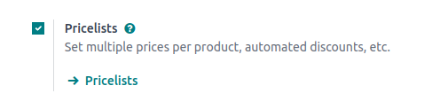

Access the *Pricelists* page by either clicking the :icon:`oi-arrow-right` :guilabel:`Pricelists`
link (beneath the :guilabel:`Pricelists` feature on the *Settings* page), or navigating to
:menuselection:`Sales app --> Products --> Pricelists`.

Either option reveals the *Pricelists* page, in which pricelists can be created and modified at any
time.

.. important::
   If there is no specific pricelist configured on a sales quotation, the :guilabel:`Default`
   pricelist is applied. The :guilabel:`Default` pricelist is the first pricelist found in
   :menuselection:`Sales app --> Products --> Pricelists` without an assigned :guilabel:`Country
   Group`. Odoo reads the :guilabel:`Pricelist Name` column from top to bottom to determine the
   :guilabel:`Default` pricelist.

.. note::
   The :guilabel:`Selectable` column is only applicable to Odoo **eCommerce**. This option allows
   website visitors to choose a pricelist when shopping in the **eCommerce** website.

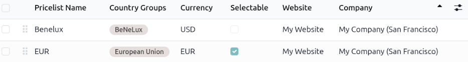

.. _sales/products/create-edit-pricelists:

Creating and editing pricelists
-------------------------------

From the *Pricelists* page, either select the pricelist to edit or click :guilabel:`New` to create a
new pricelist, which reveals a blank pricelist form that can be configured to suit the business's
needs.

When creating a new pricelist, add the name for the pricelist by clicking in the blank field at the
top of the form. Next, select the type of :guilabel:`Currency` the pricelist uses by clicking in the
field to access the drop-down menu and selecting an option.

If working in a multi-company environment, select which company this pricelist should apply to in
the :guilabel:`Company` field. If this field is left blank, the pricelist is automatically applied
to all companies in the database.

If working in a multinational company, select the countries where this pricelist applies under the
:guilabel:`Country Groups` field.

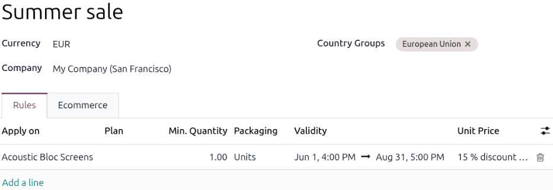

.. _sales/products/price-rules:

Adding price rules
------------------

In the *Rules* tab, each line creates specific pricing rules. When the pricelist is used on a sales
order, Odoo applies those rules to calculate the prices. This can be used to create complex pricing
structures, such as progressive discounts when greater quantities of a product are purchased.

To create a new price rule, click :guilabel:`Add a line`, which opens a *Create Pricelist Rules*
pop-up form.

In the :guilabel:`Apply To` field, select whether the price rule applies to a specific
:guilabel:`Product` or a product :guilabel:`Category`. Depending on the selection, the next field is
either :guilabel:`Product` or :guilabel:`Category`. Specify the product or category the pricelist
applies to, or leave the field blank to apply to all products or categories.

.. important::
   If a product doesn't have an assigned category, then it is not included in the :guilabel:`All
   categories` option.

For :guilabel:`Price Type`, select how the prices are adjusted, either applying a :ref:`Discount
<sales/pricing/discount>`, using a specific :ref:`Formula <sales/pricing/formula>`, or applying a
:ref:`Fixed Price <sales/pricing/fixed-price>`.

.. important::
   If a price rule is set for a specific product, and another one for its product category, Odoo
   prioritizes the *product* rule and applies it.

If the price rule is part of a subscription, in the :guilabel:`Recurring Plan` field drop-down menu,
select a recurrence period. The default selections are :guilabel:`Monthly`, :guilabel:`6 Months`, or
:guilabel:`Weekly`. New recurrence periods can also be created from this field by clicking
:guilabel:`Search more` and clicking :guilabel:`Create New`.

If the discount is only applied when a specific number of a product is ordered, enter the amount in
the :guilabel:`Min Qty` field.

If a product has the *Packagings* field configured on its product form, users can create pricing for
individual packing options. The packaging field appears next to the :guilabel:`Min Qty` field, but
is not labeled. Clicking the field displays a drop-down menu of configured packaging options.

The field defaults to the assigned :abbr:`UoM (Unit of Measure)` configured on the selected product.
The packaging field only displays when the price rule is configured for *Products*.

If the discount is only valid on specific dates, such as a limited-time sale, enter the start and
end dates in the :guilabel:`Validity Period` field during which this pricelist can be applied to
quotations.

Once all configurations are complete, either click :guilabel:`Save & Close` to save the pricelist
rule, or click :guilabel:`Save & New` to immediately create another pricelist rule on a fresh form.

.. seealso::
   :doc:`../../../subscriptions`

.. _sales/pricing/price-types:

Configuring price types
-----------------------

The *Create Pricelist Rules* pop-up form offers three different price types to offer discounts or
price increases.

- :ref:`Discount <sales/pricing/discount>`: Applies a percentage discount to all products or a
  product category.
- :ref:`Formula <sales/pricing/formula>`: Applies a customizable discount using multiple values, for
  more control over the calculation.
- :ref:`Fixed Price <sales/pricing/fixed-price>`: Sets a flat sales price for all products or a
  product category.

.. _sales/pricing/discount:

Configuring a discount
~~~~~~~~~~~~~~~~~~~~~~

To configure a discount using a percentage as the computation, select :guilabel:`Discount` for
:guilabel:`Price Type` and enter the percentage to be discounted. A mark-up can be configured by
using a negative value in this field.

Next, select the base price Odoo uses to calculate the discount percentage. The default is
:guilabel:`sales price`, which refers to the *Sales price* field on the product form. Other
pricelists can be selected for the base price from the drop-down menu. New pricelists can also be
created from this menu by clicking :guilabel:`Search more` and clicking :guilabel:`Create New`.

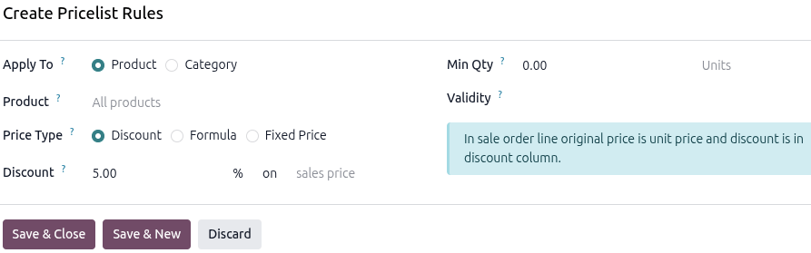

.. important::
   If a pricelist is applied to a sales quotation with the :guilabel:`Price Type` set as
   :guilabel:`Discount`, the discount is visible to the customer.

.. _sales/pricing/formula:

Configuring a formula
~~~~~~~~~~~~~~~~~~~~~

.. important::
   If a pricelist is applied to a sales quotation with the discount :guilabel:`Price Type` set as
   :guilabel:`Formula`, the discount will *not* be visible to the customer.

The :guilabel:`Formula` option calculates pricelist rules using these settings:

- :guilabel:`Based price`: Choose the base value for the calculation — :guilabel:`Sales price`,
  :guilabel:`Cost` (both pulled from the product form), or :guilabel:`Other Pricelist` (uses another
  pricelist as the base).
- :guilabel:`Discount`: The discount percentage to apply. Enter a negative number to increase the
  price instead.
- :guilabel:`Round off to`: Rounds the price to the nearest multiple of this value. Applied *after*
  the discount but *before* the :guilabel:`Extra Fee`.
- :guilabel:`Extra Fee`: Fixed amount added or subtracted after :guilabel:`Discount` and
  :guilabel:`Round off to` are applied.

.. tip::
   To have prices that end in 9.99, set the :guilabel:`Round off to` value to `10` and the
   :guilabel:`Extra Fee` to `-0.01`.

.. _sales/pricing/fixed-price:

Configuring a fixed price
~~~~~~~~~~~~~~~~~~~~~~~~~

To configure a :guilabel:`Fixed Price`, enter the new value that overrides the configured *Sales
Price* on a product form. The :guilabel:`Fixed Price` value is applied per unit. When applied on a
quotation, the *Unit Price* for each order line uses the :guilabel:`Fixed Price` value.

Company settings
~~~~~~~~~~~~~~~~

When in :ref:`Developer Mode <developer-mode/activation>`, the *Create Pricelist Rules* pop-up form
displays a *Company Settings* section. The section has the following configuration options:

- :guilabel:`Currency`: Assign a currency for the individual price rule.
- :guilabel:`Company`: Assign a company for the individual price rule.

Once all configurations are complete, either click :guilabel:`Save & Close` to save the advanced
pricelist rule, or click :guilabel:`Save & New` to immediately create another advanced pricelist
rule on a fresh form.

Pricelist rule logic
====================

Odoo automatically selects a pricelist for a quotation when none has been manually assigned. It
checks the pricelists in the order they appear on the *Pricelist* page, from top to bottom, and
applies the first one whose conditions match the quotation's details.

When multiple pricelist rules apply to the same product on the same pricelist, Odoo determines
priority using this order:

1. :ref:`Most specific to least specific <sales/pricing/most-to-least-specific>`: More specific
   rules take priority over general ones.
#. :ref:`Minimum quantity (largest first) <sales/pricing/minimum-quantity>`: The higher quantity
   thresholds take priority over lower ones.
#. :ref:`Category order <sales/pricing/category-order>`: Manually configured category hierarchy
   breaks remaining ties where the subcategory takes priority over the parent category.
#. :ref:`Creation date (newest first) <sales/pricing/creation-date>`: The most recently created rule
   takes priority if all else is equal.

.. _sales/pricing/most-to-least-specific:

1. Most specific to least specific
----------------------------------

A rule on a specific variant always takes priority over a broader rule, so a special price for one
variant overrides a general category discount.

1. Product variant: Applies to the selected variant of the product.
#. Product: Applies to all variants of a product.
#. Subcategory: Applies to all products within the subcategory.
#. Parent category: Applies to all products in the parent category.
#. All products: Applies to all products within the database.
#. All categories: Applies to all products with an assigned category. This doesn't include
   uncategorized products.

.. _sales/pricing/minimum-quantity:

2. Minimum quantity (largest first)
-----------------------------------

If the product specificity is the same, then rules with a higher minimum quantity take priority over
rules with a lower (or no) minimum. This keeps bulk-pricing rules (e.g., 10 units) from being
overridden by a generic rule that also matches.

.. _sales/pricing/category-order:

3. Category order
-----------------

If rules have the same specificity and same minimum quantity, Odoo uses the manually configured
category hierarchy, meaning the sequence is set on the categories themselves.

.. _sales/pricing/creation-date:

4. Creation date (newest first)
-------------------------------

If everything else is equal, the most recently created rule takes priority. This allows newer rules
to override older ones with identical conditions, which is useful when rules are updated or replaced
without deleting the old one immediately.

.. _sales/pricing/customer-pricelist-application:

Customer-specific pricelists
============================

When a customer is added to the database, the *Default* pricelist is automatically applied to the
*Pricelist* field on a contact form. Even if the field is left blank during :ref:`contact creation
<contacts/contact-form>`, the *Default* pricelist is automatically assigned when that contact form
is opened again.

To set a specific pricelist for a customer, go to :menuselection:`Sales app --> Orders -->
Customers` and select the customer from the *Customers* page, or click the customer's name on a
sales order.

On the customer's contact form, click the :guilabel:`Sales & Purchase` tab, in the *Sales* section,
select a pricelist using the :guilabel:`Pricelist` field drop-down menu.

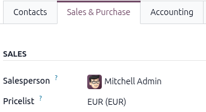

When the customer is added to a quotation, the *Pricelist* field is auto-populated based on the
information from their contact form. Users can manually change the Pricelist using the *Pricelist*
field on the quotation.

.. _sales/pricing/price-type-use-cases:

Price type use cases
====================

- :ref:`sales/pricing/discount-use-cases`
- :ref:`sales/pricing/formula-use-cases`
- :ref:`sales/pricing/fixed-price-use-cases`

.. _sales/pricing/discount-use-cases:

Discount use cases
------------------

The *Discount* price type is used when doing simple discount calculations on a product's sales price
or when using another pricelist as the base value.

Seasonal discount pricelist
~~~~~~~~~~~~~~~~~~~~~~~~~~~

A retail store holds a yearly summer sale. The sale is 25% off all summer dresses.

Navigate to :menuselection:`Sales app --> Products --> Pricelist` and select an existing pricelist
or click :guilabel:`New` to create a new one.

On the pricelist form, click :guilabel:`Add a line` to open the *Create Pricelist Rules* pop-up
window.

Configure the form using the following settings:

- :guilabel:`Apply To`: Select :guilabel:`Category`.
- :guilabel:`Category`: Select *Summer dresses* from the drop-down menu.
- :guilabel:`Price Type`: Select :guilabel:`Discount`.
- :guilabel:`Discount`: Enter `25` and leave the default :guilabel:`sales price`.
- :guilabel:`Min Qty`: Leave at `0`.
- :guilabel:`Validity`: Select :guilabel:`Range` and set the date range to `July 1` to `Aug 31`.

Click :guilabel:`Save & close` to add the pricelist rule to the pricelist.

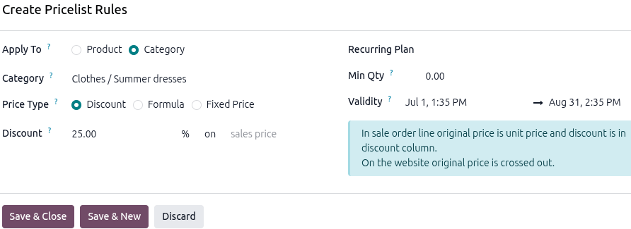

Applying a 10% markup
~~~~~~~~~~~~~~~~~~~~~

A shoe store has increased sales targets for the year, and the company decided to add an additional
10% to the sales price of their rain boots. The wholesale price for the rain boots is $40.

Navigate to :menuselection:`Sales app --> Products --> Pricelist` and select an existing pricelist
or click :guilabel:`New` to create a new one.

On the *Create Pricelist Rules* pop-up window, follow these settings:

- :guilabel:`Apply To`: Select :guilabel:`Product`.
- :guilabel:`Product`: Select *Rain boots* from the drop-down menu.
- :guilabel:`Price Type`: Select :guilabel:`Discount`.
- :guilabel:`Discount`: Enter `-10` and leave the default :guilabel:`sales price`.

Click :guilabel:`Save & close` to add the pricelist rule to the pricelist.

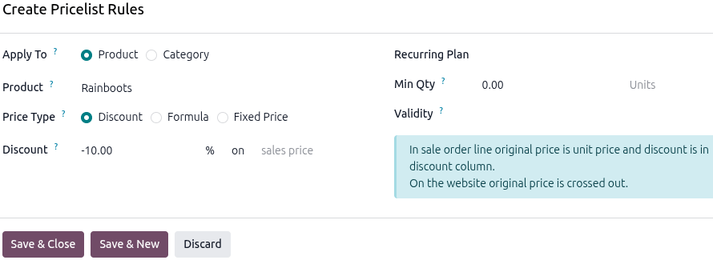

.. _sales/pricing/formula-use-cases:

Formula use cases
-----------------

The *Formula* price type is useful for complex pricing requirements, such as dynamic pricing values
based on margin cost, or pricing values that require both a discount and a flat rate to be added or
removed.

Dynamic pricing based on cost
~~~~~~~~~~~~~~~~~~~~~~~~~~~~~

It's approaching summer, and the most in-demand item is a jacket worn by a popular actress. A
clothing retail store stocks the jacket, but its inventory is running low. The store decides to sell
the jacket at a 10% markup on the cost of the product during the summer while the demand is still
high. The wholesale price of the jacket is $75, and the cost is $70.

First, navigate to :menuselection:`Sales app --> Products --> Pricelist` and select an existing
pricelist or click :guilabel:`New` to create a new one.

On the *Create Pricelist Rules* pop-up window, follow these settings:

- :guilabel:`Apply To`: Select :guilabel:`Product`.
- :guilabel:`Product`: Select *Classic Brown Jacket* from the drop-down menu.
- :guilabel:`Price Type`: Select :guilabel:`Formula`.
- :guilabel:`Base price`: Select :guilabel:`Cost` from the drop-down menu.
- :guilabel:`Markup`: Enter `10`.
- :guilabel:`Validity`: Select :guilabel:`Range` and select `Jul 1` to `Aug 31`.

Click :guilabel:`Save & Close` to add the pricelist rule to the pricelist.

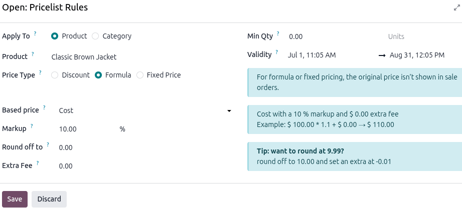

Then create a quotation for the jacket and select the desired pricelist from the
:guilabel:`Pricelist` drop-down menu.

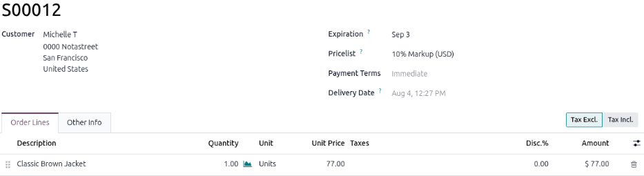

.. seealso::
   :doc:`../../sales_quotations/margin`

20% discounts with prices rounded up to $9.99
~~~~~~~~~~~~~~~~~~~~~~~~~~~~~~~~~~~~~~~~~~~~~

A grocery store is having a flash sale on their chicken products in the butcher section. All the
chicken meat products are on sale for 20% and rounded to 9.99.

Navigate to :menuselection:`Sales app --> Products --> Pricelist` and select an existing pricelist
or click :guilabel:`New` to create a new one.

On the *Create Pricelist Rules* pop-up window, follow these settings:

- :guilabel:`Apply To`: Select :guilabel:`Category`.
- :guilabel:`Category`: Select *Meat/Chicken* from the drop-down menu.
- :guilabel:`Price Type`: Select :guilabel:`Formula`.
- :guilabel:`Base price`: Select :guilabel:`Cost` from the drop-down menu.
- :guilabel:`Markup`: Enter `20`.
- :guilabel:`Round off to`: Enter `10`.
- :guilabel:`Extra Fee`: Enter `-0.01`.

Click :guilabel:`Save & Close` to add the pricelist rule to the pricelist.

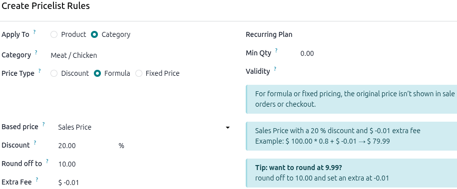

.. _sales/pricing/fixed-price-use-cases:

Fixed price use cases
---------------------

The *Fixed Price* price type is useful when applying flat rate pricing. The following are scenarios
where flat rate pricing is applicable:

- Store-wide clearance sales.
- Configuring pricing for different units of packaging.

Flat sales price for a subcategory
~~~~~~~~~~~~~~~~~~~~~~~~~~~~~~~~~~

A sports store is having a sale on all their fishing lures. All the lures are only $9.99 during the
sale.

Navigate to :menuselection:`Sales app --> Products --> Pricelist` and select an existing pricelist
or click :guilabel:`New` to create a new one.

On the *Create Pricelist Rules* pop-up window, follow these settings:

- :guilabel:`Apply To`: Select :guilabel:`Category`.
- :guilabel:`Category`: Select *Fishing/Lures* from the drop-down menu.
- :guilabel:`Price Type`: Select :guilabel:`Fixed Price`.
- :guilabel:`Fixed Price`: Enter `9.99`.

Click :guilabel:`Save & Close` to add the pricelist rule to the pricelist.

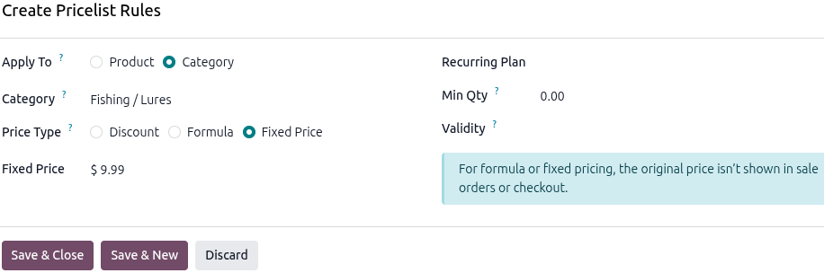

Set different product packaging prices
~~~~~~~~~~~~~~~~~~~~~~~~~~~~~~~~~~~~~~

A wine and liquor store sells a can of beer for $4. Next month, it will sell the beer in three
different packagings: four-pack, six-pack, and twelve-pack.

The store intends to offer discounts based on volumetric pricing, with prices for each pack being
the following:

- Four-pack is $12
- Six-pack is $15
- Twelve-pack is $24

Navigate to :menuselection:`Sales app --> Products --> Pricelist` and select an existing pricelist
or click :guilabel:`New` to create a new one.

On the *Create Pricelist Rules* pop-up window, follow these settings:

- :guilabel:`Apply To`: Select :guilabel:`Product`.
- :guilabel:`Product`: Select *Beer* from the drop-down menu.
- :guilabel:`Price Type`: Select :guilabel:`Fixed Price`.
- :guilabel:`Fixed Price`: Enter `3`.

To set the packaging, select :guilabel:`Pack of 4` from the :guilabel:`Units` drop-down menu. Click
:guilabel:`Save & New` to add the pricelist rule to the pricelist and start a new one.

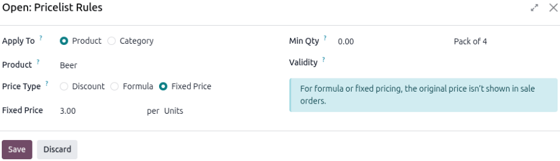

For the second pricelist rule, select the same options except for:

- :guilabel:`Fixed Price`: Enter `2.50`.
- The packaging field: Select :guilabel:`Pack of 6` from the drop-down menu.

Click :guilabel:`Save & New` to add the pricelist rule to the pricelist, and in the last pricelist
rule form, repeat the same options except for:

- :guilabel:`Fixed Price`: Enter `2`.
- The packaging field: Select :guilabel:`Pack of 12` from the drop-down menu.

Click :guilabel:`Save & Close` to add the pricelist rule to the pricelist. The pricelist should now
have three pricelist rules for all the package types.

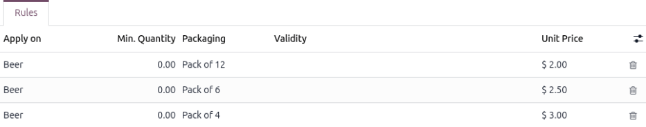

.. seealso::
   - :doc:`../../sales_quotations/margin`
   - :doc:`discounts`
