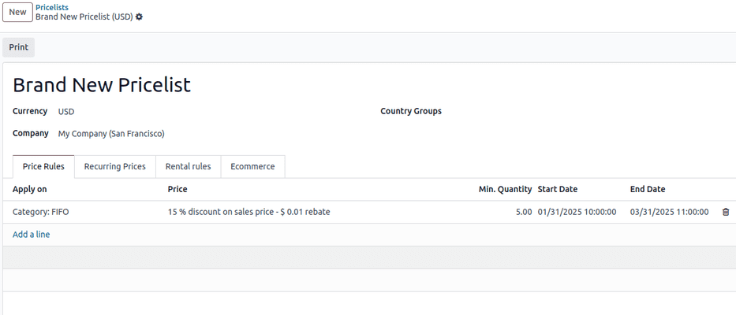
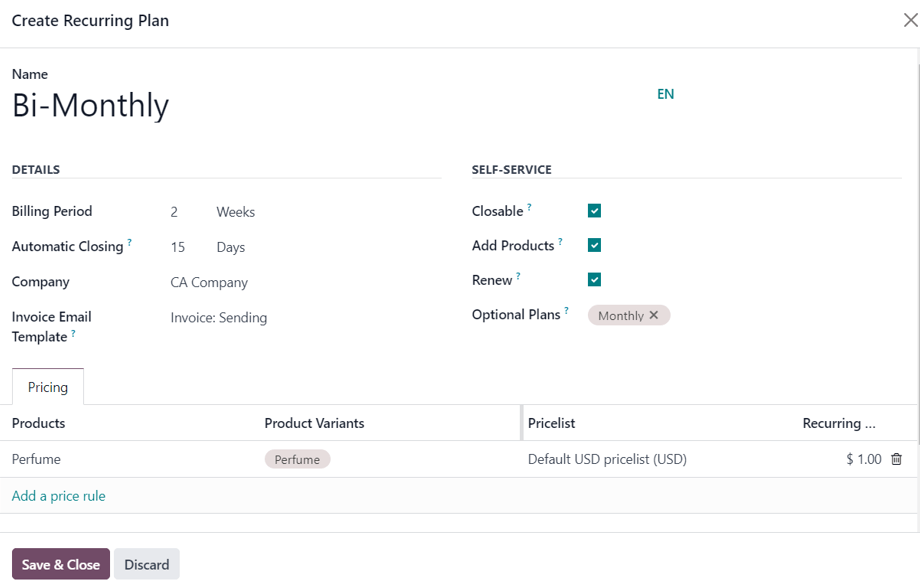
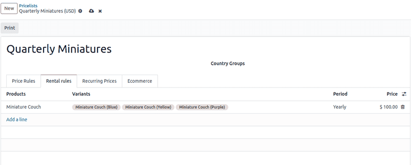

==========
Pricelists
==========

A *pricelist* is a method of dynamic pricing that applies a list of prices (or price rules) to
adjust sales prices. This adjustment can apply to specific customers, customer groups, sales orders,
time periods, etc., and is useful for creating pricing strategies and optimizing sales margins.

Odoo **Sales** has a useful pricelist feature that can be tailored to fit any unique pricing
strategy. Pricelists suggest certain prices, but they can always be overridden on the sales order.

Configuration
=============

To enable pricelists in the Odoo **Sales** app, first navigate to :menuselection:`Sales app -->
Configuration --> Settings`. In the :guilabel:`Pricing` section, tick the checkbox next to the
:guilabel:`Pricelists` feature, and click :guilabel:`Save` to save all changes.

.. image:: pricing/pricelist-feature-setting.png
   :alt: How the pricelist feature setting looks in Odoo Sales.

After activating and saving the :guilabel:`Pricelists` feature, the :guilabel:`Settings` page
reloads. From here, either select the :icon:`oi-arrow-right` :guilabel:`Pricelists` link (beneath
the :guilabel:`Pricelists` feature on the :guilabel:`Settings` page), or navigate to
:menuselection:`Sales app --> Products --> Pricelists`.

Either option reveals the :guilabel:`Pricelists` page, in which pricelists can be created and/or
modified at any time.

.. important::
   If there is no specific pricelist configured on a sales quotation, the :guilabel:`Default`
   pricelist is applied.

.. note::
   The :guilabel:`Selectable` column is only applicable to Odoo **eCommerce**. This option allows
   website visitors to choose a pricelist when shopping in your **eCommerce** website.

.. note::
   In Odoo 17 (and above), you are *not required* to enter a pricelist in the :guilabel:`Pricelist`
   field on a sales quotation form in order to confirm it (i.e. turn it into a sales order).

   The chatter section is available on pricelist forms, which allows you to add notes and
   communications on each pricelist page.

Creating and editing pricelists
-------------------------------

From the :guilabel:`Pricelists` page, either select the pricelist to edit, or click :guilabel:`New`
to create a new pricelist, which reveals a blank pricelist form that can be configured in a number
of different ways.

When creating a new pricelist, start by adding a name for the pricelist at the blank field at top of
the form. Next, select which :guilabel:`Currency` should be used.

If working in a multi-company environment, select which company this pricelist should apply to in
the :guilabel:`Company` field. If this field is left blank, the pricelist is automatically applied
to all companies in the database.

If working in a multinational company, select the countries where this pricelist will apply under
the :guilabel:`Country Groups` column.

.. _sales/products/price-rules:

Price Rules tab
---------------

In the :guilabel:`Price Rules` tab, each line creates a new record that will implement customized
pricing to the sales order where the pricelist is applied. To create a new price rule, click on
:guilabel:`Add a line`, which opens a new pricelist rules form.

Then, select whether to apply this set of rules to a :guilabel:`Product` or :guilabel:`Category`.

From here, there are several configuration options:

- :guilabel:`Product`: If selected in the :guilabel:`Apply To` field, use this field to choose one
  or more products to which this pricelist will apply.
- :guilabel:`Category`: Select one or more product categories to which this pricelist will apply.
- :guilabel:`Price Type`: Select whether the specialized pricing will fall under
  :guilabel:`Discount`, :guilabel:`Formula`, or :guilabel:`Fixed Price`. Depending on the price
  type, there will be additional configurations on how to apply the pricelist.

  - :guilabel:`Discount`: Enter the percentage to be discounted. A mark-up can be configured by
    using a negative value in this field.

    .. important::
       If a pricelist is applied to a sales quotation with the discount :guilabel:`Price Type` set
       as :guilabel:`Discount`, the discount will visible to the customer.

       .. image:: pricing/sales-pricelist-pricerule-discount.png
          :alt: A pricelist rule using Price Type: Discount to create a discount.

       .. image:: pricing/sales-pricelist-pricerule-discount-customer.png
          :alt: How a pricelist rule using Price Type: Discount appears on customer preview.

  - :guilabel:`Formula`: Calculate the pricelist rules based the following configuration:

    - :guilabel:`Discount`: Percentage discount to be applied. Negative values can be entered to
      increase prices.

    .. important::
       If a pricelist is applied to a sales quotation with the discount :guilabel:`Price Type` set
       as :guilabel:`Formula`, the discount will *not* be visible to the customer.

    - :guilabel:`Round off to`: Numerical value to act as round-off multiple, to be applied after
      discount. The rounding method sets the price so that it is a multiple of the value in this
      field.

      .. note::
         Rounding is applied *after* the discount and *before* the extra fee.

         - :guilabel:`Extra Fee`: Fixed amount to be added or subtracted once :guilabel:`Discount`
           and :guilabel:`Round off to` have been applied.
         - :guilabel:`Fixed Price`: Enter fixed price for this pricelist. When applied, all product
           lines in the quotation form will be updated to this price.

- :guilabel:`Min Qty`: Specify the minimum quantity of selected products for this pricelist to
  apply.
- :guilabel:`Validity Period`: Specify the start and end date during which this pricelist can be
  applied to quotations.

.. example::
   To formulate a 100% markup (or two times the price of the product), with a $5 minimum margin, set
   the :guilabel:`Based price` field to :guilabel:`Sales Price` and the :guilabel:`Discount` to
   `-100`. This is often seen in retail situations.

   .. image:: pricing/formula-markup-cost-example.png
      :alt: How it looks to formulate a markup cost with 5 dollar minimum margin in Odoo Sales.

.. example::
   To apply 20% discounts, with prices rounded up to 9.99, set the :guilabel:`Based on` field to
   :guilabel:`Sales Price`, the :guilabel:`Discount` field to `20`, the :guilabel:`Extra Fee` field
   to `-0.01`, and the :guilabel:`Rounding Method` field to `10`.

   .. image:: pricing/formula-discount-example.png
      :alt: Example of a 20% discount with prices rounded to 9.99 in Odoo Sales.

.. tip::
   To have prices that end in 9.99, set the :guilabel:`Rounding Method` to `10` and the
   :guilabel:`Extra Fee` to `-0.01`.

Recurring Prices tab
--------------------

Time-based rules are used specifically with subscription products. Be sure to check out the Odoo
:doc:`Subscriptions </applications/sales/subscriptions>` documentation for more information.

In the :guilabel:`Recurring Prices` tab, pricelists are configured with the same options as in the
:guilabel:`Price Rules` tab, with additional columns for :guilabel:`Product Variants` add
:guilabel:`Recurring Plan`.

:guilabel:`Product Variants` are configured under products that have one or more values, such as
color, size, etc. Once a product has been selected under the :guilabel:`Products Tab`, if
applicable, select the desired product variants to be included in the price rule.

Then, select the blank field in the :guilabel:`Recurring Plan` column to reveal a drop-down menu of
pre-designated recurrence periods (e.g. `Monthly`, `Quarterly`, `Weekly`, etc.).

.. image:: pricing/sales-pricelist-recurringprices.png
   :alt: The recurring prices tab in a pricelist configuration form.

New recurrence periods can also be created from this column. To do so, type in the name for the new
:guilabel:`Recurring Plan`, then select :guilabel:`Create` from the resulting drop-down menu to
create the time period, which can be edited later. Alternatively, select :guilabel:`Create and
edit...` to reveal a :guilabel:`Create Recurring Plan` pop-up form. From this pop-up form, the new
recurrence period can be configured, with specific :guilabel:`Details`, :guilabel:`Self-Service`,
and :guilabel:`Pricing` options. When the configurations are complete, click the :guilabel:`Save &
Close` button.

Lastly, add the desired price for this recurring price rule in the :guilabel:`Recurring Price`
column.

.. seealso::
   :doc:`../../../subscriptions`

Rental rules tab
----------------

Price rules can be configured for :doc:`rental products <../../../rental>` under the
:guilabel:`Rental rules` tab, using the same methodology as the :guilabel:`Price Rules` and
:guilabel:`Recurring Prices` tabs.

To add a rental rule, click :guilabel:`Add a line`, and select a desired product in the
:guilabel:`Products` column. Then, select any specific :guilabel:`Variants`, if necessary.

Next, designate a :guilabel:`Period` of time for the rental rule (e.g. `Daily`, `Hourly`, etc.).

Lastly, configure a :guilabel:`Price` for the rental rule in the respective column.

Ecommerce Tab
-------------

Under the :guilabel:`Ecommerce` tab, price rules can be configured for products sold on an
:doc:`Ecommerce website <../../../../websites/ecommerce/products>`.

To enable the pricelist to be visible, select the target website in the :guilabel:`Website` field.

The :guilabel:`Selectable` can be enabled to allow the customer to choose this pricelist.

Finally, promotional and loyalty codes can be added to the :guilabel:`E-commerce Promotional Code`
field.

Tick the :guilabel:`Selectable` checkbox to have this pricelist as a selectable option for
customers to choose as they shop. If the :guilabel:`Selectable` box is left unticked, customers
**cannot** select this pricelist for themselves.

Lastly, there is the option to add an :guilabel:`E-commerce Promotional Code`. To add a code, type
in the desired promo code that, when entered during the checkout process, applies the pricelist to
the customer, even if the customer does not fall into the previously-specified criteria.

Customer pricelist application
==============================

While the default pricelist applied to any customer is the :guilabel:`Public Pricelist`, Odoo
provides the opportunity to directly apply a different pricelist to customers on their contact form.

To do that, open the desired customer's contact form, either by navigating to :menuselection:`Sales
app --> Orders --> Customers` and selecting the customer from the main :guilabel:`Customers` page,
or by clicking on the customer's name on a sales order.

.. image:: pricing/customer-detail-form.png
   :align: center
   :alt: Sample customer detail form in Odoo Sales.

On the desired customer's contact form, under the :guilabel:`Sales & Purchase` tab, in the
:guilabel:`Sales` section, designate what pricelist should be applied to this specific customer from
the drop-down menu in the :guilabel:`Pricelist` field.

.. image:: pricing/customer-form-pricelist-field.png
   :align: center
   :alt: The pricelist field in a customer detail form in Odoo Sales.

.. note::
   When a customer is added to the database, the default pricelist is automatically applied to them.
   There is **no way** to have a blank *Pricelist* field on a contact form. Even if that field is
   left blank, the default pricelist appears when that contact form is opened again.

   However, when that contact is added to a quotation, and the *Pricelist* field is auto-populated
   (based on the information from their contact form), that predetermined pricelist can be removed
   from the *Pricelist* field, and the quotation can still be confirmed, and subsequently, turned
   into a sales order.

Conditions
----------

At the bottom of the :guilabel:`Create Pricelist Rules` pop-up form is the :guilabel:`Conditions`
section.

Here, start by selecting one of the options in the :guilabel:`Apply On` field:

- :guilabel:`All Products`: the advanced pricelist rule will be applied to all products.
- :guilabel:`Product Category`: the advanced pricelist rule will be applied to a specific category
  of products.
- :guilabel:`Product`: the advanced pricelist rule will be applied to a specific product.
- :guilabel:`Product Variant`: the advanced pricelist rule will be applied to a specific product
  variant.

If any of those options, apart from :guilabel:`All Products`, are selected, a new option-specific
field appears, in which the specific :guilabel:`Product Category`, :guilabel:`Product`, or
:guilabel:`Product Variant` must be chosen.

Then, select a minimum quantity to be applied to the advanced pricelist rule in the :guilabel:`Min.
Quantity` field. Lastly, select a range of dates for the pricelist item validation in the
:guilabel:`Validity` field.

Once all configurations are complete, either click :guilabel:`Save & Close` to save the advanced
pricelist rule, or click :guilabel:`Save & New` to immediately create another advanced pricelist
rule on a fresh form.

.. note::
   If a price rule is set for a particular product, and another one for its product category, Odoo
   takes the rule of the product itself.

.. seealso::
   - :doc:`/applications/sales/sales/products_prices/prices/currencies`
   - :doc:`/applications/websites/ecommerce/products/price_management`
