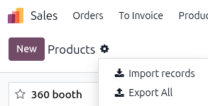
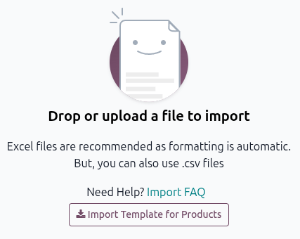
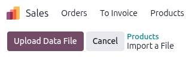
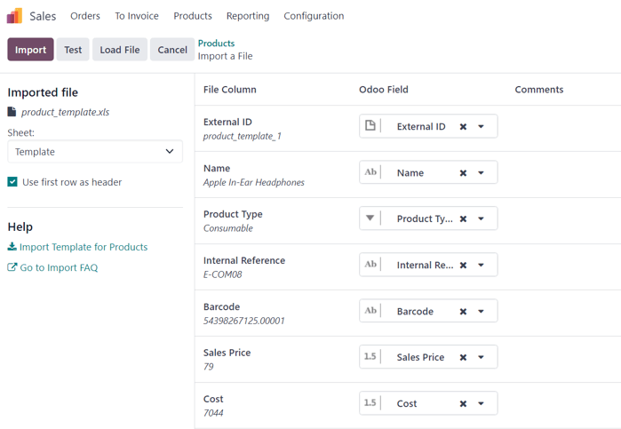
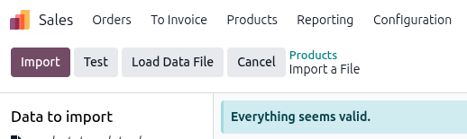
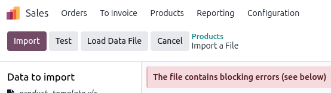
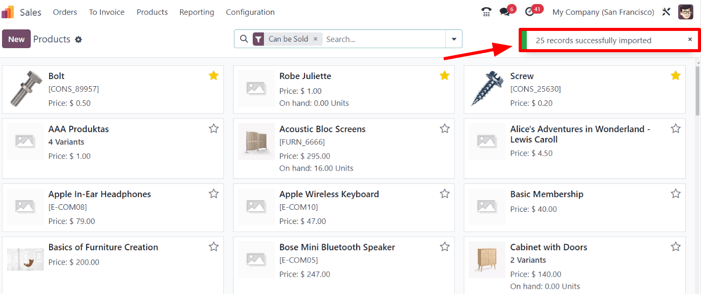
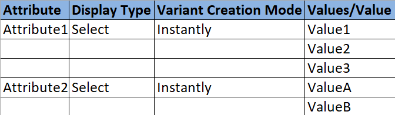
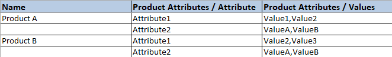

===============
Import products
===============

The Odoo **Sales** app provides a template for importing products with categories and variants,
which can be opened and edited with any spreadsheet software (Microsoft Excel, OpenOffice, Google
Sheets, etc.).

When this spreadsheet is filled out correctly, it can be uploaded to the Odoo database within
minutes. By the end of the process, all the products and their variants are live within Odoo and
accessible in the product catalog.

Download template
=================

To import products with categories and variants, the *Import Template for Products* must be
downloaded. Once downloaded, the template can be adjusted and customized, and then uploaded into the
Odoo database.

To download the necessary import template, navigate to :menuselection:`Sales app --> Products -->
Products`. On the :guilabel:`Products` page, click the :icon:`fa-cog` :guilabel:`(Action)` icon in
the upper-left corner.

From the drop-down menu, select the :guilabel:`Import records` option.

Selecting :guilabel:`Import records` displays a separate page with a :guilabel:`Import Template for
Products` link to download the template.

Once downloaded, open the spreadsheet file to customize it.

Customize product import template
=================================

When modifying the product import template, keep in mind the following:

- Feel free to remove any columns that aren't deemed necessary. But, it is recommended that the
  :guilabel:`Internal Reference` column remain.

  While it is not mandatory, having a unique identifier (e.g., `FURN_001`) in the
  :guilabel:`Internal Reference` column for each product can be helpful in many cases. This can even
  be from previous software spreadsheets to ease the transition into Odoo.

  For example, when updating imported products, the same file can be imported several times without
  creating duplicates, thus enhancing the efficiency and simplicity of imported product management.
- Do **not** change the labels of columns that are meant to be imported. Otherwise, Odoo won't
  recognize them, forcing the user to map them manually on the import screen.
- Feel free to add new columns to the template spreadsheet, if desired. However, to be added, those
  fields **must** exist in Odoo. If Odoo can't match the column name with a field, it can be matched
  manually during the import process.

  During the import of the completed template, Odoo displays a page that shows all the elements of
  the newly configured product template spreadsheet, separated by :guilabel:`File Column`,
  :guilabel:`Odoo Field`, and :guilabel:`Comments`.

  To manually match a column name with a field in Odoo, click the :guilabel:`Odoo Field` drop-down
  menu next to the :guilabel:`File Column` that needs a manual adjustment, and select the
  appropriate field.

  .. image:: import/odoo-field-dropdown-menu.png
     :alt: The Odoo Field drop-down menu next to a Field Column that needs to be manually adjusted.

Import product template spreadsheet
===================================

After customizing the product template spreadsheet, return to the Odoo product import page, where
the template download link is found, and click the :guilabel:`Upload File` button in the upper-left
corner.

Then, a pop-up window appears, in which the completed product template spreadsheet file should be
selected and uploaded to Odoo.

After that, Odoo displays a page that shows all the elements of the newly configured product
template spreadsheet, organized by :guilabel:`File Column`, :guilabel:`Odoo Field`, and
:guilabel:`Comments`.

From here, the :guilabel:`File Column` can be manually assigned to an :guilabel:`Odoo Field`, if
necessary.

To ensure everything is appropriate and that all the columns and fields are aligned correctly, click
the :guilabel:`Test` button in the upper-left corner.

If everything is lined up and applied correctly, Odoo displays a blue banner at the top of the page,
indicating that :guilabel:`Everything seems valid`.

If there are any errors, Odoo displays a red banner at the top of the page with instructions on
where to locate the specific issues and how to fix them.

Once those errors are fixed, click :guilabel:`Test` again to ensure all necessary issues have been
remedied appropriately.

If additional product template spreadsheets need to be uploaded, click the :guilabel:`Load Data
File` button, select the desired template, then repeat the process.

When everything is ready, click the :guilabel:`Import` button.

When clicked, Odoo instantly imports those products and reveals the main :guilabel:`Products` page,
with a pop-up message in the upper-right corner. This pop-up message informs the user how many
products were successfully imported.

At this point, all the newly imported products are accessible and editable on the
:guilabel:`Products` page.

Import relation fields, attributes, and variants
================================================

It's important to note that an Odoo object is always related to many other objects. For example, a
product is linked to product categories, attributes, vendors, and related information. These
links/connections are known as relations.

.. note::
   To import product relations, the records of the related object **must** be imported *first* from
   their own list menu.

Relation fields
---------------

In Odoo, product forms include several fields that can be modified and customized at any time. These
fields are available on every tab of a product form. While these fields can be edited directly on
the product form, they can also be modified via a product import.

As mentioned, relation fields of this nature can **only** be imported for products if they already
exist in the database. For example, if a user attempts to import a product with a *Product Type*, it
must be one of the preconfigured product types in the database (e.g., *Tracked Product*,
*Untracked*, etc.).

To import information for a relation field on a product import template spreadsheet, add the name of
the field as a column name/title on the spreadsheet. Then, on the appropriate product line, add the
desired relation field option.

When all desired relation field information has been entered, save the spreadsheet, and import it to
the database. Go to the :menuselection:`Sales app --> Products --> Products`. On the
:guilabel:`Product` page click the :icon:`fa-cog` :guilabel:`(Action)` icon and select
:menuselection:`Import records --> Upload File`.

Once the spreadsheet with the newly-configured relation field information has been uploaded, click
:guilabel:`Import`, and Odoo returns to the :guilabel:`Products` page.

Once the newly changed/modified products, complete with the new relation field information, have
been imported and uploaded, that new information can be found on the :guilabel:`Products` page.

Attributes and values
---------------------

Odoo supports importing attributes and values for both already existing and newly imported products.
Attributes and values **must** be uploaded through a separate spreadsheet or CSV file before they
can be applied to other products.

The column names/titles for the attributes and values spreadsheet should be: :guilabel:`Attribute`,
:guilabel:`Display Type`, :guilabel:`Variant Creation Mode`, and :guilabel:`Values / Value`.

- :guilabel:`Attribute`: name of the attribute (e.g., `Size`).
- :guilabel:`Display Type`: display type used in the product configurator. There are three display
  type options:

  - :guilabel:`Radio`: values displayed as radio buttons
  - :guilabel:`Selection`: values displayed in a selection list
  - :guilabel:`Color`: values denoted as a color selection

- :guilabel:`Variant Creation Mode`: how the variants are created when applied to a product. There
  are three variant creation mode options:

  - :guilabel:`Instantly`: all possible variants are created as soon as the attribute and its values
    are added to a product.
  - :guilabel:`Dynamically`: each variant is created **only** when its corresponding attributes and
    values are added to a sales order.
  - :guilabel:`Never`: variants are **never** created for the attribute.

    .. note::
       The :guilabel:`Variants Creation Mode` **cannot** be changed once the attribute is used on at
       least one product.

- :guilabel:`Values/Value`: values pertaining to the corresponding attribute. If there are multiple
  values for the same attribute, they need to be on separate lines in the spreadsheet.

Once the desired attributes and values have been entered and saved in the spreadsheet, it's time to
import and upload the spreadsheet to Odoo. To do that, navigate to :menuselection:`Sales app -->
Configuration --> Attributes`. On the :guilabel:`Attributes` page, click the :icon:`fa-cog`
:guilabel:`(Action)` icon and select :menuselection:`Import records --> Upload File`.

Once the spreadsheet with the newly-configured attributes and values has been uploaded, click
:guilabel:`Import`, and Odoo returns to the :guilabel:`Attributes` page. That's where the newly
added attributes and values can be found and edited, if necessary.

As mentioned previously, when attributes and values have been added to the Odoo database, they can
be used for existing or imported products.

Product variants
----------------

When product attributes and values are configured in the database, they can be used in product
import spreadsheets to add more information and detail imported products.

To import products with product attributes and values, the product import template spreadsheet must
be configured with specific :guilabel:`Product Attributes / Attribute`, :guilabel:`Product
Attributes / Values`, and :guilabel:`Name` columns.

There may be other columns as well, but these are **required** to import products with specific
variants properly.

- :guilabel:`Name`: product name
- :guilabel:`Product Attributes / Attribute`: name of attribute
- :guilabel:`Product Attributes / Values`: values pertaining to the corresponding attribute

.. tip::
   To import multiple values, separate them with a single comma, **not a comma followed by a
   space**, in the product import template spreadsheet (e.g., `furniture,couch,home`).

When the desired products and product variants have been entered and saved in the spreadsheet, it is
time to import them into Odoo. To do that, navigate to :menuselection:`Sales app --> Products -->
Products`. On the :guilabel:`Products` page, click the :icon:`fa-cog` :guilabel:`(Action)` icon and
select ::menuselection:`Import records --> Upload File`.

Once the spreadsheet with the newly-configured products and product variants has been uploaded,
click :guilabel:`Import`, and Odoo returns to the :guilabel:`Products` page. That's where the
newly-added products can be found.

To view and modify the attributes and variants on any products, select the desired product from the
:guilabel:`Products` page, and click the :guilabel:`Attributes \& Variants` tab.

.. example::
   A furniture company wants to import their existing product list into Odoo **Sales** app. Several
   of the company's products have different variations:

   - Customizable Desk

     - Color: White, Black
     - Legs: Wood, Steel
   - Stool

     - Color: Green, Navy
     - Seat: Leather, Wood

   In the template, the Customizable desk and Stool are in the *Name* column with Color, Legs, and
   Seat in the *Product Attribute/Attribute* column. White, black, wood, steel, and leather are all
   in the *Product Attribute/Value* column.

   .. image:: import/product-variants-spreadsheet.png
      :alt: Example of a product variant type import spreadsheet.

.. seealso::
   :doc:`variants`
