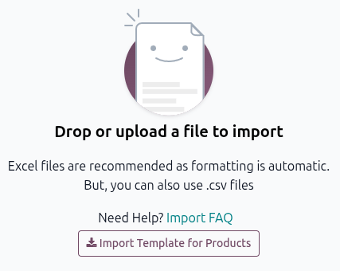
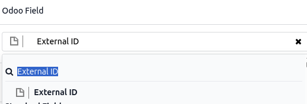
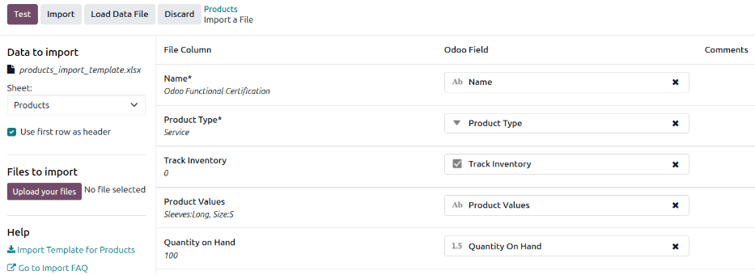
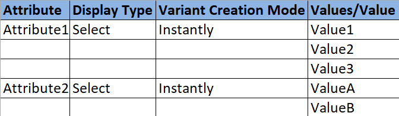
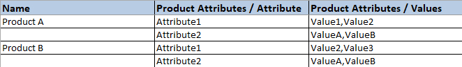

===============
Import products
===============

The Odoo **Sales** app provides a template for importing products with categories and variants,
which can be opened and edited with any spreadsheet software (Microsoft Excel, OpenOffice, Google
Sheets, etc.) A properly formatted spreadsheet can be uploaded to an Odoo database. Within minutes,
all the products and their variants are live within Odoo and accessible in the product catalog.

Download template
=================

To import products with categories and variants, download the *Import Template for Products*. Once
downloaded, the template can be adjusted and customized, then uploaded into an Odoo database.

To download the template, navigate to :menuselection:`Sales app --> Products --> Products`. On the
:guilabel:`Products` page, click the :icon:`fa-cog` :guilabel:`(Action)` icon in the upper-left
corner. From the drop-down menu, select the :guilabel:`Import records` option.

Selecting :guilabel:`Import records` opens a new page with an :guilabel:`Import Template for
Products` link to download the template. Once downloaded, open the spreadsheet file to customize it.

Common product import template considerations
=============================================

When modifying the product import template, keep in mind the following:

- Unnecessary columns may be removed.
- Keeping the :guilabel:`Internal Reference` column is recommended.
- Having a unique identifier (e.g., `FURN_001`) for each product in the :guilabel:`Internal
  Reference` column can be helpful in many cases. This number can even be reused from previous
  software spreadsheets to ease the transition into Odoo. For example, when updating imported
  products, the same file can be imported several times without creating duplicates.
- Do **not** change the labels of columns that are meant to be imported. Otherwise, Odoo won't
  recognize them, requiring them to be configured manually on the import screen.
- New columns may be added to the template spreadsheet, if desired. However, newly added columns
  **must** exist in Odoo. If Odoo can't match a column's name with a field, it can be matched
  manually during the import process.

When importing a completed template, Odoo displays a page showing all the elements of the newly
configured product template spreadsheet separated by :guilabel:`File Column`, :guilabel:`Odoo
Field`, and :guilabel:`Comments`. To manually match a column name with a field in Odoo, click the
:guilabel:`Odoo Field` drop-down menu next to the :guilabel:`File Column` that needs a manual
adjustment and select the appropriate field.

Import product template spreadsheet
===================================

After customizing the product template spreadsheet, return to the Odoo product import page, where
the template download link is found, and click the :guilabel:`Upload File` button in the upper-left
corner. A pop-up window appears where the completed product template spreadsheet file can be
selected and uploaded to Odoo.

After that, Odoo displays a page that shows all the elements of the newly configured product
template spreadsheet, organized by :guilabel:`File Column`, :guilabel:`Odoo Field`, and
:guilabel:`Comments`.

From here, the :guilabel:`File Column` can be manually assigned to an :guilabel:`Odoo Field`, if
necessary.

To ensure everything is appropriate and that all the columns and fields are aligned correctly, click
the :guilabel:`Test` button in the upper-left corner. If everything is lined up and applied
correctly, Odoo displays a blue banner at the top of the page that reads :guilabel:`Everything seems
valid`. If there are any errors, Odoo displays a red banner at the top of the page with instructions
on where to locate the specific issues and how to fix them. Once those errors are fixed, click
:guilabel:`Test` again to ensure all necessary issues have been remedied appropriately.

If additional product template spreadsheets need to be uploaded, click the :guilabel:`Load Data
File` button, select the desired template, and repeat the process.

When everything is ready, click the :guilabel:`Import` button. When clicked, Odoo instantly imports
those products and reveals the main :guilabel:`Products` page, with a pop-up message in the
upper-right corner. This pop-up message informs the user how many products were successfully
imported.

At this point, all the newly imported products are accessible and editable on the
:guilabel:`Products` page.

Import relation fields, attributes, and variants
================================================

It's important to note that an item in an Odoo database always has connections to other items. For
example, a product is linked to product categories, attributes, vendors, and related information.
These links/connections are known as relations.

.. note::
   To import product relations, the records of the related object **must be imported first** from
   their own list menu.

Relation fields
---------------

In Odoo, product forms include several fields that can be modified and customized at any time. These
fields are available on every tab of a product form. While these fields can be edited directly on
the product form, they can also be modified via a product import. Relation fields of this nature can
**only** be imported for products if the fields already exist in the database. For example, if a
user attempts to import a product with a *Product Type*, it must be one of the preconfigured product
types in the database (e.g., *Tracked Product*, *Untracked*, etc.).

To import information for a relation field on a product import template spreadsheet, add the name of
the field as a column name/title on the spreadsheet. Then add the desired relation field option on
the appropriate product line. When all desired relation field information has been entered, save the
spreadsheet and import it to the database. Go to the :menuselection:`Sales app --> Products -->
Products`. On the :guilabel:`Product` page click the :icon:`fa-cog` :guilabel:`(Action)` icon and
select :menuselection:`Import records --> Upload File`.

Once the spreadsheet with the newly-configured relation field information has been uploaded, click
:guilabel:`Import`, and Odoo returns to the :guilabel:`Products` page. The new information can be
found on the :guilabel:`Products` page.

Attributes and values
---------------------

Odoo supports importing attributes and values for both pre-existing and newly imported products.
Attributes and values **must** be uploaded through a separate spreadsheet or CSV file before they
can be applied to other products.

The column names/titles for the attributes and values spreadsheet should be: :guilabel:`Attribute`,
:guilabel:`Display Type`, :guilabel:`Variant Creation Mode`, and :guilabel:`Values / Value`.

- :guilabel:`Attribute`: The name of the attribute (e.g., `Size`).
- :guilabel:`Display Type`: The display type used in the product configurator. There are three
  display type options:

  - :guilabel:`Radio`: Values displayed as radio buttons.
  - :guilabel:`Selection`: Values displayed in a selection list.
  - :guilabel:`Color`: Values denoted as a color selection.

- :guilabel:`Variant Creation Mode`: The way variants are created when applied to a product. This
  option **cannot** be changed once the attribute has been changed on at least one product. There
  are three variant creation mode options:

  - :guilabel:`Instantly`: With this option, all possible variants are created as soon as the
    attribute and its values are added to a product.
  - :guilabel:`Dynamically`: With this option, each variant is created **only** when its
    corresponding attributes and values are added to a sales order.
  - :guilabel:`Never`: With this option, variants are **never** created for the attribute.

- :guilabel:`Values/Value`: Values pertaining to the corresponding attribute. If there are multiple
  values for the same attribute, they need to be on separate lines in the spreadsheet.

Once the desired attributes and values have been entered and saved in the spreadsheet, the sheet may
be imported and uploaded to Odoo. To do that, navigate to :menuselection:`Sales app -->
Configuration --> Attributes`. On the :guilabel:`Attributes` page, click the :icon:`fa-cog`
:guilabel:`(Action)` icon and select :menuselection:`Import records --> Upload File`.

Once the spreadsheet with the newly-configured attributes and values has been uploaded, click
:guilabel:`Import` to load the :guilabel:`Attributes` page and review and edit the newly added
attributes.

Product variants
----------------

Before importing product variants, it's best to set up their product attributes with the desired
display type, creation mode, and values. Attributes with names that are not found during the import
process are instead created with default values. Attribute values that are not found are also
automatically created and added to the first corresponding attribute by name. Duplicated attribute
names may cause issues during this process.

.. example::
   The minimal amount of information to import product variants is as follows.

   The *Name* column defines the product template name and is used to group all the variants with
   the same name under a unique product template.

   The *Product Values* column defines the product template name and is used to group all the
   variants with the same name under a unique product template.

   =========  ========================
   Name       Product Values
   =========  ========================
   Odoo polo  Sleeves: Long, Size: S
   Odoo polo  Sleeves: Long, Size: M
   Odoo polo  Sleeves: Short, Size: S
   Odoo polo  Sleeves: Short, Size: M
   Odoo polo  Sleeves: Short, Size: L
   =========  ========================

.. important::
   Commas cannot be used in attribute and value names since they are used by the database to
   separate items from each other.

When product attributes and values are configured in the database, they can be used in product
import spreadsheets to add more information and detail to imported products.

To import products with product attributes and values, the product import template spreadsheet must
be configured with specific :guilabel:`Product Attributes / Attribute`, :guilabel:`Product
Attributes / Values`, and :guilabel:`Name` columns. These specific columns are **required** to
import products with specific variants properly.

- :guilabel:`Name`: The product's name.
- :guilabel:`Product Attributes / Attribute`: The name of the attribute.
- :guilabel:`Product Attributes / Values`: The values pertaining to the corresponding attribute.

.. tip::
   To import multiple values, separate them with a single comma (**not a comma followed by a
   space**) in the product import template spreadsheet (e.g., `furniture,couch,home`).

When the desired products and product variants have been entered and saved in the spreadsheet, they
can be imported into Odoo. To do that, navigate to :menuselection:`Sales app --> Products -->
Products`. On the :guilabel:`Products` page, click the :icon:`fa-cog` :guilabel:`(Action)` icon and
select :menuselection:`Import records --> Upload File`.

Once the spreadsheet with the newly-configured products and product variants has been uploaded,
click :guilabel:`Import`. Odoo loads the :guilabel:`Products` page, where the newly added products
can be found.

To view and modify the attributes and variants on any products, select the desired product from the
:guilabel:`Products` page, and click the :guilabel:`Attributes \& Variants` tab.

.. example::
   A furniture company wants to import their existing product list into Odoo **Sales** app. Several
   of the company's products have different variations:

   - Customizable Desk

     - Color: White, Black
     - Legs: Wood, Steel

   - Stool

     - Color: Green, Navy
     - Seat: Leather, Wood

   In the template, the Customizable desk and Stool are in the :guilabel:`Name` column with Color,
   Legs, and Seat in the :guilabel:`Product Attribute/Attribute` column. White, black, wood, steel,
   and leather are all in the :guilabel:`Product Attribute/Value` column.

   .. image:: import/product-variants-spreadsheet.png
      :alt: Example of a product variant type import spreadsheet.

Importing products and product variants from files
==================================================

Files with product information can be imported from both the Product menu and the Product Variants
menu. By default, Odoo splits large files into batches of 2,000 rows. For variant imports, all
variants of the same template must be imported in the same batch. To ensure that no products are
missed, set the import batch size to a greater amount than the number of products to import.

.. seealso::
   :doc:`variants`
