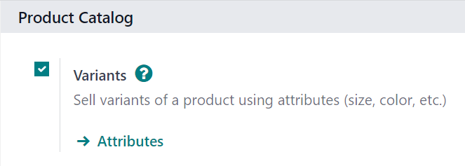
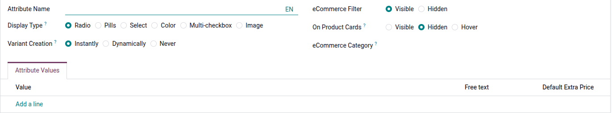
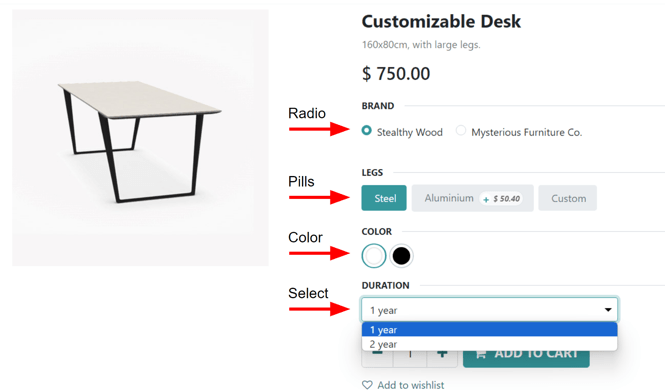
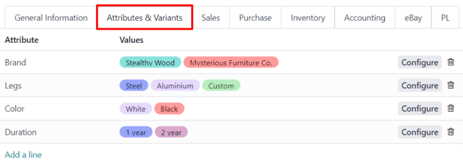
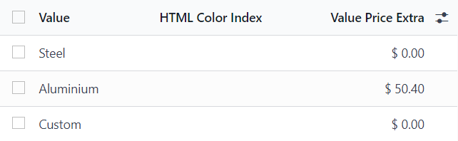
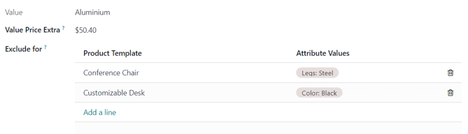
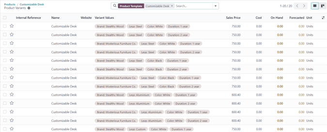

================
Product variants
================

Product variants are used to give single products a variety of different characteristics and options
for customers to choose from, such as size, style, or color, just to name a few.

Products variants can be managed via their individual product template, or by navigating to either
the :guilabel:`Product Variants` or :guilabel:`Attributes` page. All of these options are located
within the Odoo *Sales* application.

.. example::
   An apparel company has the following variant breakdown for one their best-selling t-shirts:

   - Unisex Classic Tee

     - Color: Blue, Red, White, Black
     - Size: S, M, L, XL, XXL

   Here, the **T-shirt** is the product template, and **T-shirt: Blue, S** is a specific product
   variant.

   **Color** and **Size** are *attributes*, and the corresponding options (like **Blue** and **S**)
   are *values*.

   In this instance, there is a total of twenty different product variants: four **Color** options
   multiplied by five **Size** options. Each variant has its own inventory count, sales totals, and
   other similar records in Odoo.

.. seealso::
   :doc:`/applications/websites/ecommerce/managing_products/variants`

Configuration
=============

To use product variants, the *Variants* setting **must** be activated in the Odoo *Sales*
application.

To do that, go to :menuselection:`Sales app --> Configuration --> Settings`, and locate the
:guilabel:`Product Catalog` section at the top of the page.

In that section, check the box to enable the :guilabel:`Variants` feature.

Then, click :guilabel:`Save` at the top of the :guilabel:`Settings` page.

Attributes
==========

Before product variants can be set up, attributes **must** be created. To create, manage, and modify
attributes, navigate to :menuselection:`Sales app --> Configuration --> Attributes`.

.. note::
   The order of attributes on the :guilabel:`Attributes` page dictates how they appear on the
   :guilabel:`Product Configurator`, :guilabel:`Point of Sale` dashboard, and :guilabel:`eCommerce`
   pages.

To create a new attribute from the :guilabel:`Attributes` page, click :guilabel:`New`. Doing so
reveals a blank attributes form that can be customized and configured in a number of ways.

First, create an :guilabel:`Attribute Name`, such as `Color` or `Size`.

Next, in the optional :guilabel:`Category` field, select a category from a drop-down menu to group
similar attributes under the same section for added specificity and organization.

.. note::
   To view the details related to the attribute category selected, click the internal link
   :guilabel:`➡️ (arrow)` icon to the far-right of the :guilabel:`Category` field. Doing so reveals
   that attribute category's detail form.

   .. image:: variants/attribute-category-internal-link.png
      :align: center
      :alt: A standard attribute category detail page accessible via its internal link arrow icon.

   Here, the :guilabel:`Category Name` and :guilabel:`Sequence` is displayed at the top. Followed by
   :guilabel:`Related Attributes` associated with the category. These attributes can be
   dragged-and-dropped into a desirable order of priority.

   Attributes can be directly added to the category, as well, by clicking :guilabel:`Add a line`.

.. tip::
   To create an attribute category directly from this field, start typing the name of the new
   category, then select either :guilabel:`Create` or :guilabel:`Create and edit...` from the
   drop-down menu that appears.

   Clicking :guilabel:`Create` creates the category, which can be modified later. Clicking
   :guilabel:`Create and edit...` creates the category and reveals a :guilabel:`Create Category`
   pop-up window, in which the new attribute category can be configured and customized.

Beneath the :guilabel:`Category` field are the :guilabel:`Display Type` options. The
:guilabel:`Display Type` determines how this product is shown on the online store, :guilabel:`Point
of Sale` dashboard, and :guilabel:`Product Configurator`.

The :guilabel:`Display Type` options are:

- :guilabel:`Radio`: options appear in a bullet-style list on the product page of the online store.
- :guilabel:`Pills`: options appear as selectable buttons on the product page of the online store.
- :guilabel:`Select`: options appear in a drop-down menu on the product page of the online store.
- :guilabel:`Color`: options appear as small, colored squares, which reflect any HTML color codes
  set, on the product page of the online store.

The :guilabel:`Variants Creation Mode` field informs Odoo when to automatically create a new variant
once an attribute is added to a product.

- :guilabel:`Instantly`: creates all possible variants as soon as attributes and values are added
  to a product template.
- :guilabel:`Dynamically`: creates variants **only** when corresponding attributes and values are
  added to a sales order.
- :guilabel:`Never (option)`: never automatically creates variants.

.. warning::
   Once added to a product, an attribute's :guilabel:`Variants Creation Mode` cannot be edited.

Lastly, the :guilabel:`eCommerce Filter Visibility` field determines whether these attribute options
are visible to the customer on the front-end, as they shop on the online store.

- :guilabel:`Visible`: the attribute values are visible to customers on the front-end.
- :guilabel:`Hidden`: the attribute values are hidden from customers on the front-end.

Attribute values
----------------

Attribute values should be added to the :guilabel:`Attribute Values` tab. Values can be added to an
attribute at any time, if needed.

To add a value, click :guilabel:`Add a line` in the :guilabel:`Attribute Values` tab.

Then, enter the name of the value in the :guilabel:`Value` column. Next, check the box in the
:guilabel:`Is custom value` column, if the value is custom (i.e. the customer gets to provide unique
specifications that are specific to this particular value).

.. note::
   If the :guilabel:`Display Type` - :guilabel:`Color` option is selected, the option to add an HTML
   color code will appear to the far-right of the value line, to make it easier for salespeople and
   customers to know exactly what color option they're choosing.

   .. image:: variants/attribute-value-add-a-line.png
      :align: center
      :alt: Attribute values tab when add a line is clicked, showing the custom columns.

   To choose a color, click the blank circle in the :guilabel:`Color` column, which reveals an HTML
   color selector pop-up window.

   .. image:: variants/picking-a-color.png
      :align: center
      :alt: Selecting a color from the HTML color pop-up window that appears on attribute form.

   In this pop-up window, select a specific color by dragging the color slider to a particular hue,
   and clicking on the color portion directly on the color gradient window.

   Or, choose a specific color by clicking the *dropper* icon, and selecting a desired color that's
   currently clickable on the screen.

.. tip::
   Attributes can also be created directly from the product template by adding a new line and
   typing the name into the :guilabel:`Variants` tab.

Once an attribute is added to a product, that product is listed and accessible, via the attribute's
:guilabel:`Related Products` smart button. That button lists every product in the database currently
using that attribute.

Product variants
================

Once an attribute is created, use the attribute (and its values) to create a product variant. To do
that, go to :menuselection:`Sales app --> Products --> Products`, and select an existing product to
view that desired product's form. Or, click :guilabel:`Create` to create a new product, to which a
product variant can be added.

On the product form, click the :guilabel:`Attributes \& Variants` tab to view, manage, and modify
attributes and values for the product.

To add an attribute to a product, and subsequent attribute values, click :guilabel:`Add a line` in
the :guilabel:`Attributes \& Variants` tab. Then, choose the desired attribute from the drop-down
menu that appears.

.. tip::
   Attributes can be created directly from the :guilabel:`Attributes \& Variants` tab of a product
   form. To do that, start typing the name of the new attribute in the blank field, and select
   either :guilabel:`Create` or :guilabel:`Create and edit...` from the mini drop-down menu that
   appears.

   Clicking :guilabel:`Create` creates the attribute, which can be customized later. Clicking
   :guilabel:`Create and edit...` creates the attribute, and a :guilabel:`Create Attribute` pop-up
   form appears. In the pop-up form, proceed to modify the attribute in a number of ways.

Once an attribute is selected in the :guilabel:`Attribute` column, proceed to select the specific
attribute values to apply to the product, via the drop-down menu available in the :guilabel:`Values`
column.

.. note::
   There is no limit to how many values can be added.

.. tip::
   Similar product variant creation processes are accessible through the Purchase, Inventory, and
   eCommerce applications.

Configure variants
------------------

To the far-right of the attribute line is a :guilabel:`Configure` button. When clicked, Odoo reveals
a separate page showcasing those specific :guilabel:`Product Variant Values`.

Here, the specific :guilabel:`Value` name, :guilabel:`HTML Color Index` (if applicable), and
:guilabel:`Value Price Extra` are viewable.

.. note::
   The :guilabel:`Value Price Extra` represents the increase in the sales price if the attribute is
   selected.

When a value is clicked on the :guilabel:`Product Variant Values` page, Odoo reveals a separate
page, detailing that value's related details.

On the specific product variant detail page, the :guilabel:`Value` and :guilabel:`Value Price Extra`
fields can be found, along with an :guilabel:`Exclude for` field.

In the :guilabel:`Exclude for` field, different :guilabel:`Product Templates` and specific
:guilabel:`Attribute Values` can be added. When added, this specific attribute value will be
excluded from those specific products.

Variants smart button
---------------------

When a product has attributes and variants configured in its :guilabel:`Attributes \& Variants` tab,
a :guilabel:`Variants` smart button appears at the top of the product form. The :guilabel:`Variants`
smart button indicates how many variants are currently configured for that specific product.

.. image:: variants/variants-smart-button.png
   :align: center
   :alt: The variants smart button at the top of the product form in Odoo Sales.

When the :guilabel:`Variants` smart button is clicked, Odoo reveals a separate page showcasing all
the specific product variant combinations configured for that specific product.

Impact of variants
==================

In addition to offering more detailed product options to customers, product variants have their own
impacts that can be taken advantage of throughout the Odoo database.

- :guilabel:`Barcode`: barcodes are associated with each variant, instead of the product template.
  Each individual variant can have its own unique barcode/SKU.
- :guilabel:`Price`: every product variant has its own public price, which is the sum of the
  product template price *and* any extra charges for particular attributes.

  .. example::
   A red shirt's sales price is $23 -- because the shirt's template price is $20, plus an additional
   $3 for the red color variant. Pricelist rules can be configured to apply to the product template,
   or to the variant.

- :guilabel:`Inventory`: inventory is counted for each individual product variant. On the product
  template form, the inventory reflects the sum of all variants, but the actual inventory is
  computed by individual variants.
- :guilabel:`Picture`: each product variant can have its own specific picture.

.. note::
   Changes to the product template automatically apply to every variant of that product.

.. seealso::
   :doc:`import`
