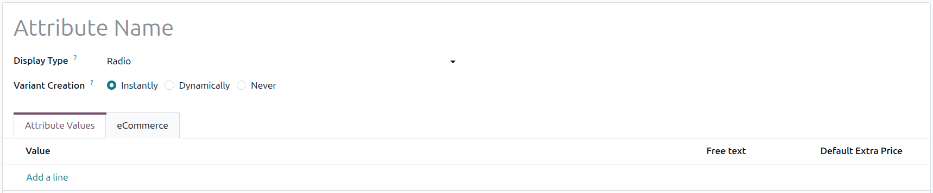
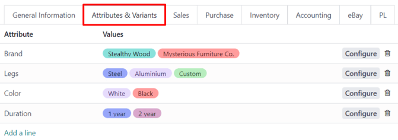
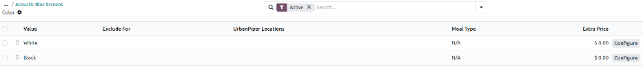
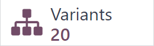
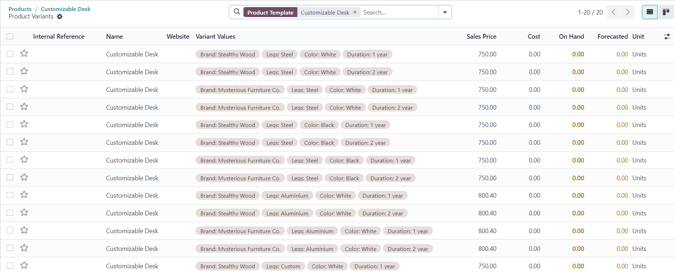

================
Product variants
================

Product variants are used to give single products a variety of different characteristics and options
for customers to choose from, such as size, style, or color, just to name a few.

Product variants can be managed by navigating to :menuselection:`Sales app --> Products -->
Products`, clicking a product with variants, and clicking the :icon:`fa-sitemap`
:guilabel:`Variants` smart button.

.. example::
   An apparel company has the following variant breakdown for one of its best-selling t-shirts:

   - Unisex Classic Tee

     - Color: Blue, Red, White, Black
     - Size: S, M, L, XL, XXL

   Here, the **T-shirt** is the product template, and **T-shirt: Blue, S** is a specific product
   variant.

   **Color** and **Size** are *attributes*, and the corresponding options (like **Blue** and **S**)
   are *values*.

   In this instance, there is a total of twenty different product variants: four **Color** options
   multiplied by five **Size** options. Each variant has its own inventory count, sales totals, and
   other similar records in Odoo.

.. seealso::
   :ref:`Product variants in the eCommerce <ecommerce/categories_variants/product-variants>`

.. _products/variants/configuration:

Configuration
=============

To use product variants, go to :menuselection:`Sales --> Configuration --> Settings`, then enable
the :guilabel:`Variants` feature in the *Product Catalog* section, and click :guilabel:`Save` at the
top of the :guilabel:`Settings` page.

.. _products/variants/attributes:

Attributes
==========

Before product variants can be set up, attributes **must** be created. To create, manage, and modify
attributes, navigate to :menuselection:`Sales app --> Products --> Attributes`.

.. note::
   The order of attributes on the :guilabel:`Attributes` page dictates how they appear on the
   *Product Configurator*, *Point of Sale* dashboard, and *eCommerce* pages.

To create a new attribute from the :guilabel:`Attributes` page, click :guilabel:`New`. Doing so
reveals a blank attributes form that can be customized and configured in a number of ways.

First, create an :guilabel:`Attribute Name`, such as `Color` or `Size`.

Next, select one of the options from the :guilabel:`Display Type` field. The :guilabel:`Display
Type` determines how this product is shown on the online store, *Point of Sale* dashboard, and
*Product Configurator*.

The following :guilabel:`Display Type` options are available:

.. tabs::

   .. group-tab:: Radio

      Options appear as radio buttons.

      .. image:: variants/radio-display-type.png
         :alt: Radio display type

   .. group-tab:: Pills

      Options appear as selectable buttons.

      .. image:: variants/pills-display-type.png
         :alt: Pills display type

   .. group-tab:: Select

      Options appear in a drop-down menu.

      .. image:: variants/select-display-type.png
         :alt: Select display type

   .. group-tab:: Color

      Options appear as small, colored circles; the colors can be defined using any HTML color code.

      .. image:: variants/color-display-type.png
         :alt: Color display type

   .. group-tab:: Multi-checkbox

      Options appear as selectable checkboxes. This allows customers to choose multiple options,
      e.g., to add extras to food orders or highly customizable products.

      .. image:: variants/multi-checkbox-display-type.png
         :alt: Multi-checkbox display type

   .. group-tab:: Image

      Options appear as images.

      .. image:: variants/image-display-type.png
         :alt: Image display type

The :guilabel:`Variant Creation` field determines when new variants are automatically created
once an attribute is added to a product. Once added to a product, an attribute's :guilabel:`Variants
Creation` mode cannot be edited.

- :guilabel:`Instantly`: Creates all possible variants as soon as attributes and values are added to
  a product template.
- :guilabel:`Dynamically`: Creates variants **only** when corresponding attributes and values are
  added to a sales order.
- :guilabel:`Never`: Prevents the automatic creation of purchaseable variants with this tag.
  Instead, this tag is treated as being informational. If more than one value is assigned to an
  attribute with this tag, all values are loaded when the product displays, since the creation of
  discrete variants is prevented.

.. important::
   If the attribute's :guilabel:`Display Type` is :guilabel:`Multi-checkbox`, you **must** set the
   :guilabel:`Variant Creation` field to :guilabel:`Never`.

In the *eCommerce* tab, the :guilabel:`Category`, :guilabel:`Filter`, :guilabel:`On Product Cards`,
and :guilabel:`Show Thumbnails` fields can be found.

- :guilabel:`Category`: Sets the category to regroup similar attributes under for comparison
  purposes.
- :guilabel:`Filter`: Determines whether these attribute options are visible to customers as they
  shop online.
- :guilabel:`On Product Cards`: Makes variants available for selection from the shop's pages. This
  option is only available if :guilabel:`Variant Creation` is set to *Instantly*.
- :guilabel:`Show Thumbnails`: Uses product variant images in place of the attribute value text.
  This option is only available if :guilabel:`Variant Creation` is set to *Instantly*.

To view the details related to an attribute category selected, simply click the category's list
entry.

   .. image:: variants/attribute-category-internal-link.png
      :alt: A standard attribute category detail page accessible via its internal link arrow icon.

   Here, the :guilabel:`Category Name` and :guilabel:`Sequence` are displayed at the top. Followed
   by :guilabel:`Related Attributes` associated with the category. These attributes can be dragged
   and dropped into a desired priority order.

   Attributes can be directly added to the category, as well, by clicking :guilabel:`Add a line`.

.. tip::
   To create an attribute category directly from this field, start typing the name of the new
   category, then select either :guilabel:`Create` or :guilabel:`Create and edit...` from the
   drop-down menu that appears.

   Clicking :guilabel:`Create` creates the category, which can be modified later. Clicking
   :guilabel:`Create and edit...` creates the category and reveals a :guilabel:`Create Category`
   pop-up window, in which the new attribute category can be configured and customized.

.. _products/variants/attributes-values:

Attribute values
----------------

Attribute values should be added in the *Attribute Values* tab. Values can be added to an attribute
at any time. To add a value, click :guilabel:`Add a line` and enter the name of the value in the
:guilabel:`Value` column.

.. _products/variants/variants:

Product variants
================

Once an attribute is created, use the attribute (and its values) to create a product variant. To do
that, go to :menuselection:`Sales app --> Products --> Products`, and select an existing product to
view that desired product's form. Or, click :guilabel:`Create` to create a new product, to which a
product variant can be added.

On the product form, click the *Attributes \& Variants* tab to view, manage, and modify attributes
and values for the product.

To add an attribute to a product and subsequent attribute values, click :guilabel:`Add a line` in
the *Attributes \& Variants* tab. Then, choose the desired attribute from the drop-down menu that
appears.

.. tip::
   Attributes can be created directly from the *Attributes \& Variants* tab of a product form. To do
   that, start typing the name of the new attribute in the blank field, and select either
   :guilabel:`Create` or :guilabel:`Create and edit...` from the mini drop-down menu that appears.

   Clicking :guilabel:`Create` creates the attribute, which can be customized later. Clicking
   :guilabel:`Create and edit...` creates the attribute, and a :guilabel:`Create Attribute` pop-up
   form appears. In the pop-up form, proceed to modify the attribute in a number of ways.

Once an attribute is selected in the :guilabel:`Attribute` column, proceed to select the specific
attribute values to apply to the product, via the drop-down menu available in the :guilabel:`Values`
column.

.. note::
   There is no limit to how many values can be added.

.. tip::
   Similar product variant creation processes are accessible through the Purchase, Inventory, and
   eCommerce applications.

.. _products/variants/configure-variants:

Configure variants
------------------

On the attribute line is a :guilabel:`Configure` button. When clicked, Odoo opens a separate page
with that product's specific product variant :guilabel:`Values`. The layout of this page may differ
slightly from what is pictured based on the apps, modules, and prior configurations of the database.

.. _products/variants/variants-smart-button:

Variants smart button
---------------------

When a product has attributes and variants configured in its *Attributes \& Variants* tab, a
:icon:`fa-sitemap` :guilabel:`Variants` smart button appears at the top of its product form. The
:icon:`fa-sitemap` :guilabel:`Variants` smart button indicates how many variants are currently
configured for that specific product. Using the smart button is the primary way to access variants
for products.

When the :icon:`fa-sitemap` :guilabel:`Variants` smart button is clicked, Odoo reveals a separate
page showcasing all the specific product variant combinations configured for that specific product.

Impact of variants
==================

In addition to offering more detailed product options to customers, product variants have their own
impacts that can be taken advantage of throughout the Odoo database.

- :guilabel:`Barcode`: barcodes are associated with each variant, instead of the product template.
  Each individual variant can have its own unique barcode/SKU.
- :guilabel:`Price`: every product variant has its own public price, which is the sum of the product
  template price *and* any extra charges for particular attributes.

  .. example::
   A red shirt's sales price is $23 -- because the shirt's template price is $20, plus an additional
   $3 for the red color variant. Pricelist rules can be configured to apply to the product template
   or to the variant.

- :guilabel:`Inventory`: Inventory is counted for each individual product variant. On the product
  template form, the inventory reflects the sum of all variants, but the actual inventory is
  computed by individual variants.
- :guilabel:`Manufacturing`: a single BoM can be used for multiple variants of the same product.
     Refer to
     :doc:`../../../../inventory_and_mrp/manufacturing/advanced_configuration/product_variants`
     documentation for more information.
- :guilabel:`Picture`: each product variant can have its own specific picture.

.. note::
   Changes to the product template automatically apply to every variant of that product.

Adding and deleting attributes from product variants
====================================================

When attributes are added or deleted from products, variants that have already been created are
affected. Depending on whether or not these variants have been used in orders, they are archived or
deleted and recreated.

- Variants that have not been used in an order are deleted and recreated with the new attributes.
  This may result in the deletion of additional customizations, depending on how the variants were
  configured.
- Variants that have been previously used in one or more orders are archived and removed from the
  product catalog instead of being deleted.

.. example::
   A business offers leather motorcycle jackets with the following attributes and values for a total
   of 27 product variants:

    - Size: Small, Medium, Large
    - Color: Black, Brown, Natural
    - Material: Leather, Vegan Leather, Premium Leather

   Due to rising costs, the business makes the decision to stop offering different leathers and
   removes the "Material" attribute from the product form. This has the following effects:

    - Any leather jacket variants that have been sold will be archived
    - Any leather jacket variants that have not been sold will be deleted
    - A new set of variants using just Size and Color attributes will be created, for a total of 9
      product variants

   The business owner can find archived product variants by navigating to the product's form,
   clicking the :icon:`fa-sitemap` :guilabel:`Variants` smart button, clicking the drop-down in the
   search bar, and finally clicking the :guilabel:`Archived` tag in the :icon:`fa-filter`
   :guilabel:`Variants`. Any deleted variants and their customizations will be lost.

.. seealso::
   :doc:`import`
