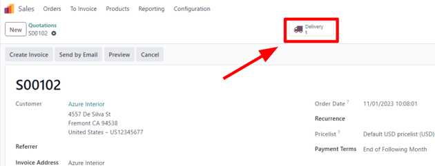
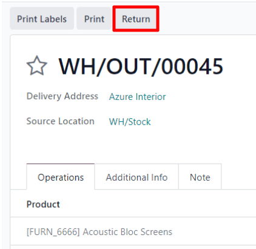
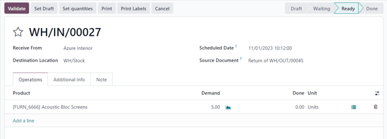
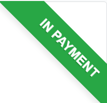
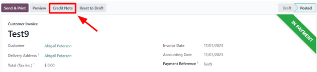
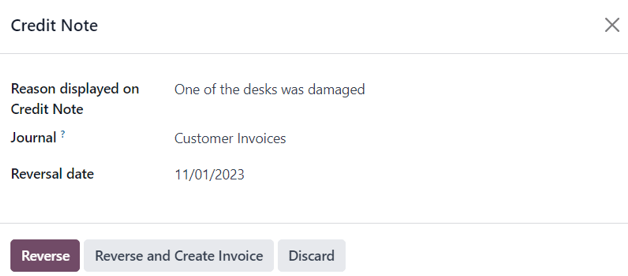

===================
Returns and refunds
===================

The Odoo *Sales* app provides two different ways to process returns. The method used depends on
whether or not an invoice has been sent.

Before invoicing
================

Returns are completed using *Reverse Transfers* when a customer decides to return a product
**before** an invoice has been sent or validated.

.. note::
   In order to use *Reverse Transfers*, the *Inventory* app **must** be installed.

To start a return before invoicing, navigate to the :menuselection:`Sales` app, select the desired
sales order, and click on the :guilabel:`Delivery` smart button to open the associated delivery
order.

On the validated delivery order, click :guilabel:`Return`.

This opens a :guilabel:`Reverse Transfer` pop-up window.

By default, the :guilabel:`Quantity` matches the validated quantities from the delivery order.
Update the quantities, if necessary. Click on the :guilabel:`🗑️ (trash)` icon next to a line item
to remove it from the return.

.. image:: returns/reverse-transfer-popup.png
   :align: center
   :alt: The "Reverse Transfer" pop-up window, to make a return before invoicing the customer.

Next, click :guilabel:`Return` to confirm the return. This generates a new warehouse operation for
the incoming returned product(s).

Upon receiving the return, the warehouse team validates the warehouse operation by clicking
:guilabel:`Validate`. Then, on the original sales order, the :guilabel:`Delivered` quantity updates
to reflect the difference between the initial validated quantities and the returned quantities.

.. image:: returns/updated-sales-quantities.png
   :align: center
   :alt: The updated "Delivered" quantity on the sales order after the reverse transfer.

When an invoice is created, the customer receives an invoice **only** for the products they are
keeping, if any.

After invoicing
===============

Sometimes, customers return an item after they receive and/or pay for their invoice. In these
cases, a return using only *Reverse Transfers* is insufficient since validated, or sent, invoices
cannot be changed.

However, *Reverse Transfers* can be used in conjunction with *Credit Notes* to complete the
customer's return.

To start a return after invoicing, navigate to the relevant sales order in the
:menuselection:`Sales` app.

If there is a payment registered on the sales order, the payment details appear in the chatter, and
the invoice (accessible through the :guilabel:`Invoices` smart button) has a green :guilabel:`In
Payment` banner.

From the sales order, click on the :guilabel:`Delivery` smart button to view the validated delivery
order. Then, click :guilabel:`Return` to open the :guilabel:`Reverse Transfer` pop-up window.

Next, edit the :guilabel:`Product` and/or :guilabel:`Quantity`, as needed for the return. Then,
click :guilabel:`Return`. This generates a new warehouse operation for the incoming returned
product(s), which is validated by the warehouse team once the return is received by clicking
:guilabel:`Validate`.

Then, on the sales order, the :guilabel:`Delivered` quantity updates to reflect the difference
between the initial validated quantities and the returned quantities.

To process a refund, navigate to the relevant invoice (from the sales order, click on the
:guilabel:`Invoices` smart button). Then, click the :guilabel:`Credit Note` button at the top of the
validated invoice.

Doing so reveals a :guilabel:`Credit Note` pop-up form.

Start by entering a :guilabel:`Reason displayed on Credit Note` and a specific :guilabel:`Journal`
to process the credit. Then, select a specific :guilabel:`Reversal Date`.

After the information is filled in, click :guilabel:`Reverse` or :guilabel:`Reverse and Create
Invoice`. Then, edit the draft, if needed.

Lastly, click :guilabel:`Confirm` to confirm the credit note.

When complete, a blue banner reading: :guilabel:`You have outstanding credits for this customer. You
can allocate them to mark this invoice as paid.` appears at the top of the page.

.. seealso::
   :doc:`../../../finance/accounting/customer_invoices/credit_notes`
