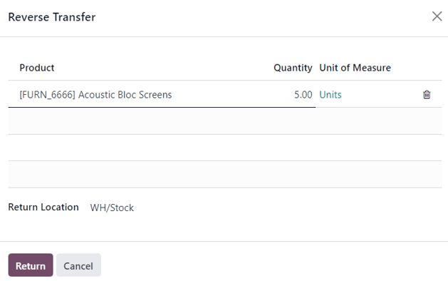
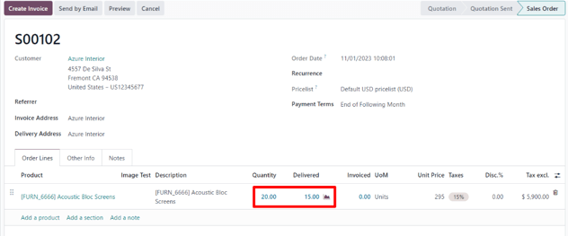
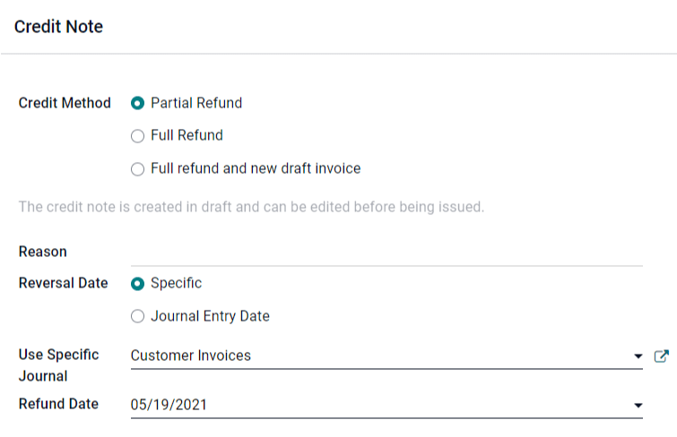

===========================
Process returns and refunds
===========================

The :guilabel:`Sales` app provides two different ways to process returns based on whether an
invoice has been sent or not.

Before invoicing
================

Returns are completed using *Reverse Transfers* when a customer decides to return a product before
an invoice has been sent or validated.

.. note::
   In order to use Reverse Transfers, the :guilabel:`Inventory` app must also be installed.

To start a return, open the :guilabel:`Sales` app, navigate to the customer's sales order, and
click on the :guilabel:`Delivery` smart button to open the associated delivery order.

On the validated delivery order, click :guilabel:`Return` to open the :guilabel:`Reverse Transfer`
pop-up window. By default, the :guilabel:`Quantity` matches the validated quantities from the
delivery order. Update the quantities if necessary. Click on the trash icon next to a line item to
remove it from the return.

Next, click :guilabel:`Return` to confirm the return. This generates a new warehouse operation for
the incoming returned product(s). Upon receiving the return, the warehouse team validates the
warehouse operation. Then, on the original sales order, the :guilabel:`Delivered` quantity will
reflect the difference between the initial validated quantities and the returned quantities.

When an invoice is created, the customer receives an invoice only for the products they are
keeping.

After invoicing
===============

Sometimes, customers return an item after they receive and/or pay for their invoice. In these
cases, a return using only *Reverse Transfers* is insufficient since validated or sent invoices
cannot be changed. However, *Reverse Transfers* can be used in conjunction with *Credit Notes* to
complete the customer's return.

To start a return, navigate to the relevant sales order. If there is a payment registered on the
sales order, then the payment details will appear in the Chatter, and the invoice (accessible
through the :guilabel:`Invoices` smart button) will have a green banner across it.

From the sales order, click on the :guilabel:`Delivery` smart button to view the validated delivery
order. Then, click :guilabel:`Return` to open the :guilabel:`Reverse Transfer` pop-up window. Next,
edit the :guilabel:`Product` or :guilabel:`Quantity` as needed for the return, and then click
:guilabel:`Return`. This generates a new warehouse operation for the incoming returned product(s),
which is validated by the warehouse team once the return is received. Then, on the sales order, the
:guilabel:`Delivered` quantity will reflect the difference between the initial validated quantities
and the returned quantities.

To process a refund, navigate to the relevant invoice (from the sales order, click on the
:guilabel:`Invoices` smart button). Click :guilabel:`Add Credit Note` from the validated invoice.

A :guilabel:`Reason` for the credit and a :guilabel:`Specific Journal` to use to process the credit
can be specified. If a :guilabel:`Specific Reversal Date` is selected, then a :guilabel:`Refund
Date` must also be selected.

After the information is filled in, click :guilabel:`Reverse`. Then, :guilabel:`Edit` the draft as
needed, and finally, click :guilabel:`Confirm` to confirm the credit note.
