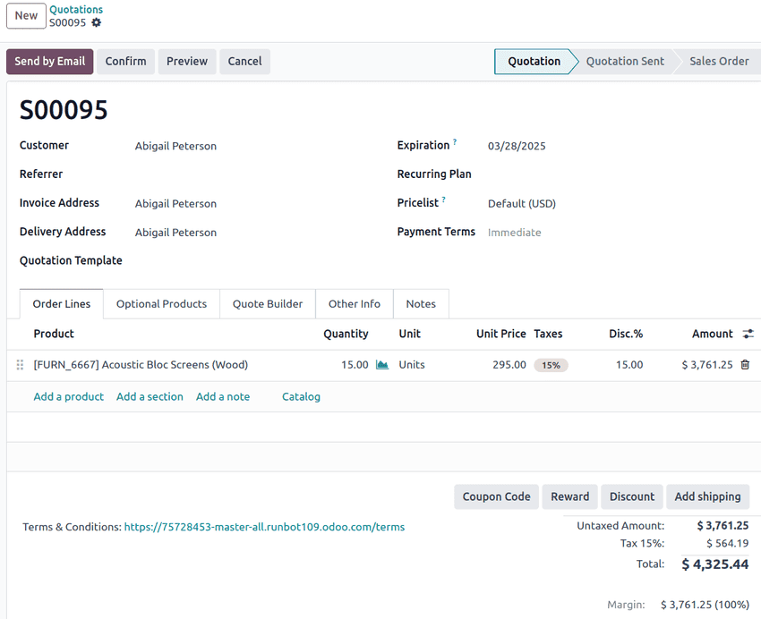

:show-content:
:hide-page-toc:

================
Sales quotations
================

A *sales quotation* or quote is a document sent to a customer that outlines the estimated costs and
terms for goods and services. Once accepted, a quotation can be converted into a sales order, which
serves as the final agreement before delivery and invoicing.

Sales flow overview
===================

Quotations fit into a broader sales flow that connects different stages of customer interactions
from initial interest to payment.

The typical flow follows these steps:

#. *Quotation*: A proposal sent to the customer with product details and pricing.
#. *Sales order*: Created automatically when the customer accepts the quotation, confirming the
   sale.
#. *Delivery* (if applicable): Products are shipped or services are delivered.
#. *Invoice*: The final bill is issued based on the sales order or delivered products/services.
#. *Payment*: The customer settles the invoice, completing the sales cycle.

This flow helps businesses track the entire lifecycle of a sale while keeping information consistent
across apps.

In Odoo, quotations are configured in the **Sales** app. They can also be generated from other apps
as part of the sales workflow:

- **CRM**: :doc:`Convert opportunities <../crm/acquire_leads/send_quotes>` into quotes to follow up
  on potential deals.
- **Helpdesk**: :doc:`Generate quotes from tickets <../../services/helpdesk/advanced/after_sales>`
  when offering paid services or products.
- **Subscriptions**: :doc:`Offer recurring services <../subscriptions>` before
  starting an automatic billing cycle.

.. cards::

   .. card:: Create quotations
      :target: sales_quotations/create_quotations

      Create, configure, and send quotations to customers.

   .. card:: Quotation templates
      :target: sales_quotations/quote_template

      Configure and use quotation templates to send tailor-fit quotations at a quicker pace.

   .. card:: Optional products
      :target: sales_quotations/optional_products

      Offer useful and related products to customers to increase sales.

   .. card:: Online signatures for order confirmations
      :target: sales_quotations/get_signature_to_validate

      Customers have the ability to confirm orders via online signatures, directly on sales orders.

   .. card:: Online payment order confirmation
      :target: sales_quotations/get_paid_to_validate

      Customers have the ability to confirm orders via online payment, directly on sales orders.

   .. card:: Quotation Deadlines
      :target: sales_quotations/deadline

      Set deadlines on quotations to encourage customers to act in a timely manner when
      closing business deals.

   .. card:: Deliver orders and invoices to different addresses
      :target: sales_quotations/different_addresses

      Specify separate customer delivery and invoicing addresses on quotations.

   .. card:: Product variants on quotations and sales orders
      :target: sales_quotations/orders_and_variants

      Add product variants to sales orders to provide additional options for single products.

   .. card:: PDF quote builder
      :target: sales_quotations/pdf_quote_builder

      Add custom PDF files to quotations to elevate the document's headers and designs.

Sales quotations in business deals
==================================

Sales quotations serve as a key step in the sales process, bridging the gap between a customer's
initial inquiry about goods and services and the final contractual agreement for payment and
delivery. The quotation also provides transparency in pricing, helping both parties negotiate and
finalize the terms before making a commitment.

Sales quotations play a crucial role in business transactions by defining the scope and cost of what
is being sold to the end-customer; setting clear expectations on pricing, delivery, tax, and
payment terms; and providing a documented stage where the business deal can be negotiated before
agreed upon.

Key components of a sales quotation
===================================

A well-structured sales quotation comprises the following:

- Quotation number and date: A unique identifier for tracking and reference, as well as the
  :doc:`dates of issue and expiration <sales_quotations/deadline>`. In Odoo **Sales** app, the
  quotation number is assigned under a standard naming convention once it is confirmed.
- Customer information: Customer name and contact information, as well as
  :doc:`invoicing and delivery address <sales_quotations/different_addresses>`.
- Products and services: Itemized listing of items to be purchased, including quantity,
  specifications (as needed), and unit price.
- Payment terms and :doc:`pricelists <products_prices/prices/pricing>`: Configured agreements and
  rules for the pricing and payment of this particular sales quotation.
- Special pricing: Optional :doc:`discounts and promotional pricing
  <products_prices/prices/pricing>` to update and/or modify individual product lines.
- Total cost and currency: Summary totals of product or service and shipping prices, including
  relevant taxes.

In Odoo's **Sales** app, quotations can include additional details and configurations that add
more detail and information, such as :doc:`quotation templates <sales_quotations/quote_template>`,
:doc:`subscription plans <../../sales/subscriptions>`, and :doc:`sales team referrer name
<sales_quotations/create_quotations>`.

.. toctree::
   :titlesonly:

   sales_quotations/create_quotations
   sales_quotations/quote_template
   sales_quotations/optional_products
   sales_quotations/get_signature_to_validate
   sales_quotations/get_paid_to_validate
   sales_quotations/deadline
   sales_quotations/different_addresses
   sales_quotations/orders_and_variants
   sales_quotations/pdf_quote_builder
