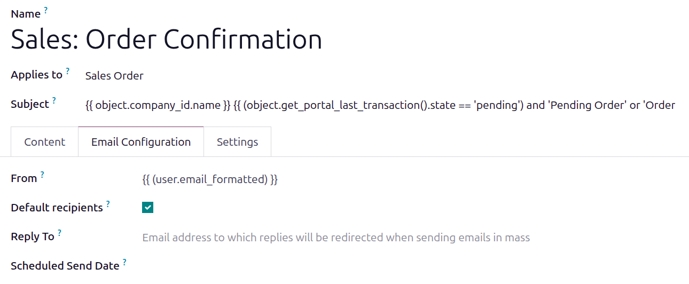
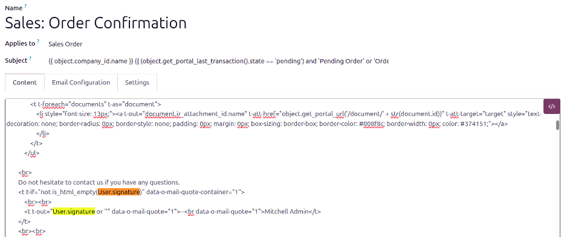

=======================
Custom email signatures
=======================

Some business workflows require email template signatures to be updated so outgoing communications
display the appropriate contact information for customer follow-up and correspondence.

This is particularly important when responsibility for a customer opportunity is shared between team
members. In these cases, the employee responsible for managing quotes and customer communications
may differ from the employee associated with the sales order for commission purposes.

Email templates default to the signature of the employee assigned to the record; therefore the
template should be modified to display the contact information of the employee responsible for
customer follow-up. This ensures customers know who to contact with questions, approvals, and other
correspondence.

.. note::
   The `Sales: Order Confirmation` email template is used as the example throughout this article to
   demonstrate how email signatures can be customized.

Open the email template
=======================

To modify an email template, first :ref:`activate developer mode <developer-mode/activation>`, then
navigate to :menuselection:`Settings app --> Technical --> Email Templates`. Click on the email
template being modified, in this case, the `Sales: Order Confirmation` template.

Update from field
=================

On the email template, open the *Email Configuration* tab. Delete the default text in the
:guilabel:`From` field and replace it with: `{{ (user.email_formatted) }}`.

Modify the code
===============

Click the *Content* tab, and highlight some text so the toolbar is visible. Click the :guilabel:`</>
(Code view)` button and the text changes to code.

Search the code for `signature` to find the two instances of the code `object.user_id.signature`.
Replace both `object.user_id.signature` instances with `User.signature`.

.. tip::
   If a user has not set up their email signature, instead of having the default `Mitchell Admin`
   populate the signature, the company name can be displayed instead.

   To do this, search for `Mitchell Admin` in the code, and replace it with the company name.
