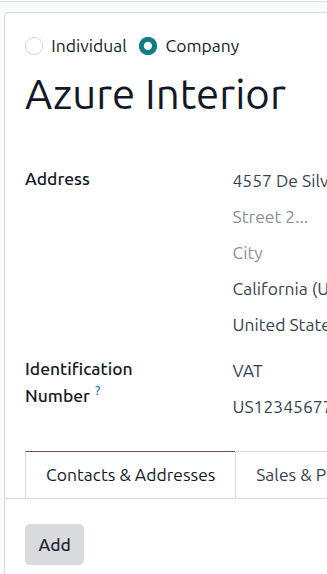
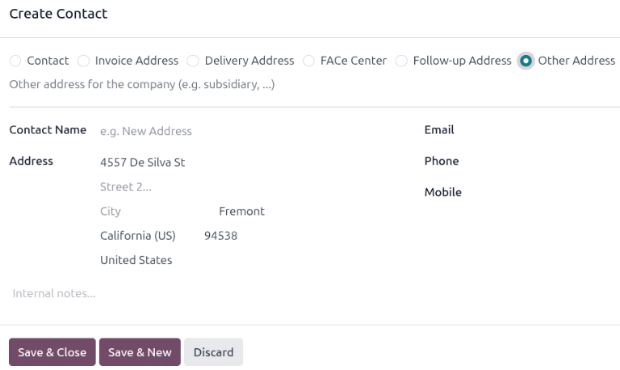
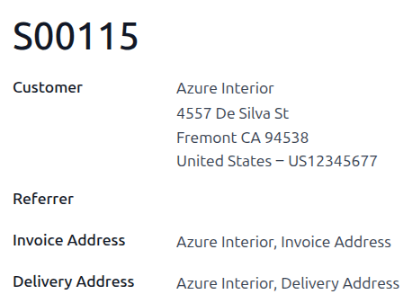

==============================================
Deliveries and invoices to different addresses
==============================================

People and businesses often use separate addresses for billing (invoicing) and shipping (delivery)
purposes. With the Odoo **Sales** app, contacts can have different specified addresses for delivery
and invoicing.

Settings
========

To properly utilize multiple addresses in Odoo, go to the :menuselection:`Accounting app -->
Configuration --> Settings`, and scroll down to the :guilabel:`Customer Invoices` heading. Then,
tick the :guilabel:`Customer Addresses` checkbox.

.. image:: different_addresses/customer-addresses-setting.png
   :alt: Activate the Customer Addresses setting.

.. _sales/send_quotations/contact-form-config:

Contact form configuration
==========================

To add multiple addresses to a contact, go to the :menuselection:`Sales app --> Orders -->
Customers`, and clear any default filters from the search bar. Then, click on the desired customer
to open their contact form.

.. tip::
   Contact forms can be accessed in the **Contacts** application, as well.

From the contact form, click the :guilabel:`Add Contact` button, which is located under the
:guilabel:`Contacts` tab. This brings up the :guilabel:`Create Contact` pop-up form, in which
additional addresses can be configured.

On the :guilabel:`Create Contact` pop-up form, select any of the following options:

- :guilabel:`Contact`: Adds another contact, such as an employee at a company, to the contact form.
- :guilabel:`Invoice`: Adds a default invoice address to the contact form.
- :guilabel:`Delivery`: Adds a default delivery address to the contact form.
- :guilabel:`Other Address`: Adds an alternate address to the contact form.

Once the corresponding information has been entered, click :guilabel:`Save & Close` to save the
address and close the :guilabel:`Create Contact` window. To save the address and input additional
contact information, click :guilabel:`Save & New` instead.

Quotations and autopopulated addresses
======================================

When a customer with invoice and delivery addresses in their contact form is added to a quotation,
the :guilabel:`Invoice Address` and :guilabel:`Delivery Address` fields autopopulate with the
corresponding addresses.

The :guilabel:`Invoice Address` and :guilabel:`Delivery Address` can also be edited directly from
the quotation by mousing over the address and clicking the :icon:`oi-arrow-right`
:guilabel:`(Internal Link)` icon.
