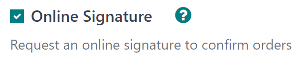
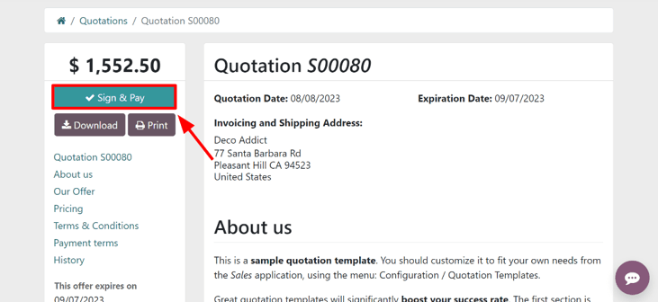
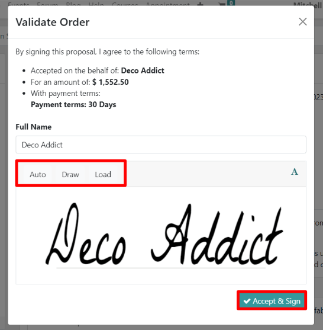

=========================================
Online signatures for order confirmations
=========================================

The Odoo *Sales* application provides customers with the ability to confirm orders, via an online
signature, directly on the sales order. Once the sales order is electronically signed by the
customer, the salesperson attached to the sales order is instantly notified that the order is
confirmed.

Activate online signatures
==========================

In order to have customers confirm orders with an online signature, the *Online Signature* feature
**must** be activated.

To activate the *Online Signature* feature, go to :menuselection:`Sales app --> Configuration -->
Settings`, scroll to the :guilabel:`Quotations \& Orders` heading, and activate the
:guilabel:`Online Signature` feature by checking the box beside it.

Then, click the :guilabel:`Save` button in the top-left corner.

.. note::
   When making a quotation template, the online signature feature is the :guilabel:`Signature`
   option, located in the :guilabel:`Online confirmation` field of the quotation template form.

   .. image:: get_signature_to_validate/signature-feature-quotation-template.png
      :align: center
      :alt: The Online confirmation signature option found on every quotation template in Odoo.

   On standard quotations, the online signature feature is the :guilabel:`Signature` option, located
   under the :guilabel:`Other Info` tab of the quotation form.

   .. image:: get_signature_to_validate/signature-other-info-tab.png
      :align: center
      :alt: The online signature feature option in the Other Info tab of a quotation form in Odoo.

Order confirmations with online signatures
==========================================

When clients access quotations online through their customer portal, there's a :guilabel:`Sign \&
Pay` button directly on the quotation.

When clicked, a :guilabel:`Validate Order` pop-up window appears. In this pop-up window, the
:guilabel:`Full Name` field is auto-populated, based on the contact information in the database.

Then, customers have the option to enter an online signature with any of the following options:
:guilabel:`Auto`, :guilabel:`Draw`, or :guilabel:`Load`.

:guilabel:`Auto` lets Odoo automatically generate an online signature based on the information in
the :guilabel:`Full Name` field. :guilabel:`Draw` lets the customer use the cursor to create a
custom signature directly on the pop-up window. And :guilabel:`Load` lets the customer upload a
previously-created signature file from their computer.

After the customer has chosen any of the three previously mentioned signature options
(:guilabel:`Auto`, :guilabel:`Draw`, or :guilabel:`Load`), they will click the :guilabel:`Accept \&
Sign` button.

When :guilabel:`Accept \& Sign` is clicked, the various payment method options become available for
them to choose from (if the *online payment* option applies to this quotation).

Then, when the quotation is paid and confirmed, a delivery order is automatically created (if the
Odoo *Inventory* app is installed).

.. seealso::
   - :doc:`quote_template`
   - :doc:`get_paid_to_validate`
