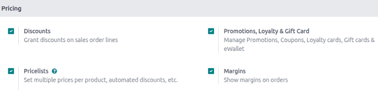
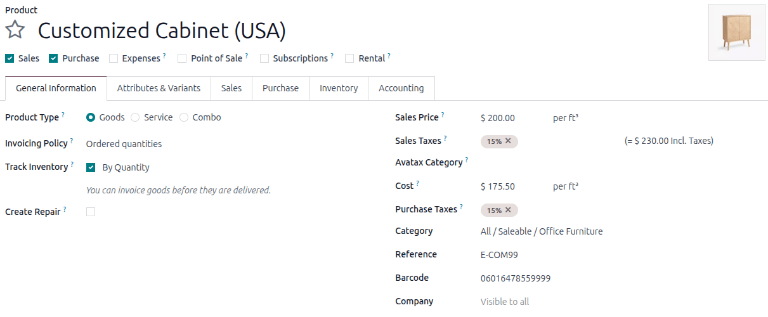
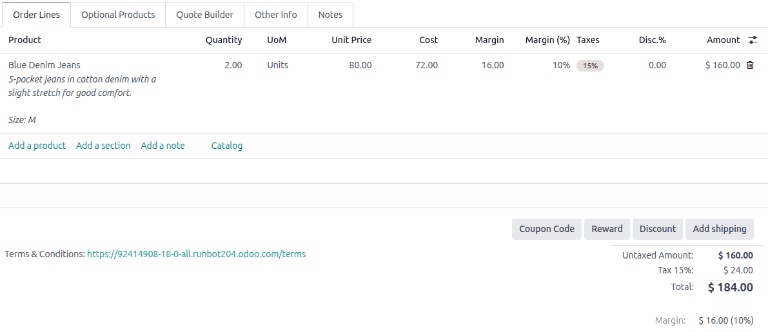

=======
Margins
=======

The sales margin is the profit gained from the sale of a product or service after all the costs
related to it have been accounted for.

In the Odoo **Sales** application, it is possible to show sales margins on quotations and sales
orders. Salespeople can use the feature for better management and monitoring of profitability.

Configuration
=============

To activate the *Margins* feature, go to the :menuselection:`Sales app --> Configuration -->
Settings`. In the :guilabel:`Pricing` section, tick the :guilabel:`Margins` checkbox. Then click
:guilabel:`Save`.

.. _sales_quotations/margin/configure-price-and-cost:

Configure price and cost
------------------------

To automatically calculate the sales margin for each quotation or sales order line item, go to
:menuselection:`Sales app --> Products --> Products`. Fill out the :guilabel:`Sales Price` and
:guilabel:`Cost` fields in the :guilabel:`General Information` tab for every product.

Odoo calculates the margin by:

.. math::
   Sales~Margin = Sales~Price - Cost

The margin percentage is calculated by:

.. math::
   \frac{Sales~Price - Cost~Price}{Sales~Price} \times 100

Compute margins on sales orders
===============================

Go to :menuselection:`Sales app --> Orders --> Quotations` and click the :guilabel:`New` button to
begin a new quotation. Fill out the quotation with the necessary information. While adding products
to the quotation, a new field, :guilabel:`Margin`, automatically appears at the bottom of the
document. This field displays the order's total margin in the configured currency as well as the
percentage.

To display a product's margin and the margin percentage per line item, click the
:icon:`oi-settings-adjust` :guilabel:`(settings adjust)` icon in the :guilabel:`Order Lines` tab.

Then, tick the checkboxes for :guilabel:`Margin` and :guilabel:`Margin(%)`. The :guilabel:`Margin`
column shows the profit to earn from the sale after accounting for all associated costs. It displays
in the configured currency value. The :guilabel:`Margin(%)` shows the margin value as a percentage.
The margin for one unit is multiplied by the quantity to determine the margin for the entire line.

The :guilabel:`Margin` and :guilabel:`Margin(%)` columns are not displayed by default, but once
enabled, the columns appear on all new and existing quotations and :abbr:`SOs (sales orders)`.

.. image:: margin/so-with-margins-checkboxes.png
   :alt: Sales order with Margin and Margin(%) columns displayed.

.. note::
   The :guilabel:`Margin` and :guilabel:`Margin (%)` columns are not editable since they are
   automatic calculations. To change the calculation, refer to :ref:`Configure price and cost
   <sales_quotations/margin/configure-price-and-cost>` section for more information.

Margin calculation with a pricelist
===================================

To calculate the margin with an applied pricelist, begin with configuring a pricelist for the
product. Follow these steps:

#. Go to :menuselection:`Sales app --> Products --> Pricelists` and click the :guilabel:`New`
   button.
#. Enter the name of the pricelist and click :guilabel:`Add a line` to create a new pricelist
   rule.
#. Configure the pricelist and click :guilabel:`Save & Close` button.
#. Go to :menuselection:`Sales app --> Orders --> Quotations` and create a quotation.
#. In the :guilabel:`Pricelist` field, select the newly made pricelist.
#. Click on :guilabel:`Update Prices` to refresh the product price and margin.

.. example::
   To apply a seasonal 5% discount on blue denim jeans that requires a minumim of two pairs of jeans
   in an order and is valid only from October to the end of December, the pricelist rule should look
   like this:

   .. image:: margin/pricelist-configuration.png
      :alt: Pricelist Rules pop-up window.

   After saving the pricelist, go to the desired :abbr:`SO (sales order)` and select the newly
   created pricelist, and adjust the quantity according to the pricelist's rule.

   .. image:: margin/so-with-pricelist.png
      :alt: Sales order with a new pricelist selected.

   After the changes are made, click :icon:`fa-refresh` :guilabel:`Update Prices` to update the
   :guilabel:`Margin`, :guilabel:`Margin (%)`, and :guilabel:`Amount`. The margin is recalculated
   based on the pricelist-adjusted product's sales price and cost.

   .. image:: margin/so-with-applied-pricelist.png
      :alt: Sales order with margins recalculated based on the price-list adjustment.

.. tip::
   Another way to visualize the impact of margins on sales orders is to go to :menuselection:`Sales
   app --> Orders --> Quotations`, select the :icon:`fa-area-chart` :guilabel:`(area chart)` icon or
   :icon:`oi-view-pivot` :guilabel:`(pivot)` icon, click :guilabel:`Measures` button and change it
   to :guilabel:`Margin` to see margin contributions across the customer base.

