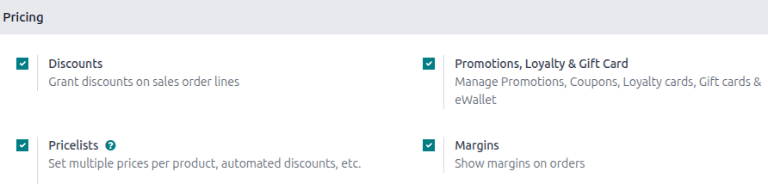
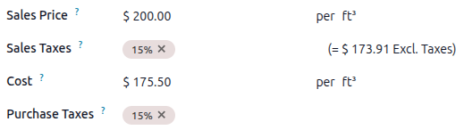
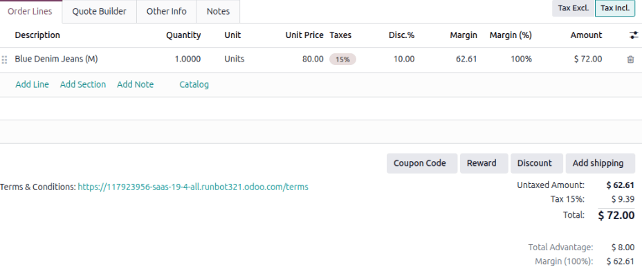
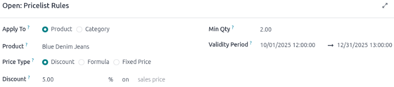
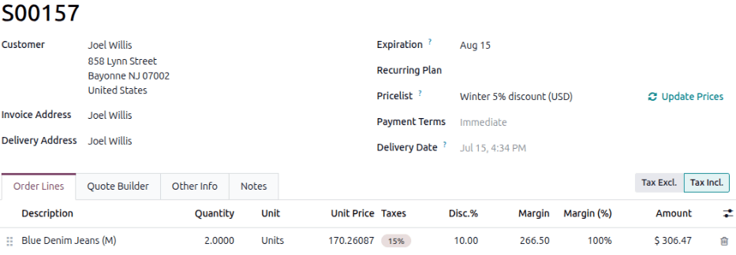
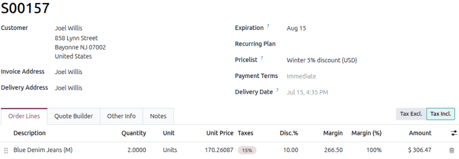

=======
Margins
=======

A *sales margin* is the profit gained from the sale of a product or service after all the costs
related to it have been accounted for.

In the Odoo **Sales** app, it is possible to show sales margins on quotations and sales orders
(SOs). Salespeople can use the feature for better management and monitoring of profitability.

Configuration
=============

To activate the *Margins* feature, go to the :menuselection:`Sales app --> Configuration -->
Settings`. In the :guilabel:`Pricing` section, enable the :guilabel:`Margins` checkbox. Then click
:guilabel:`Save`.

.. _sales_quotations/margin/configure-price-and-cost:

Configure price and cost
------------------------

Each individual product must be configured to automatically calculate the sales margin on each
quotation and :abbr:`SO (sales order)` line. To enable this feature, navigate to
:menuselection:`Sales app --> Products --> Products`. Click :guilabel:`New` and on the product form
fill out the :guilabel:`Sales Price` and :guilabel:`Cost` fields in the *General Information* tab.

Odoo calculates the margin with the following formula:

.. math::
   Sales~Margin = Sales~Price - Cost

The margin percentage is calculated with the following formula:

.. math::
   \frac{Sales~Price - Cost~Price}{Sales~Price} \times 100

Compute margins on sales orders
===============================

To calculate the margins on a :abbr:`SO (sales order)`, navigate to :menuselection:`Sales app -->
Orders --> Quotations` and :ref:`create a new quotation <sales/create_quotations/create-quotation>`.
While adding products to the quotation, a new field, :guilabel:`Margin`, automatically appears at
the bottom of the to the quotation. This field displays the order's total margin in the configured
currency as well as the percentage.

Compute margins on sales order lines
------------------------------------

To display a product's margin and the margin percentage per line item, click the
:icon:`oi-settings-adjust` :guilabel:`(settings adjust)` icon in the :guilabel:`Order Lines` tab.
Then, select the checkboxes for :guilabel:`Margin` and :guilabel:`Margin (%)`. The
:guilabel:`Margin` and :guilabel:`Margin (%)` columns are not displayed by default, but once
enabled, the columns appear on all new and existing quotations and :abbr:`SOs (sales orders)`.

The :guilabel:`Margin` column shows the profit earned from the sale after accounting for all
associated costs, in the configured currency value. The :guilabel:`Margin (%)` shows the margin
value as a percentage. The margin for one unit is multiplied by the quantity to determine the margin
for the entire line.

Editing the :guilabel:`Margin` column automatically recalculates the :guilabel:`Unit Price` of the
product on the :abbr:`SO (sales order)`. Both columns can be edited on the :abbr:`SO (sales order)`
until an invoice is created.

.. note::
   The :guilabel:`Margin (%)` column becomes read-only when the line item cost is `0`. To change the
   calculations for :guilabel:`Margin` and :guilabel:`Margin (%)` columns on the product form, refer
   to the :ref:`sales_quotations/margin/configure-price-and-cost` section for more information.

Margin calculation with a pricelist
===================================

To calculate the margin with an applied pricelist, begin with configuring a pricelist for the
product. Follow these steps:

#. Go to :menuselection:`Sales app --> Products --> Pricelists` and click the :guilabel:`New`
   button.
#. Enter the name of the pricelist and click :guilabel:`Add a line` to :ref:`create a new pricelist
   rule <sales/products/price-rules>`.
#. Configure the pricelist and click :guilabel:`Save & Close` button.
#. Go to :menuselection:`Sales app --> Orders --> Quotations` and :ref:`create a quotation
   <sales/create_quotations/create-quotation>`.
#. In the :guilabel:`Pricelist` field, select the newly made pricelist.
#. Click on :guilabel:`Update Prices` to refresh the product price and margin.

Use case: Conditional discounts
-------------------------------

A clothing store wants to create a seasonal 5% discount on blue denim jeans. The discount requires a
minimum of two pairs of jeans in an order and is valid only from October to the end of December.

First go to :menuselection:`Sales app --> Products --> Pricelists` and create a new pricelist for
the seasonal discount. Click :guilabel:`Add a line` to configure a price rule for seasonal discount.
Include the specific product it applies to, the type of discount, the minimum quantity needed to
trigger the discount, and the date range the discount is active.

After saving the pricelist, go to a :abbr:`SO (sales order)` containing blue denim jeans and select
the newly created pricelist in the :guilabel:`Pricelist` field.

.. important::
   The discount only applies if the :abbr:`SO (sales order)` meets both the date range and minimum
   quantity requirements.

After the changes are made, click :icon:`fa-refresh` :guilabel:`Update Prices` to update the
:guilabel:`Margin`, :guilabel:`Margin (%)`, and :guilabel:`Amount`. The margin is recalculated based
on the pricelist-adjusted product's sales price and cost.

.. tip::
   Another way to visualize the impact of margins on :abbr:`SOs (sales orders) is to view the
   quotations data as a graph or chart. Go to :menuselection:`Sales app --> Orders --> Quotations`,
   then click either the :icon:`fa-area-chart` :guilabel:`(Graph)` icon or the :icon:`oi-view-pivot`
   :guilabel:`(Pivot)` icon. Next, click the :guilabel:`Measures` drop-down button and deselect
   :guilabel:`Total` and select :guilabel:`Margin`. This presents all margin contributions across
   the customer base.

