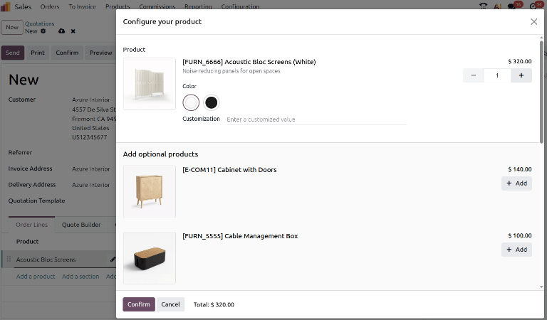
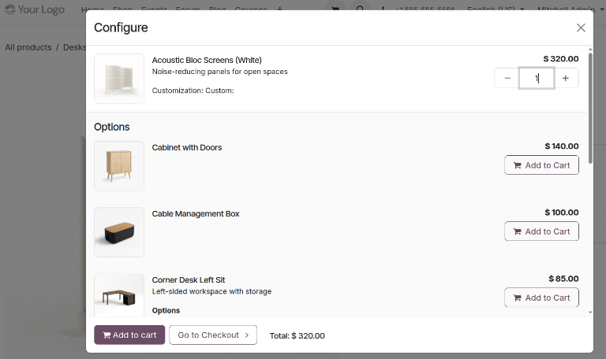
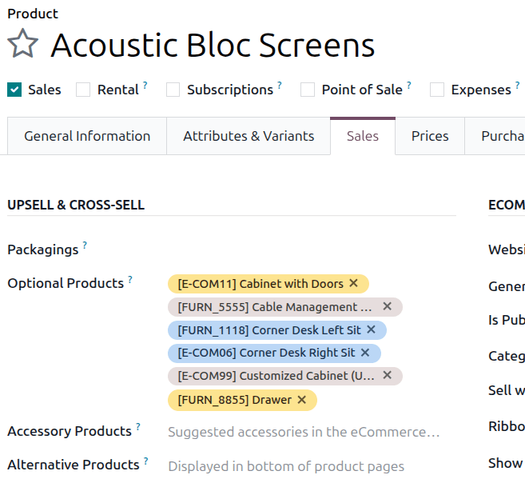
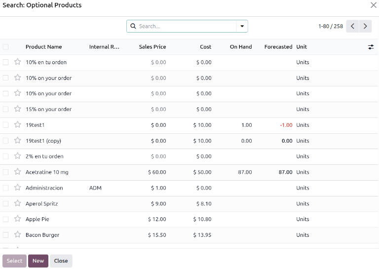
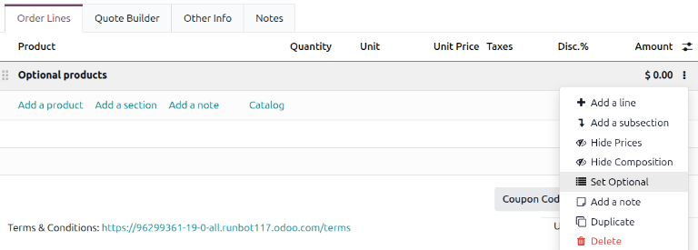
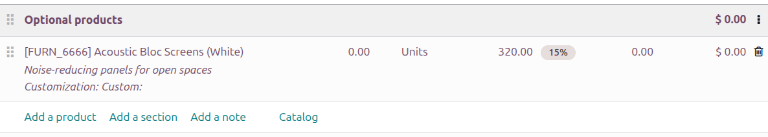

=================
Optional products
=================

The use of optional products is a marketing strategy that involves the cross-selling of useful and
related products alongside a desired core product. For instance, when a business configures optional
products in their Odoo database, an eCommerce or Website customer could be suggested a mouse and
keyboard or an extended warranty when they add a laptop to their shopping cart.

Optional products are automatically suggested during the quotation process whenever an associated
core product is added to a quote. They are also suggested in eCommerce interactions when a customer
adds an associated core product to their shopping cart.

.. note::
   Optional products are differentiated from accessory products and alternative products by where
   they appear in the customer's shopping experience.

   - Optional products are suggested when a core product has been added to a cart or a quotation.
   - Accessory products appear as suggestions when viewing an eCommerce cart.
   - Alternative products are suggested at the bottom of an eCommerce product page whenever the
     product page is viewed.

   Optional products as they appear during the quotation process.

   Optional products as they appear when viewing the shopping cart on an eCommerce website.

Configuring optional products
=============================

With the Odoo **Sales** app, it is possible to add optional products directly to product forms. To
add an optional product to a product form, navigate to :menuselection:`Sales --> Products -->
Products` and choose a product.

Ensure that the product's :guilabel:`Sales` checkbox is checked and click the :guilabel:`Sales` tab.
Under :guilabel:`Upsell & Cross-sell` heading, the :guilabel:`Optional Products` drop-down menu
allows for optional products to be set. Products will be displayed in alphabetical order. If the
desired product isn't readily visible, type its name in the field to bring it up, then select it to
add it as an optional product.

To delete an optional product from the product form, simply click the :icon:`fa-times`
:guilabel:`(Delete)` icon.

Additional products can also be added to a core product by clicking :guilabel:`Search more...`. This
opens the :guilabel:`Search: Optional Products` form, which displays all products in the catalog and
includes the :guilabel:`New` button to create a new product. Multiple products may be selected as
optional products at once when using this form by clicking their checkboxes and then clicking
:guilabel:`Select`.

Setting optional product sections in quotations
===============================================

When developing a quotation for customers, entire sections of the quotation can be set as optional
products, even if they haven't been configured in the product form. To create a section, click the
:guilabel:`Add a section` link and enter its desired name in the :guilabel:`Enter a description`
field. Click the :icon:`fa-ellipsis-v` :guilabel:`(drop-down menu)` and choose :icon:`fa-list`
:guilabel:`Set Optional`.

Once a section is set to optional, the font color changes to reflect its status. All products within
that section default to a quantity of `0`, ensuring they are not included in the total cost
automatically. Both portal users (such as customers or vendors) and employees with access to create
quotations and sales orders can update these quantities. Once a quantity is set to `1` or more, the
product is added to the quote total.

Once an optional product section has been created in a quotation, users who have been :doc:`granted
portal access <../../../general/users/user_portals/portal_access>` can interact with the quotation
there. They can view the quotation and decide whether or not to add the optional products to their
final sales order.

.. seealso::
   :doc:`quote_template`
