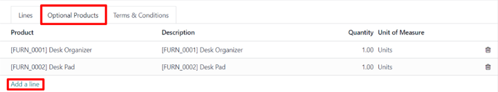

=================
Optional products
=================

The use of optional products is a marketing strategy that involves the cross-selling of products
along with a core product. The aim is to offer useful and related products to customers, which may
result in an increased sale.

For instance, if a customer wants to buy a car, they have the choice to order massaging seats, as
well, or ignore the offer and simply buy the car. Presenting the choice to purchase optional
products enhances the customer experience.

Optional products on quotations
===============================

With the Odoo *Sales* application, it is possible to add or modify optional products directly on
quotations by navigating to the :guilabel:`Optional Products` tab on a quotation form.

.. image:: optional_products/optional-products-tab.png
   :align: center
   :alt: How to add optional products to your quotations on Odoo Sales.

To add an optional product(s) to a quotation, click :guilabel:`Add a product` in the
:guilabel:`Optional Products` tab of a quotation. Doing so reveals a blank field in the
:guilabel:`Product` column.

When clicked, a drop-down menu with products from the database appear. Select the desired product
from the drop-down menu to add it as an optional product to the quotation template.

.. tip::
   If the desired product isn't readily visible, type the name of the desired product in the field,
   and the option appears in the drop-down menu. Then, select that desired product to add it to the
   quotation.

.. note::
   When a product is added, the default :guilabel:`Quantity` is `1`, but that can be edited at any
   time.

To delete any line item from the :guilabel:`Optional Products` tab, click the :guilabel:`🗑️ (trash
can)` icon.

Click the :guilabel:`Preview` button, located in the upper-left corner of the quotation, to reveal a
preview of the quotation customers would receive, via email, along with the optional products they
can potentially add to their order, located in the :guilabel:`Options` section.

.. image:: optional_products/optional-products-checkout.png
   :align: center
   :alt: Preview your quotations on Odoo Sales.

Customers are able to add different optional products to an order by clicking the :guilabel:`🛒
(shopping cart)` icon, located to the right of the optional product line.

If a customer selects optional products, these are automatically added to the quotation managed by
the salesperson.

When the customer adds an optional product(s) to an order, the salesperson is instantly notified
about the change, along with any other change the customer makes to an order. This allows
salespeople to stay up-to-date with everything related to an order in the backend of the *Sales*
application.

Optional products on quotation templates
========================================

.. note::
   Be sure to review the :doc:`quote_template` documentation to better understand how quotation
   templates work before reading the following information.

For quotation templates, just like a typical quotation form, there is also an :guilabel:`Optional
Products` tab, wherein related products or services can be added to a quotation template.

To add optional products to a quotation template, navigate to :menuselection:`Sales app -->
Configuration --> Quotation Templates`. Then, either select an existing quotation template to edit,
or create a new one by clicking :guilabel:`New`.

On the quotation template form, click the :guilabel:`Optional Products` tab. Under the
:guilabel:`Optional Products` tab, click :guilabel:`Add a line`, and select the desired product to
add as an optional product to the quotation template.

The products added in the :guilabel:`Optional Products` tab are present in the quotation, by
default, whenever that particular quotation template is used. These products can be removed, and
additional products can be added, before the quotation is sent to a customer.

.. tip::
   It's best to offer optional products that would encourage a customer to add additional items to
   their order, or entice them to purchase a more expensive version of their initially selected
   product.

   For example, if a customer purchases a wooden chair, some optional products could be: a warranty
   on that chair and/or a wooden chair with leather seats.

.. note::
   There is no limit to how many optional products can be added to a quotation template.

.. seealso::
   :doc:`quote_template`
