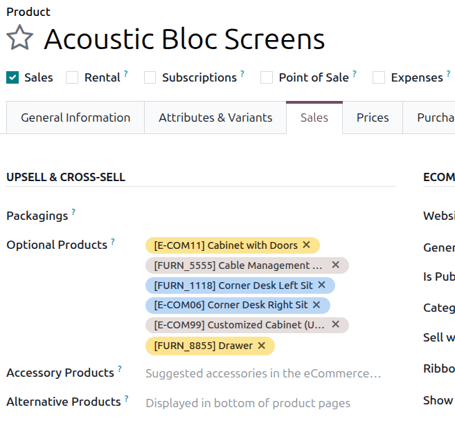
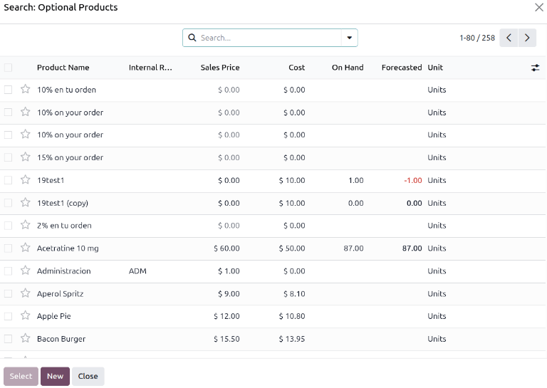

=================
Optional products
=================

The use of optional products is a marketing strategy that involves the cross-selling of useful and
related products alongside a desired core product. For instance, when a business configures optional
products in their Odoo database, an eCommerce or Website customer could be suggested a mouse and
keyboard or an extended warranty when they add a laptop to their shopping cart.

Optional products are automatically suggested during the quotation process whenever an associated
core product is added to a quote. They are also suggested in e-commerce interactions when a customer
adds an associated core product to their shopping cart.

.. note::
   Optional products differ from :doc:`accessory and alternative products
   </applications/websites/ecommerce/products/cross_upselling>` in terms of where they are displayed
   during customers' online shopping journeys.

Configuring optional products
=============================

With the Odoo **Sales** app, it is possible to add optional products directly to product forms. To
add an optional product to a product form, navigate to :menuselection:`Sales --> Products -->
Products` and choose a product.

Ensure that the product's :guilabel:`Sales` checkbox is checked and click the :guilabel:`Sales` tab.
Under :guilabel:`Upsell & Cross-sell` heading, the :guilabel:`Optional Products` drop-down menu
allows for optional products to be set. Products will be displayed in alphabetical order. If the
desired product isn't readily visible, type its name in the field to bring it up, then select it to
add it as an optional product.

To delete an optional product from the product form, simply click the :icon:`fa-times`
:guilabel:`(Delete)` icon.

Additional products can also be added to a core product by clicking :guilabel:`Search more...`. This
opens the :guilabel:`Search: Optional Products` form, which displays all products in the catalog and
includes the :guilabel:`New` button to create a new product. Multiple products may be selected as
optional products at once when using this form by clicking their checkboxes and then clicking
:guilabel:`Select`.

Optional products on quotation templates and quotations
=======================================================

Optional products can be added to quotation templates, allowing sales staff to offer related
products without needing to manually add them to each quote. Additional optional products can also
be added to individual quotations when needed.

Quotations
----------

To add additional products on an individual quote, navigate to :menuselection:`Sales --> Orders -->
Quotations` and select an existing quote or :doc:`create a new quote <create_quotations>`. Then open
the :guilabel:`Optional Products` tab. Doing so reveals a blank field in the :guilabel:`Product`
column. Click :guilabel:`Add a product`. When clicked, a drop-down menu with products from the
database appear. Select the desired product from the drop-down menu to add it as an optional
product. Type the name of the desired product or click :guilabel:`Search More...` to find additional
products.

To delete any line item from the :guilabel:`Optional Products` tab, click the :icon:`fa-trash-o`
:guilabel:`(delete)` icon.

.. note::
   When a product is added, the default :guilabel:`Quantity` is `1`, but can be updated.

Quotation templates
-------------------

Quotation templates also have an *Optional Products* tab, where related products or services can be
added. To add optional products to a quotation template, navigate to :menuselection:`Sales app -->
Configuration --> Quotation Templates`. Then, either select an existing quotation template to edit
or :doc:`create a new one <quote_template>`.

On the quotation template form, click the :guilabel:`Optional Products` tab. Then, click
:guilabel:`Add a line` and select the desired product to add as an optional product to the quotation
template.

When the configured quotation template is used, the products added in the :guilabel:`Optional
Products` tab will appear in the corresponding tab in the quotation. These products can be removed
and additional products can be added before the quotation is sent to a customer.

.. image:: optional_products/optional-products-tab-quotation-template.png
   :alt: The Optional Products section in a quotation template in Odoo Sales.

.. note::
   There is no limit to how many optional products can be added to a quotation template.

Previewing optional products
============================

Click the :guilabel:`Preview` button, located in the upper-left corner of the quotation, to reveal a
preview of the quotation email customers would receive. Optional products are located in the
:guilabel:`Options` section of the preview.

Customers are able to add different optional products to an order by clicking the
:icon:`fa-shopping-cart` :guilabel:`(Add to cart)` icon, located to the right of the optional
product line.

.. image:: optional_products/optional-products-options-section.png
   :alt: The Options section within a quotation preview.

If a customer selects optional products, they are automatically added to the quotation managed by
the salesperson.

When a customer adds optional products to an order, the salesperson is instantly notified about the
change, along with any other change the customer makes to an order. This allows salespeople to stay
up-to-date with everything related to an order in the backend of the *Sales* application. Added
products appear in green in the :guilabel:`Optional Products` tab when the quote is viewed.

.. seealso::
   :doc:`quote_template`
