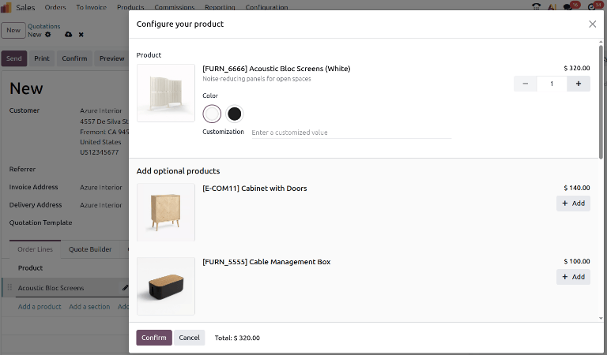
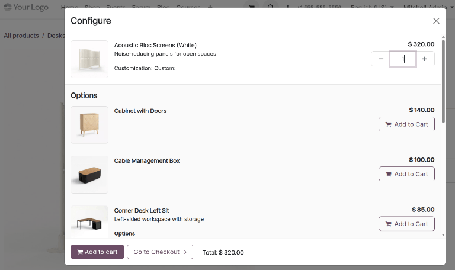

=================
Optional products
=================

The use of optional products is a marketing strategy that involves the cross-selling of useful and
related products alongside a desired core product. For instance, by configuring optional products, a
customer could be suggested a mouse and keyboard or an extended warranty when they add a laptop to
their shopping cart.

Optional products are automatically suggested during the quotation process whenever an associated
core product is added to a quote. They are also suggested in eCommerce interactions when a customer
adds an associated core product to their shopping cart.

.. note::
   Optional products are differentiated from accessory products and alternative products by where
   they appear in the customer's shopping experience.

   - Optional products are suggested when a core product has been added to a cart or a quotation.
   - Accessory products appear as suggestions when viewing an eCommerce cart.
   - Alternative products are suggested at the bottom of an eCommerce product page whenever the
     product page is viewed.

Configuring optional products
=============================

With the Odoo **Sales** app, it is possible to add optional products directly to product forms. To
add an optional product to a product form, navigate to :menuselection:`Sales --> Products -->
Products` and choose a product. Ensure that the product's :guilabel:`Sales` checkbox is checked and
click the :guilabel:`Sales` tab. Under :guilabel:`UPSELL & CROSS-SELL` section, the
:guilabel:`Optional Products` drop-down menu allows for optional products to be set. Products will
be displayed in alphabetical order. If the desired product isn't readily visible, type its name in
the field to bring it up, then select it to add it as an optional product.

To delete an optional product from the product form, simply click the :icon:`fa-times`
:guilabel:`(Delete)` icon.

.. image:: optional_products/optional-products-product-form.png
   :alt: The optional products section of product forms in Odoo Sales

Additional products can also be added to a core product by clicking :guilabel:`Search more...`. This
opens the :guilabel:`Search: Optional Products` form, which displays all products in the catalog and
includes the :guilabel:`New` button to create a new product. Multiple products may be selected as
optional prodcuts at once when using this form by clicking their checkboxes and then clicking
:guilabel:`Select`.

.. image:: optional_products/search-optional-products-form.png
   :alt: The Search: Optional Products form accessed by clicking Search more...

.. seealso::
   :doc:`quote_template`
