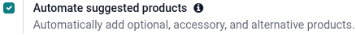
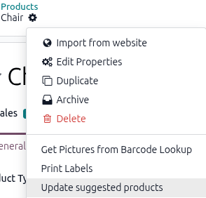
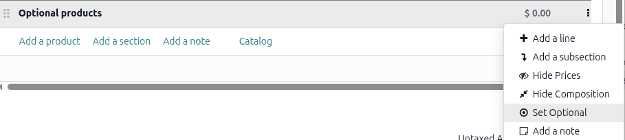
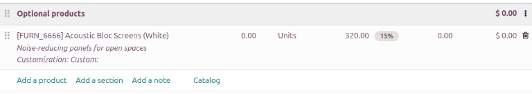

=================
Optional products
=================

The use of optional products is a marketing strategy that involves the cross-selling of useful and
related products alongside a desired core product. For instance, when a business configures optional
products in their Odoo database, an eCommerce or Website customer could be suggested a mouse and
keyboard or an extended warranty when they add a laptop to their shopping cart.

Optional products are automatically suggested during the quotation process whenever an associated
core product is added to a quote. They are also suggested in eCommerce interactions when a customer
adds an associated core product to their shopping cart.

.. note::
   Optional products differ from :ref:`accessory and alternative products
   <ecommerce/products/cross_upselling>` in terms of where they are displayed during the customer’s
   online shopping journey.

.. figure:: optional_products/optional-products-quotation.png
   :alt: A screen from the quotation process shows how optional products appear as a pop-up window.

   Optional products as they appear during the quotation process.

.. _sales/sales_quotations/config-optional-product:

Configuring optional products
=============================

With the Odoo **Sales** app, it is possible to add optional products directly to product forms. To
add an optional product to a product form, navigate to :menuselection:`Sales --> Products -->
Products` and choose a product.

Ensure that the product's :guilabel:`Sales` checkbox is checked and click the :guilabel:`Sales` tab.
Under the :guilabel:`Upsell & Cross-sell` heading, the :guilabel:`Optional Products` drop-down menu
allows for optional products to be set. Products will be displayed in alphabetical order. If the
desired product isn't readily visible, type its name in the field to bring it up, then select it to
add it as an optional product.

To delete an optional product from the product form, simply click the :icon:`fa-times`
:guilabel:`(Delete)` icon.

.. image:: optional_products/optional-products-product-form.png
   :alt: Where the optional products section appears in product forms in Odoo Sales.

Additional products can also be added to a core product by clicking :guilabel:`Search more...`. This
opens the :guilabel:`Search: Optional Products` form, which displays all products in the catalog and
includes the :guilabel:`New` button to create a new product. Multiple products may be selected as
optional products at once when using this form by clicking their checkboxes and then clicking
:guilabel:`Select`.

.. image:: optional_products/search-optional-products-form.png
   :alt: The Search: Optional Products form accessed by clicking Search more...

Enabling automatic suggestions for optional products
====================================================

Using an :doc:`../../../websites/ecommerce` integration, the **Sales** app can automatically fill in
:guilabel:`Optional Products`, :guilabel:`Accessory Products`, and :guilabel:`Alternative Products`
based on the database's historical sales order (SO) data and existing products.

Configuration
-------------

To enable the feature, install the *eCommerce* module, then navigate to :menuselection:`Website app
--> Configuration --> Settings`. Select the :guilabel:`Automate suggested products` checkbox in the
*eCommerce* section.

Automation rules and use
------------------------

Automatic suggestions for the :guilabel:`Optional Products`, :guilabel:`Accessory Products`, and
:guilabel:`Alternative Products` on the **Sales** app's product form follow several rules:

- :guilabel:`Optional` and :guilabel:`Accessory Products` follow the *bought together rule*:

  - Products are selected based on the highest frequency of appearing together in the same :abbr:`SO
    (sales order)`.
  - Designate the highest-priced item in the :abbr:`SO (sales order)` as the main product.
    Lower-priced items are designated as optional and accessory products.
  - Display up to two suggestions for :guilabel:`Optional Products`.
  - Display one suggestion for :guilabel:`Accessory Products`.
- :guilabel:`Alternative Products` follow the *most shared categories and attributes* rule:

  - Based on the shared :ref:`Categories <ecommerce/categories_variants/categories>` set on the
    *eCommerce* tab and :guilabel:`Attributes` set on the *Variants* tab.
  - Display up to four suggestions for :guilabel:`Alternative Products`.
- Combo items are excluded.
- The automation rule covers the last five years of :abbr:`SOs (sales orders)`.
- For products with the same number of :abbr:`SO (sales order)` occurrences or category counts,
  suggestions are randomized to prevent repeated product suggestions.

The :guilabel:`Automate suggested products` feature runs once a week or on demand from the product
form. It is valid for all types of suggestions (optional, accessory, and alternative).

The fields can be manually changed, but once a field is changed, the automatic suggestions stop for
that field. To restart the automation or trigger a suggestion update for a product, navigate to
:menuselection:`Sales app --> Products --> Products`. Select a product, click the :icon:`fa-cog`
:guilabel:`(Actions)` icon, and select :guilabel:`Update suggested products`.

Setting optional product sections in quotations
===============================================

When developing a quotation for customers, entire sections of the quotation can be set as optional
products, even if they haven't been configured in the product form. To create a section, click the
:guilabel:`Add a section` link and enter its desired name in the :guilabel:`Enter a description`
field. Click the :icon:`fa-ellipsis-v` :guilabel:`(drop-down menu)` and choose
:icon:`fa-dot-circle-o` :guilabel:`Set Optional`.

Once a section is set to optional, the font color changes to reflect its status. All products within
that section default to a quantity of `0`, ensuring they are not included in the total cost
automatically. Both portal users (such as customers or vendors) and employees with access to create
quotations and sales orders can update these quantities. Once a quantity is set to `1` or more, the
product is added to the quote total.

Once an optional product section has been created in a quotation, users who have been :doc:`granted
portal access <../../../general/users/user_portals/portal_access>` can interact with the quotation
there. They can view the quotation and decide whether or not to add the optional products to their
final sales order.

.. seealso::
   :doc:`quote_template`
