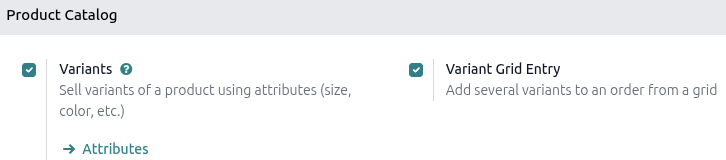
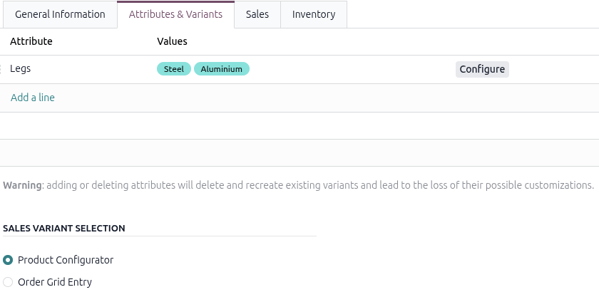
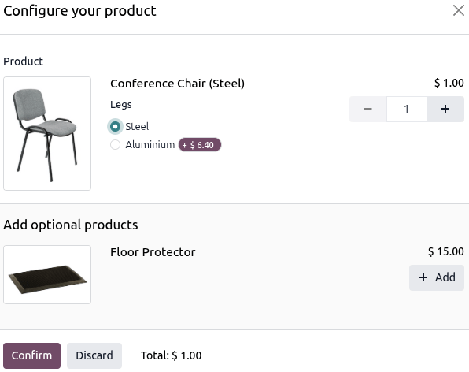
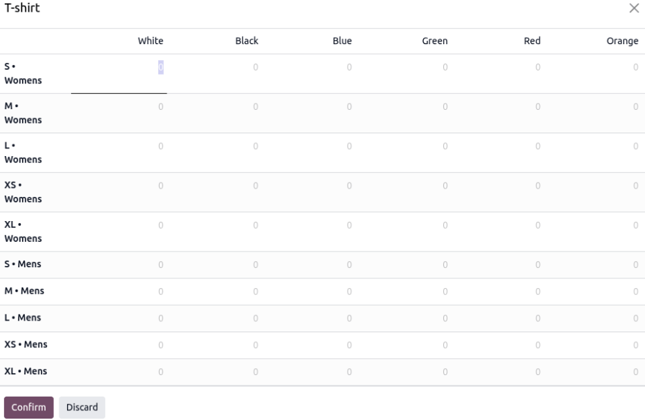
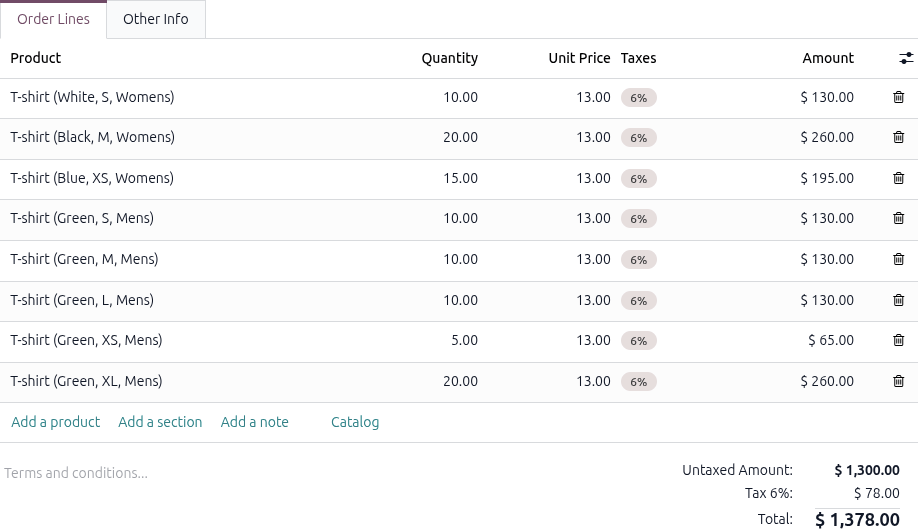

===============================================
Product variants on quotations and sales orders
===============================================

Before getting into detail about how to use product variants on quotations and sales orders, it's
recommended to learn about :doc:`../products_prices/products/variants` in Odoo.

Once familiarized with the basics surrounding product variants, the following covers how product
variants can be added to quotations and sales orders using the *product configurator* or *order grid
entry*.

.. note::
   It should be noted that the setting is titled *Variant Grid Entry* on the **Sales** app settings
   page and titled *Order Grid Entry* on product forms. Be sure to keep that in mind.

Settings
========

When working with product variants, Odoo uses the product configurator by default. To add the
variant grid entry option, that feature **must** be enabled in the Odoo **Sales** application. The
variant grid entry option provides a pop-up window on the quotation/sales order to simplify the
variant selection process.

To enable that setting, go to the :menuselection:`Sales app --> Configuration --> Settings`. In the
*Product Catalog* section, ensure the :guilabel:`Variants` checkbox is ticked in order to use
product variants on quotations and sales orders. Then, tick the :guilabel:`Variant Grid Entry`
checkbox and click :guilabel:`Save`.

Product configuration
=====================

Once the :guilabel:`Variant Grid Entry` setting is enabled, both options (*Product Configurator* and
*Order Grid Entry*) become available on every product form.

To configure a product form to use either a product configurator or variant grid entry, start by
navigating to the :menuselection:`Sales app --> Products --> Products` to view all the products in
the database.

Then, select the desired product to configure, or click :guilabel:`New` to create a new product from
scratch. Once on the product form, click into the *Attributes & Variants* tab, where product
variants can be viewed, modified, and added. Add an attribute with **at least two values** to the
product form.

Doing so displays the :guilabel:`Product Configurator` and :guilabel:`Order Grid Entry` options in
the :guilabel:`Sales Variant Selection` section. These options determine which method is used when
adding product variants to quotations or sales orders.

The :guilabel:`Product Configurator` provides a pop-up window that displays all the available
product variants for that particular product when it's added to a quotation. However, only one
variant can be selected at a time.

The :guilabel:`Order Grid Entry` provides the same information as the :guilabel:`Product
Configurator` in a table layout, allowing the user to select larger numbers of unique product
variants and add them to a quotation or sales order in a single view.

Product configurator
====================

If the :guilabel:`Product Configurator` option is selected on the product form, the feature appears
as a *Configure your product* pop-up window when the product with **at least two** variants is added
to a quotation or sales order. The :guilabel:`Product Configurator` is the default option for new
products after the :guilabel:`Variant Grid Entry` feature is enabled on the *Settings* page.

The :guilabel:`Product Configurator` option helps salespeople choose exactly which product variant
to add to the quotation or sales order using a format similar to online shopping.

.. note::
   All products configured with variants display a *Configure your product* pop-up window by
   default. This is true even with the :guilabel:`Variant Grid Entry` option disabled.

Order grid entry
================

If the :guilabel:`Order Grid Entry` option is selected on a product form, the order grid entry
feature appears as a *Choose Product Variants* pop-up window.

The *Choose Product Variants* pop-up window features all the variant options for that particular
product. From this pop-up window, the salesperson can designate how many of each variant they'd like
to add to the quotation or sales order at once.

When all the desired quantities and variants have been selected, the salesperson clicks
:guilabel:`Confirm`, and those orders are instantly added to the quotation or sales order in the
:guilabel:`Order Lines` tab.

.. seealso::
   :doc:`../products_prices/products/variants`

