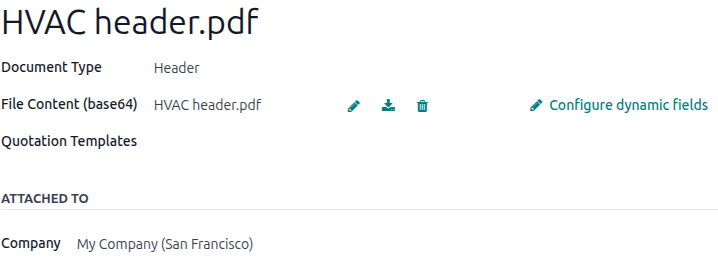

:show-content:
:hide-page-toc:

=================
PDF quote builder
=================

The *PDF Quote Builder* in the Odoo **Sales** app transforms a standard, text-heavy quote into a
polished, branded proposal. Instead of sending a table of products and prices, it enables users to
sandwich a quotation between professionally designed PDF pages.

The PDF Quote Builder seamlessly combines user-provided marketing documents, technical sheets,
branded cover pages, and Odoo-generated quotes in one document. Quotation templates can be
configured to include specific PDFs in the quote, ensuring documents reach the intended customers.
Dynamic text in PDF templates allows users to extract **Sales** app data and customize files for
each project or customer.

Empty text fields on the PDF can be completed directly from the quotation form in the **Sales** app.
This approach lets users personalize quotes without editing the PDF itself.

Users can also configure PDFs on the product form. These files are then automatically added to the
quote when a product is included. Beyond assembling quotes, the PDF Quote Builder also enables PDFs
to be featured on the online store product page. This ensures customers can access detailed product
information directly on the website.

.. seealso::
   `Odoo Quick Tips - Create a PDF quote [video] <https://www.youtube.com/watch?v=tQNydBZt-VI>`_

.. note::
   It is recommended to edit PDF forms with Adobe software. The form fields in the header and footer
   PDF templates are required to retrieve dynamic values in Odoo.

.. cards::

   .. card:: Add dynamic text to PDFs
      :target: pdf_quote_builder/dynamic_text

      Add dynamic text fields to PDFs.

   .. card:: Add PDFs to quotes
      :target: pdf_quote_builder/add_pdf_quotes

      Add a PDF header or footer to a quote.

   .. card:: Add PDFs to products
      :target: pdf_quote_builder/add_pdf_products

      Set up the PDF headers and footers for products. These appear on sales quotes and online store
      pages.

Configuration
=============

To add custom PDF files to quotes, the :guilabel:`PDF Quote builder` feature *must* be configured.

Navigate to :menuselection:`Sales app --> Configuration --> Settings`. Scroll to the *Quotations &
Orders* section, enable the :guilabel:`PDF Quote builder` feature, then click :guilabel:`Save`.

Add PDF as Header/Footer
========================

.. important::
   Odoo does not permit spaces in PDF field names. Only use letters, numbers, hyphens, or
   underscores.

The Odoo **Sales** app can add a custom PDF as a header or footer. The :guilabel:`Quote Builder` tab
in a quote allows the selection of multiple headers and footers for insertion into the final PDF
quote.

To add a custom PDF as a header or footer, navigate to :menuselection:`Sales app --> Configuration
--> Headers/Footers`. On this page, click :guilabel:`New` to create a new header or footer, or click
:guilabel:`Upload` to add a PDF file.

Clicking :guilabel:`Upload` lets the user select a PDF file from their computer. Select the
:guilabel:`Document Type` to set the order in which the PDF appears in the quote. :guilabel:`Header`
places the PDF before the quote, and :guilabel:`Footer` places it after. Further configuration can
be done by clicking the :icon:`fa-ellipsis-v` :guilabel:`(vertical ellipsis)` icon in the top-right
corner of the document card and selecting :guilabel:`Edit`.

Click :guilabel:`New` to open a blank document form. In the :guilabel:`File Content` field, click
the :guilabel:`Upload your file` button and select the PDF to upload. Once uploaded, Odoo
automatically names the document after the file name. The :guilabel:`Name` field then becomes
editable.

To modify the uploaded file, click the :icon:`fa-pencil` :guilabel:`(Edit)`, :icon:`fa-download`
:guilabel:`(Download)`, or :icon:`fa-trash` :guilabel:`(Clear)` icon next to the file name. If the
PDF includes form fields, they are automatically recognized as dynamic text fields. View and edit
these fields by clicking :guilabel:`Configure dynamic fields`. For more details, refer to
:doc:`pdf_quote_builder/dynamic_text`.

The :doc:`quote_template` field assigns the PDF to the selected template, restricting the PDF's use
to that template.

.. note::
   Headers and footers can also be added to a quotation template by navigating to
   :menuselection:`Sales app --> Configuration --> Quotation Templates`. Select a template and then
   in the :guilabel:`Quote Builder` tab, :guilabel:`Add` or :guilabel:`Upload` a PDF directly.

   The HVAC PDF file is configured as a Header and the **Sales** app recognizes the form fields as
   dynamic text fields.

.. toctree::
   :titlesonly:

   pdf_quote_builder/dynamic_text
   pdf_quote_builder/add_pdf_quotes
   pdf_quote_builder/add_pdf_products
