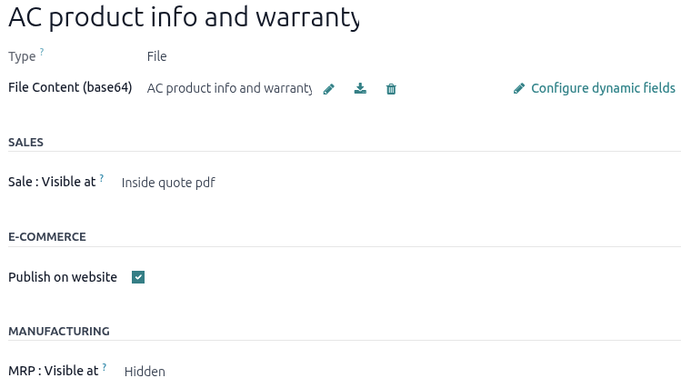
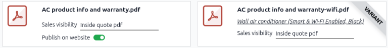

===============================
Add a PDF or a URL to a product
===============================

The Odoo **Sales** app lets users add a custom PDF or URL to a *product template* or variant using
the PDF Quote builder. By attaching a PDF or a URL, users can include extra information or resources
in their quotes, online product pages, or for manufacturing.

.. _sales/pdf_quote_builder/add_pdf_products/add-pdf-to-product:

Add a PDF or URL to a product template
======================================

To add a custom PDF to a product template, go to the :menuselection:`Sales app --> Products -->
Products`, and select the desired product. Next, click the :guilabel:`Documents` smart button at the
top of the product template page.

Click :guilabel:`Upload` to open the user's local file directory then select and upload a PDF to
Odoo. Odoo automatically creates a PDF document form from the uploaded PDF, with the
:guilabel:`Sales Visibility` set to :guilabel:`Hidden` and the :guilabel:`Publish on website` toggle
disabled by default. Click the :icon:`fa-ellipsis-v` :guilabel:`(vertical ellipsis)` icon in the
corner of the document card and select :guilabel:`Edit` to further :ref:`configure the PDF form
<sales/pdf_quote_builder/add_pdf_products/pdf-form-configuration>`.

Click :guilabel:`New` to open a blank PDF form and manually :ref:`configure the document form
<sales/pdf_quote_builder/add_pdf_products/pdf-form-configuration>`.

.. _sales/pdf_quote_builder/add_pdf_products/add-pdf-to-variant:

Add a PDF or URL to a product variant
-------------------------------------

A PDF document or URL can also be added to a product variant, rather than the product template. The
document form for the product variant is the same as the product template's document form,
**except** it doesn't include the *E-Commerce* section and thus cannot be published on the website.

To add a PDF to a product variant, navigate to the :menuselection:`Sales app --> Products -->
Product Variants`, select the product variant, click the :guilabel:`Documents` smart button, and
:ref:`upload the PDF <sales/pdf_quote_builder/add_pdf_products/add-pdf-to-product>`.

.. note::
   If the variant is added to a quotation, and there are documents on a product *and* on its
   variant, **only** the documents in the variant are shown in the *Quote Builder* tab of the
   quotation.

.. _sales/pdf_quote_builder/add_pdf_products/pdf-form-configuration:

Document form configuration
===========================

.. important::
   To save a document form entry, the user **must** add a URL or PDF to the document form. Odoo
   won't save the entry without one, even if the rest of the form is configured.

General Information
-------------------

Fill out the following information in the top section of the document form:

- :guilabel:`Type`: Select either :guilabel:`File` or a :guilabel:`URL` from the drop-down menu. If
  a PDF is uploaded, the :guilabel:`Type` field is automatically set to :guilabel:`File` and cannot
  be changed.
- :guilabel:`URL`: This field is only clickable if the :guilabel:`Type` field is set to
  :guilabel:`URL`. Enter a URL link to an online PDF document.
- :guilabel:`Name`: This field is grayed out (not clickable) until a URL is entered or a PDF is
  uploaded. If the URL is entered, the :guilabel:`Name` field is left blank, and it can then be
  edited. If a PDF document has been uploaded, the :guilabel:`Name` field is auto-populated with the
  file name, and it can then be edited.
- :guilabel:`File Content (base64)`: This field displays the uploaded file. Click it to open the
  file directory and select a different PDF.
- :icon:`fa-pencil` :guilabel:`(Edit)` icon: Click to open the file directory and select a different
  PDF.
- :icon:`fa-download` :guilabel:`(Download)` icon: Click to download the PDF document. This icon
  only appears after a PDF is uploaded and the document form is saved.
- :icon:`fa-trash` :guilabel:`(Delete)` icon: Click to remove the uploaded PDF. This action allows
  the user to change the :guilabel:`Type` field from :guilabel:`File` to :guilabel:`URL` and enter a
  URL link instead.
- :guilabel:`Configure dynamic fields`: Click the link if the PDF document or URL has dynamic form
  fields that need to be :ref:`configured to Odoo fields
  <sales/pdf_quote_builder/dynamic_text/map-PDF-to-Odoo>`. If the PDF document or URL has custom
  dynamic form fields, refer to the
  :ref:`sales/pdf_quote_builder/dynamic_text/custom-dynamic-form-fields` for more information.

Sales section
-------------

Click the :guilabel:`Sale: Visible at` field and select one of the following options:

- :guilabel:`Hidden`: The PDF or URL isn't visible in the **Sales** app. This option is best for
  digital product documents intended for publication on the website, but not shown in the quotation
  or customer portal.
- :guilabel:`On quote`: The PDF document or URL can be sent to customers at any time. It is also
  available for download on the customer portal. This options is best for product description files.
- :guilabel:`On confirmed order`: The PDF document or URL is sent to customers upon order
  confirmation. It is available on the customer port after a quotation is confirmed. This is best
  for user manuals and digital content sold on eCommerce websites.
- :guilabel:`Inside quote`: The PDF document or URL is included in the PDF quotation, between the
  header pages and the :guilabel:`Pricing` section.

.. example::
   When the :guilabel:`On quote` option for the :guilabel:`Visible at` field is selected and the
   custom PDF document, `AC product info and warranty.pdf`, is uploaded, the PDF appears in the
   *customer portal* quotation in the :guilabel:`Documents` section.

   .. image:: add_pdf_products/pdf-on-quote-sample.png
      :alt: Sample of an uploaded pdf with the on quote option chosen in Odoo Sales.

E-Commerce section
------------------

- :guilabel:`Publish on Website`: A checkbox that, if enabled, displays a link to download the PDF
  document on the product page in the online store.

  .. image:: add_pdf_products/show-product-page.png
     :alt: An uploaded document on an e-commerce product page.

Manufacturing section
---------------------

.. important::
   This section only appears if the **Manufacturing** app is installed.

Click the :guilabel:`Sale: Visible at` field and select one of the following options:

- :guilabel:`Hidden`: The PDF or URL is accessible only on the product form.
- :guilabel:`Bill of Materials`: The PDF or URL is attached to the bill of materials when the
  product is manufactured. This option is best for assembly instructions and manufacturing
  specifications.

.. _sales/pdf_quote_builder/add_pdf_products/find-pdfs-for-product:

View all configured PDFs or links for a product
===============================================

Navigate to the :menuselection:`Sales app --> Products --> Products` and select a product. Click the
:guilabel:`Documents` smart button to open the :guilabel:`Documents` page and display all the
documents for the product template and its variants. File and URL cards can be visually
distinguished by the images in the left corner. A PDF thumbnail is for PDF documents, and a
:icon:`fa-link` :guilabel:`link` icon is for URL links. For product variants documents, a *Variant*
badge is to be displayed in the corner as well.

.. seealso::
   :doc:`dynamic_text`

