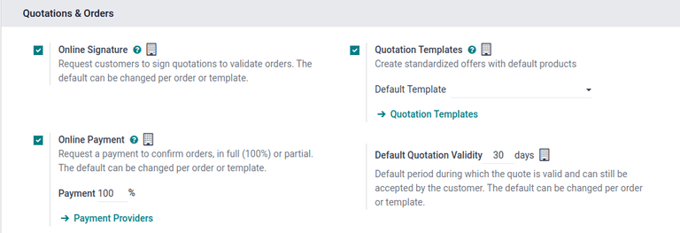
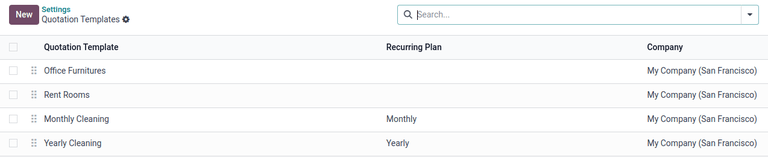
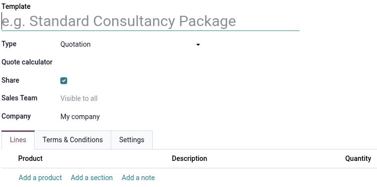
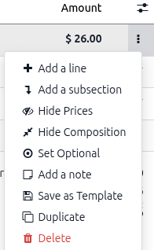
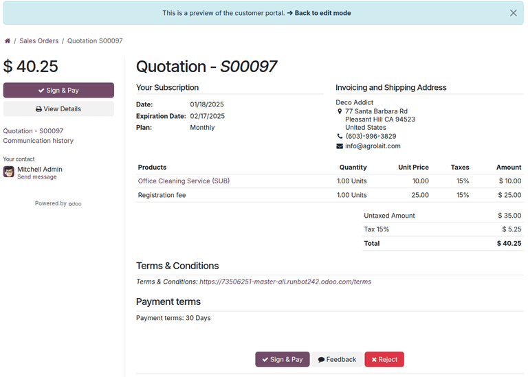
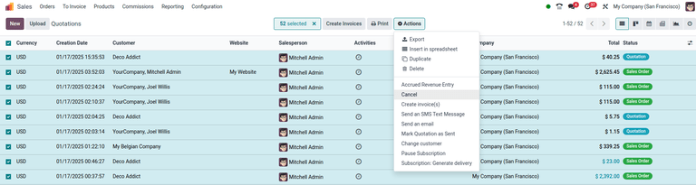

.. _quote-calculator: https://youtu.be/W_0-gUc87WI?si=GMIuIMXP9-lOPtob

=============================
Quotation & section templates
=============================

Reusable quotation and section templates can be made in Odoo's **Sales** app for common products or
services.

By using these templates, quotations can be tailored and sent to customers at a quicker pace,
without having to create new quotations from scratch every time a sales negotiation occurs.

Configuration
=============

To use quotation and section templates, begin by activating the setting in :menuselection:`Sales app
--> Configuration --> Settings`, and scroll to the :guilabel:`Quotations &_Orders` heading.

Under the heading, tick the :guilabel:`Quotation Templates` checkbox. Doing so reveals a new
:guilabel:`Default Template` field, in which a default quotation template can be chosen from the
drop-down menu.

Upon activating the :guilabel:`Quotation Templates` feature, an internal :icon:`fa-arrow-right`
:guilabel:`Quotation Templates` link appears beneath the :guilabel:`Default Template` field.

Clicking this link reveals the :guilabel:`Templates` page, from which templates can be created,
viewed, and edited.

Before leaving the :guilabel:`Settings` page, click the :guilabel:`Save` button to save all changes
made during the session.

.. _sales_quotations/quote_template/create-templates:

Create quotation templates
==========================

To create a quotation template, click the :guilabel:`Quotation Templates` link on the
:guilabel:`Settings` page once :guilabel:`Quotation templates` are enabled, or navigate to
:menuselection:`Sales app --> Configuration --> Templates`. Both options reveal the *Templates*
page, where quotation templates can be created, viewed, and edited.

To create a new quotation template, click the :guilabel:`New` button, located in the upper-left
corner. Doing so reveals a blank quotation template form that can be customized.

Start by entering a name for the template in the :guilabel:`Template` field. If needed, create or
select an existing spreadsheet to do complex calculations for the template in the :guilabel:`Quote
calculator` field.

.. important::

   The :guilabel:`Quote calculator` field is only available for Quotation templates.

Enable the :guilabel:`Share` checkbox to make the template accessible to specific sales teams.
Select which teams can access it in the :guilabel:`Sales Team` field. If working in a
:doc:`multi-company environment <../../../general/companies/multi_company>`, use the
:guilabel:`Company` field to designate to which company can access the template.

.. _sales_quotations/quote_template/lines-tab:

Lines tab
---------

In the :guilabel:`Lines` tab, products can be added to the quotation template by clicking
:guilabel:`Add a product`, organized by clicking :guilabel:`Add a section` (and dragging/dropping
section headers), and further explained with discretionary information (such as warranty details,
terms, etc.) by clicking :guilabel:`Add a note`.

To add a product to a quotation template, click :guilabel:`Add a product` in the :guilabel:`Lines`
tab of a quotation template form. Doing so reveals a blank field in the :guilabel:`Product` column.

When clicked, a drop-down menu with existing products in the database appears. Select the desired
product from the drop-down menu to add it to the quotation template. If the desired product is not
visible, type the name of the desired product in the :guilabel:`Product` field, and the option
appears in the drop-down menu. Products can also be found by clicking :guilabel:`Search More...`
from the drop-down menu.

.. tip::
   It is possible to add event-related products (booths and registrations) to quotation templates.
   To do so, click the :guilabel:`Product` field, type in `Event`, and select the desired
   event-related product from the resulting drop-down menu.

.. note::
   When a product is added to a quotation template, the default :guilabel:`Quantity` is `1`, but
   that can be edited at any time.

Then, drag and drop the product to the desired position, via the :guilabel:`six squares` icon,
located to the left of each line item.

To add a *section*, which serves as a header to organize the lines of a sales order, click
:guilabel:`Add a section` in the :guilabel:`Lines` tab. When clicked, a blank field appears, in
which the desired name of the section can be typed. When the name has been entered, click away to
secure the section name. Then, drag and drop the section name to the desired position, via the
:icon:`oi-apps` :guilabel:`(six squares)` icon, located to the left of each line item.

To add a note, which appears as a piece of text for the customer on the quotation, click
:guilabel:`Add a note` in the :guilabel:`Lines` tab. When clicked, a blank field appears, in which
the desired note can be typed. When the note has been entered, click away to secure the note. Then,
drag and drop the note to the desired position, via the :icon:`oi-apps` :guilabel:`(six squares)`
icon.

To delete any line item from the :guilabel:`Lines` tab (product, section, and/or note), click the
:icon:`fa-trash` :guilabel:`(remove record)` icon on the far-right side of the line.

Terms & Conditions tab
----------------------

The :guilabel:`Terms & Conditions` tab provides the opportunity to add terms and conditions to the
quotation template. To add terms and conditions, type the desired terms and conditions in this tab.

.. seealso::
   :doc:`../../../finance/accounting/customer_invoices/terms_conditions`

.. note::
   Terms and conditions are **not** required to create a quotation template.

Quote Builder tab
-----------------

.. important::
   The :guilabel:`PDF Quote builder` checkbox must be enabled for this tab to become available.

The :guilabel:`Quote Builder` tab allows specific headers and footers to become available when the
quotation template is used on a sales quote. Any headers or footers that are :ref:`assigned to the
template <pdf_quote_builder/add_pdf_quotes/add-to-quote-template>` are not available to use unless
the template is applied.

Settings tab
------------

The :guilabel:`Settings` tab provides extra confirmation and invoicing settings to the quotation
template.

In the *Confirmation* section, the :guilabel:`Quotation Validity` field designates how many days the
quotation template is valid for, or leave the field on the default `0` to keep the template valid
indefinitely.

If either of the :guilabel:`Online Signature` or :guilabel:`Online Payment` features are activated
in the :guilabel:`Settings` (:menuselection:`Sales app --> Configuration --> Settings`), toggles for
each of them are available to activate on the quotation template.

Enable the toggle for :guilabel:`Online Signature` to request an online signature from the customer
to confirm an order.

Enable the toggle for :guilabel:`Online Payment` to request an online payment from the customer to
confirm an order. When :guilabel:`Online Payment` is checked, a new percentage field appears, in
which a specific percentage of payment can be entered.

Both toggles, :guilabel:`Online Signature` and :guilabel:`Online Payment` can be enabled
simultaneously, in which case the customer must provide **both** a signature **and** a payment to
confirm an order.

Next, in the :guilabel:`Confirmation Mail` field, click the blank drop-down menu to select a
preconfigured email template to be sent to customers upon confirmation of an order.

.. tip::
   To create a new email template directly from the :guilabel:`Confirmation Mail` field, start
   typing the name of the new email template in the field, and select either: :guilabel:`Create` or
   :guilabel:`Create and edit...` from the drop-down menu that appears.

   Selecting :guilabel:`Create` creates the email template, which can be edited later.

   Selecting :guilabel:`Create and edit...` creates the email template, and a :guilabel:`Create
   Confirmation Mail` pop-up window appears, in which the email template can be customized and
   configured immediately.

   .. image:: quote_template/create-confirmation-mail-popup.png
      :alt: Create confirmation mail pop-up window from the quotation template form in Odoo Sales.

   When all modifications are complete, click :guilabel:`Save & Close` to save the email template
   and return to the quotation form.

In the *Invoicing* section, the :guilabel:`Invoicing Journal` field designates all sales orders
using this template are invoiced in the selected journal. If no journal is selected, the sales
journal with the lowest sequence is used.

.. _sales_quotations/quote_template/section-templates:

Create section templates
========================

Section templates can be created on the *Templates* page or directly from a sales quote. To create a
template from the *Templates* page, navigate to :menuselection:`Sales app --> Configuration -->
Templates` and click the :guilabel:`New` button, located in the upper-left corner. A blank template
form displays.

Enter the name of the template in :guilabel:`Template` field and set the :guilabel:`Type` field to
:guilabel:`Section`. To add sections, products, or notes follow the instructions in the
:ref:`sales_quotations/quote_template/lines-tab` section.

.. important::
   Only the :guilabel:`Lines` tab is available for section templates. Templates with the same name
   and created by the same user are overwritten when saved. Combos **cannot** be saved as a section
   template.

To create a section template from a sales quote, navigate to :menuselection:`Sales app --> Orders
--> Quotations` and :ref:`create a new quote <sales_quotations/create_quotations/create-quotation>`
or select an existing one.

Add section and any products in the :guilabel:`Order Lines` tab, then click the
:icon:`fa-ellipsis-v` :guilabel:`Ellipsis` icon on the right side of the order line. Select the
:icon:`fa-save` :guilabel:`Save as Template` icon to save the section. Odoo saves the section
template using the name given the section on the sales quote.

.. note::
   Section templates can be saved without any products added in the section.

To find a section template, navigate to :menuselection:`Sales --> Configuration --> Templates`. In
the search bar, delete the :guilabel:`Quotation Templates filter` to display all template types.

.. _sales_quotations/quote_template/use-templates:

Use templates
=============

When :ref:`creating a quote <sales_quotations/create_quotations/create-quotation>`
(:menuselection:`Sales app --> New`), choose a preconfigured template in the :guilabel:`Quotation
Template` field.

.. note::
   The order of the templates in the :guilabel:`Quotation Template` field is determined by the order
   of the templates in the Quotation Templates form. The order of the quotations in the Quotation
   Templates form does **not** affect anything else.

To apply a section template, click :guilabel:`Add a section` and select a template from the
drop-down menu.

To view what the customer will see, click the :guilabel:`Preview` button at the top of the page to
see how the quotation template appears on the front-end of the website through Odoo's customer
portal.

When all blocks and customizations are complete, click the :guilabel:`Save` button to save the
configuration.

The blue banner located at the top of the quotation template preview can be used to quickly return
:icon:`fa-arrow-right` :guilabel:`Back to edit mode`. When clicked, Odoo returns to the quotation
form in the back-end of the *Sales* application.

Mass cancel quotations/sales orders
===================================

Cancel multiple quotations (or sales orders) by navigating to the :menuselection:`Sales app -->
Orders --> Quotations` dashboard, landing, by default, in the list view. Then, on the left side of
the table, tick the checkboxes for the quotations to be canceled.

.. tip::
   Select all records in the table by selecting the checkbox column header at the top-left of the
   table; the total number of selected items are displayed at the top of the page.

Then, with the desired quotations (or sales orders) selected from the list view on the
:guilabel:`Quotations` page, click the :icon:`fa-cog` :guilabel:`Actions` button to reveal a
drop-down menu.

From this drop-down menu, select :guilabel:`Cancel quotations`.

.. note::
   This action can be performed for quotations in *any* stage, even if it is confirmed as a sales
   order.

Upon selecting the :guilabel:`Cancel quotations` option, a :guilabel:`Cancel quotations`
confirmation pop-up window appears. To complete the cancellation, click the :guilabel:`Cancel
quotations` button.

.. note::
   An error pop-up message appears when attempting to cancel an order for an ongoing subscription
   that has an invoice.

.. seealso::
   - :doc:`get_signature_to_validate`
   - :doc:`get_paid_to_validate`
   - `Tutorial: Quote calculator Basics <quote-calculator_>`_

