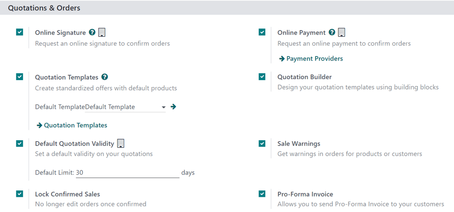
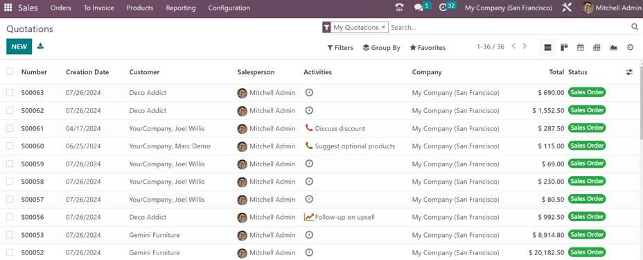
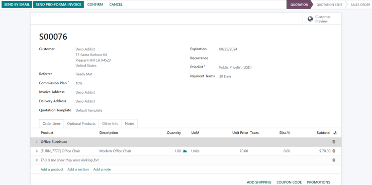
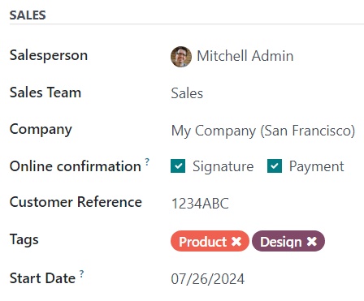
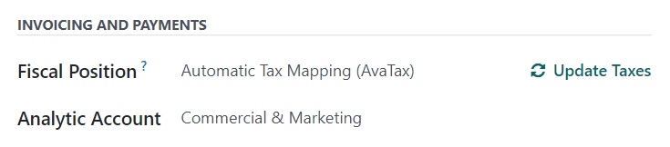
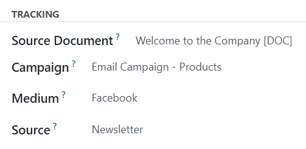

=================
Create quotations
=================

.. |SO| replace:: :abbr:`SO (Sales Order)`

In Odoo **Sales**, quotations can be created and sent to customers. Once a quotation has been
confirmed, it officially turns into a *sales order*, which can then be invoiced and paid for.

.. _sales/quotation-settings:

Quotation settings
==================

To access these settings options, navigate to :menuselection:`Sales app --> Configuration -->
Settings`, and scroll to the :guilabel:`Quotations & Orders` section.

- :guilabel:`Online Signature`: Request an online signature to confirm orders.
- :guilabel:`Quotation Templates`: Enable this option to create quotation templates featuring
  standard product offers, which are then selectable on quotation forms. When this checkbox is
  ticked, an additional field, :guilabel:`Default Template`, appears, along with a link to the
  :guilabel:`Quotation Templates` page.
- :guilabel:`Default Quotation Validity`: Determine a set amount (in :guilabel:`days`) that
  quotations can remain valid for.
- :guilabel:`Lock Confirmed Sales`: Ensure no further edits can be made to confirmed orders.
- :guilabel:`Online Payment`: Request an online prepayment from customers to confirm orders, which
  can be a full or partial payment (via down payment). When this checkbox is ticked, an additional
  field, :guilabel:`Prepayment amount (%)`, appears. There is also a link to the :guilabel:`Payment
  Providers` page.
- :guilabel:`Quotation Builder`: Enable this option to utilize Odoo's building block options and
  style elements to design quotation templates.
- :guilabel:`Sale Warnings`: Get warning messages about orders that include specific products or
  customers.
- :guilabel:`Pro-Forma Invoice`: Send pro-forma invoices to customers.

To activate any of these settings, tick the checkbox beside the desired option(s). Then, click
:guilabel:`Save`.

Quotations dashboard
====================

The *Quotations* dashboard is the page that appears when the :menuselection:`Sales app` is opened.

By default, the :guilabel:`Quotations` dashboard displays all quotations in the database related to
the current user, as indicated by the default :guilabel:`My Quotations` filter present in the search
bar.

.. note::
   To view *all* quotations in the database, remove the :guilabel:`My Quotations` filter from the
   search bar.

Quotations on this page appear in a default list view, but can also be viewed in a
:icon:`oi-view-kanban` :guilabel:`Kanban` view, :icon:`fa-calendar` :guilabel:`Calendar`,
:icon:`oi-view-pivot` :guilabel:`Pivot` table, :icon:`fa-area-chart` :guilabel:`Graph`, or
:icon:`fa-clock-o` :guilabel:`Activity` view.

To view and/or modify any listed quotation from the :guilabel:`Quotations` dashboard, click on the
desired quotation, and Odoo reveals the specific form for that selected quotation.

Create quotation
================

To create a quotation, open the :menuselection:`Sales app`, and click the :guilabel:`New` button,
located in the upper-left corner of the main :guilabel:`Quotations` dashboard.

.. important::
   The :guilabel:`New` button is **only** present if the :guilabel:`Quotations` dashboard is in list
   or Kanban view.

Clicking the :guilabel:`New` button reveals a blank quotation form, with various fields and tabs to
configure.

.. tip::
   To create a new quotation from the :guilabel:`Quotations` dashboard, while in :icon:`fa-calendar`
   :guilabel:`Calendar` view, click into the desired date/time slot on the calendar, and Odoo
   presents a new quotation form.

On the quotation form, begin by entering the customer's name in the :guilabel:`Customer` field at
the top of the form. This is a **required** field.

If the customer's information is already in the database, the :guilabel:`Invoice Address` and
:guilabel:`Delivery Address` fields auto-populate with the saved information for those respective
fields, based on the data from that customer's contact record (found in the **Contacts**
application).

If the customer was referred by another customer or contact, enter their name in the
:guilabel:`Referrer` field.

If a :guilabel:`Referrer` is selected, a new field, :guilabel:`Commission Plan` appears, in which a
commission can be selected from the drop-down menu. This commission is rewarded to the contact
selected in the :guilabel:`Referrer` field.

Next, if they have not already been auto-populated with the customer's information, enter the
appropriate addresses in the :guilabel:`Invoice Address` and :guilabel:`Delivery Address` fields.
Both of these fields are **required**.

Then, if desired, choose a :guilabel:`Quotation Template` from the drop-down field to apply to this
quotation. It should be noted that some additional fields may appear, depending on the template
selected. The :guilabel:`Default Template` option is selected, by default.

The default date that appears in the :guilabel:`Expiration` field is based on the number configured
in the *Quotation expires after* field on the quotation template form.

.. tip::
   To access the various quotation forms, go to :menuselection:`Sales app --> Configuration -->
   Quotation Templates`. Alternatively, hover over the :guilabel:`Quotation Template` field on the
   quotation form, and click the :icon:`fa-arrow-right` :guilabel:`(right arrow)` icon to view that
   specific quotation template form.

If the quotation is for a recurring product or subscription, select the desired
:guilabel:`Recurrence` option from that specific drop-down menu.

If a :guilabel:`Recurrence` option is selected, an :guilabel:`until` field appears beside it. In
this field, select the desired date the :guilabel:`Recurrence` should end, via a calendar popover
window.

Also, if a :guilabel:`Recurrence` option is selected, a new field, :guilabel:`Freeze Plan`, appears
on the quotation form, between :guilabel:`Referrer` and :guilabel:`Commission Plan`. When this
checkbox is ticked, the commission plan does not automatically update.

Next, select a specific :guilabel:`Pricelist` to be applied to this quotation, if desired.

Lastly, select any specific :guilabel:`Payment Terms` to be used for this quotation.

Order Lines tab
---------------

The first tab on the quotation form is the :guilabel:`Order Lines` tab.

In this tab, select products, and the quantities of those products, to add to the quotation.

Click :guilabel:`Add a product`, select the desired item from the :guilabel:`Product` drop-down
field, and proceed to adjust the :guilabel:`Quantity` of that selected product, if necessary.

If multiple items should be presented in a more organized way on the quotation, click :guilabel:`Add
a section`, enter a name for the section, and drag-and-drop that section heading in the desired
location amongst the items in the :guilabel:`Order Lines` tab. The section heading appears in bold.

If needed, click :guilabel:`Add a note` beneath a certain product line to add a custom note about
that specific product. The note appears in italics. Then, if needed, proceed to drag-and-drop the
note beneath the desired product line.

Beneath the product lines, there are buttons that can be clicked to apply any of the following:
:guilabel:`Add Shipping`, :guilabel:`Coupon Code`, and :guilabel:`Promotions`.

.. seealso::
   - :doc:`../products_prices/ewallets_giftcards`
   - :doc:`../products_prices/loyalty_discount`
   - :doc:`../products_prices/prices/pricing`

Optional Products tab
---------------------

Open the :guilabel:`Optional Products` tab to select related products that can be presented to the
customer, which may result in an increased sale.

For example, if the customer wants to buy a car, an optional product that could be offered is a
*Trailer Hitch*.

.. seealso::
  :doc:`optional_products`

Other Info tab
--------------

In the :guilabel:`Other Info` tab, there are various quotation-related configurations separated into
four different sections: :ref:`Sales <sales/sales-section>`, :ref:`Delivery
<sales/delivery-section>`, :ref:`Invoicing and Payments <sales/invoice-payments-section>`, and
:ref:`Tracking <sales/tracking-section>`.

.. note::
   Some fields **only** appear if specific settings and options have been configured.

.. _sales/sales-section:

Sales section
~~~~~~~~~~~~~

In the :guilabel:`Sales` section of the :guilabel:`Other Info` tab, there are sales-specific fields
that can be configured.

- :guilabel:`Salesperson`: Assign a salesperson from the drop-down menu to be associated with this
  quotation. The user who originally created the quotation is selected in this field, by default.
- :guilabel:`Sales Team`: Assign a specific sales team to this quotation. If the selected
  :guilabel:`Salesperson` is a member of a sales team, that team is auto-populated in the field.
- :guilabel:`Company`: Select a company from the drop-down menu this quotation should be associated
  with. This field only appears when working in a multi-company environment.
- :guilabel:`Online confirmation`: This field contains two checkboxes: :guilabel:`Signature` and
  :guilabel:`Payment`. Tick the :guilabel:`Signature` checkbox to request an online signature from
  the customer to confirm the order. This field only appears if the *Online Signature* setting has
  been enabled. Tick the :guilabel:`Payment` checkbox to request an online payment from the customer
  to confirm the order. This field only appears if the *Online Payment* setting has been enabled.
- :guilabel:`Customer Reference`: Enter a custom reference ID for this customer. The entered
  reference ID can contain letters, numbers, or a mix of both.
- :guilabel:`Tags`: Add specific tags to the quotation for added organization and enhanced
  searchability in the Odoo **Sales** application. Multiple tags can be added, if necessary.
- :guilabel:`Start Date`: If the quotation is for a subscription-based product, select a
  subscription starting date from the calendar popover window that appears when the field is
  clicked.

.. _sales/delivery-section:

Delivery section
~~~~~~~~~~~~~~~~

In the :guilabel:`Delivery` section of the :guilabel:`Other Info` tab, there are delivery-specific
fields that can be configured.

.. image:: create_quotations/other-info-delivery.png
   :align: center
   :alt: The Delivery section of the Other Info tab of a quotation form in Odoo Sales.

- :guilabel:`Shipping Policy`: Select a desired shipping policy from the drop-down menu. If all
  products are delivered at once, the delivery order is scheduled, based on the greatest product
  lead time. Otherwise, it is based on the shortest lead time. The available options are:
  :guilabel:`As soon as possible` or :guilabel:`When all products are ready`.
- :guilabel:`Delivery Date`: Click into the empty field to reveal a calendar popover, from which a
  customer delivery date can be selected. If no custom date is required, refer to the
  :guilabel:`Expected` date listed to the right of that field.

.. _sales/invoice-payments-section:

Invoicing and Payments section
~~~~~~~~~~~~~~~~~~~~~~~~~~~~~~

In the :guilabel:`Invoicing` section of the :guilabel:`Other Info` tab, there are invoicing-specific
fields that can be configured.

- :guilabel:`Fiscal Position`: Select a fiscal position to be used to adapt taxes and accounts for
  particular customers or sales orders/invoices. The default value comes from the customer. If a
  selection is made in this field, an :icon:`fa-refresh` :guilabel:`Update Taxes` clickable link and
  icon appear. When clicked, the taxes for this partiuclar customer and quotation are updated. A
  confirmation window appears, as well.
- :guilabel:`Analytic Account`: Select an analytic account to apply to this customer/quotation.

.. _sales/tracking-section:

Tracking section
~~~~~~~~~~~~~~~~

In the :guilabel:`Tracking` section of the :guilabel:`Other Info` tab, there are tracking specific
fields that can be configured.

- :guilabel:`Source Document`: Enter the reference of the document that generated the
  quotation/sales order, if applicable.
- :guilabel:`Campaign`: Select the marketing campaign related to this quotation, if applicable.
- :guilabel:`Medium`: Select the method by which this quotation originated (e.g. *Email*,
  *Facebook*, etc.), if applicable.
- :guilabel:`Source`: Select the source of the link used to generate this quotation, if applicable.

Notes tab
---------

In the :guilabel:`Notes` tab of the quotation form, enter any specific internal notes about the
quotation and/or customer, if desired.

Sending and confirming quotations
=================================

Once all the necessary fields and tabs have been configured, it is time to send the quotation to the
customer for confirmation. Upon confirmation, the quotation turns into an official |SO|.

At the top of the form, there is a series of buttons:

- :guilabel:`Send by Email`: When clicked, a pop-up window appears with the customer's name and
  email address in the :guilabel:`Recipients` field, the quotation (and reference ID) in the
  :guilabel:`Subject` field, and a brief default message in the body of the email, which can be
  modified, if needed.

  Below that, a PDF copy of the quotation is attached. When ready, click :guilabel:`Send` to send
  the quotation, via email, to the customer, so they can review and confirm it.
- :guilabel:`Send PRO-FORMA Invoice`: This button **only** appears if the *Pro-Forma Invoice*
  setting has been enabled. When clicked, a pop-up window appears with the customer's name and email
  address in the :guilabel:`Recipients` field, the *Proforma* invoice (and reference ID) in the
  :guilabel:`Subject` field, and a brief default message in the body of the email, which can be
  modified, if needed.

  Below that, a PDF copy of the quotation is attached. When ready, click :guilabel:`Send` to send
  the quotation, via email, to the customer, so they can review and confirm it.
- :guilabel:`Confirm`: When clicked, the quotation is confirmed, and the status changes to
  :guilabel:`Sales Order`.
- :guilabel:`Cancel`: When clicked, the quotation is canceled.

There is also a :guilabel:`Customer Preview` smart button present, in the upper-right corner of the
form. When clicked, Odoo reveals a preview of the quotation the customer sees when they log into
their customer portal. Click the :icon:`fa-arrow-right` :guilabel:`Back to edit mode` link at the
top of the preview page, in the blue banner, to return to the quotation form.

.. note::
   If the *Lock Confirmed Sales* setting is enabled, the |SO| becomes :guilabel:`Locked`, and is
   indicated as such on the |SO| form.

At this point, the quotation has been confirmed, turned into a |SO|, and is now ready to be invoiced
and paid for.

For more information about invoicing, refer to the :doc:`Invoice based on delivered or ordered
quantities <../invoicing/invoicing_policy>` documentation.

.. seealso::
   - :doc:`quote_template`
   - :doc:`deadline`
   - :doc:`get_signature_to_validate`
   - :doc:`get_paid_to_validate`
   - :doc:`../invoicing/proforma`
