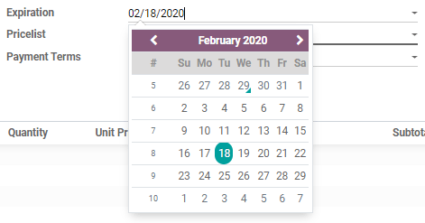
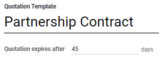

===================
Quotation deadlines
===================

In the Odoo *Sales* application, it is possible to set deadlines on sales quotations. Doing so
encourages customers to act quickly during sales negotiations, for they might fear for missing out
on a good deal. As well, deadlines also can also act as protection for a company in case an order
has to be fulfilled at a price that is no longer profitable for the business.

Quotation expiration
====================

In Odoo *Sales*, there's the option to add an expiration date to a quotation.

To add an expiration date to a quotation, navigate to :menuselection:`Sales app`, and select a
desired quotation, or create a new one by clicking :guilabel:`New`.

On the quotation form, click the :guilabel:`Expiration` field to reveal a pop-up calendar. From this
pop-up calendar, select the desired month and date as the expiration date for the quotation.

.. tip::
   By clicking the :guilabel:`Preview` button on a quotation, Odoo clearly displays when that
   specific offer expires.

   .. image:: deadline/quotation-deadlines-preview.png
      :align: center
      :alt: How customers will see deadlines on Odoo Sales.

Quotation template expiration
=============================

The Odoo *Sales* application also makes it possible to add a deadline expiration date to quotation
templates.

To add a deadline expiration date to a quotation template, navigate to :menuselection:`Sales app -->
Configuration --> Quotation Templates`, and either select the desired quotation template to which a
deadline should be added, or click :guilabel:`New` to build a new quotation template from scratch.

On the quotation template form, add a specific number of days to the :guilabel:`Quotation expires
after` field, located beneath the quotation template name. The number of days represents how long
the quotation will be valid for, before it expires.

Then, whenever that specific quotation template is used in a quote, an expiration date is
automatically calculated, based on the number of days designated above. However, this date can be
overwritten before sending the quotation to the customer.

.. seealso::
   :doc:`/applications/sales/sales/send_quotations/quote_template`
