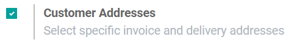

==========================================
Deliver and invoice to different addresses
==========================================

With Odoo Sales, you can configure different addresses for delivery and invoicing. For some
customers, it will be very practical to define specific billing and shipping addresses. Indeed, not
everyone will have the same delivery location as the invoicing location.

Activate the feature
====================

Go to :menuselection:`Sales --> Configuration --> Settings` and activate the **Customer Addresses**
feature.

Add addresses from a quotation
==============================

When you create a quotation, you must add a customer. This customer can be a company or a person
with specific billing and shipping addresses already defined and registered in the system, or it can
be a new customer. In this case, you have to **Create and edit** the contact form for your new
customer and link it, if necessary, to a company. In this contact form, you will be able to add,
delete and modify invoice and delivery addresses.

.. image:: different_addresses/addresses_2.png
   :align: center
   :class: img-thumbnail
   :alt: How to add addresses from a quotation on Odoo Sales?

.. note::
   If you select a customer with defined invoice and delivery addresses, Odoo will automatically use
   them to fill in the fields. Now, if you want to change it instantly, it is possible to do so
   directly from the quotation or the sales order.

Add addresses from a contact form
=================================

Previously, we talked about the contact form that you can fill in directly from a quotation or a
sales order to add billing and shipping addresses to customers. But, if you go to
:menuselection:`Sales --> Orders --> Customers`, you can create or modify every customer you want
and add, delete or modify invoice and delivery addresses instantly there, before creating a
quotation.

.. image:: different_addresses/addresses_3.png
   :align: center
   :class: img-thumbnail
   :alt: How to add addresses from a contact form on Odoo Sales?

Deal with different addresses
=============================

Like for the previous example, go to :menuselection:`Sales --> Orders --> Customers` and create a
new customer. There, you can add company information but, more importantly, you can enter billing
and shipping addresses under the **Contacts & Addresses** tab.

.. image:: different_addresses/addresses_4.png
   :align: center
   :class: img-thumbnail
   :alt: How to manage different customer addresses on Odoo Sales?

Once done, you can return to your Sales dashboard and create a new quotation. Now, if you enter
your new customer, you will see that the other fields will fill in by themself with the information
previously saved for billing and shipping addresses.

.. image:: different_addresses/addresses_5.png
   :align: center
   :class: img-thumbnail
   :alt: Automatic quotation fields filling on Odoo Sales

With Odoo Sales, it is now very convenient to play with various addresses in terms of invoice and
delivery features.