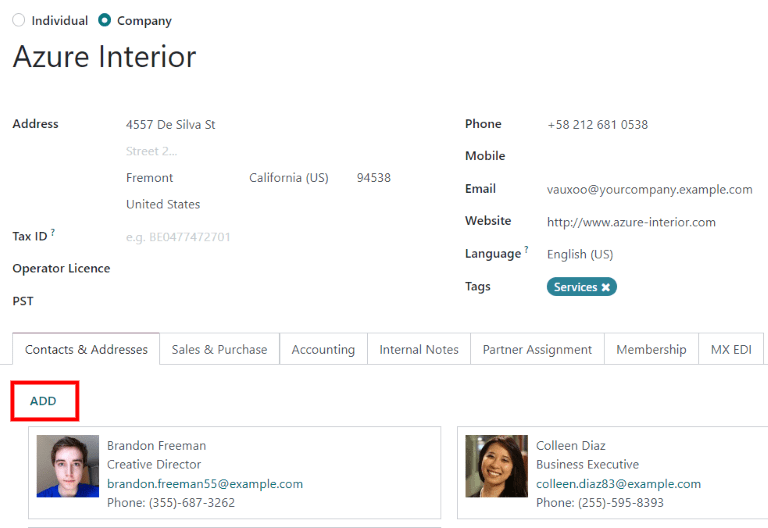
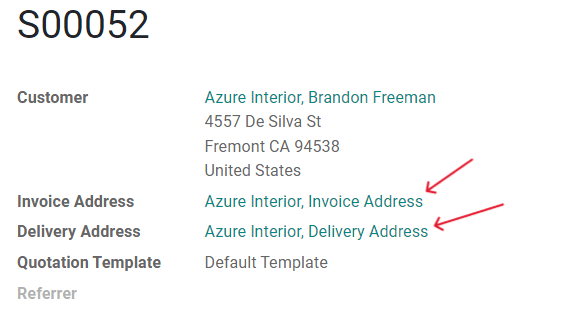

==========================================
Deliver and invoice to different addresses
==========================================

People and businesses often use separate addresses for billing (invoicing) and shipping (delivery)
purposes. With the Odoo *Sales* app, contacts can have different specified addresses for delivery
and invoicing.

Configure the settings
======================

Go to :menuselection:`Invoicing --> Configuration --> Settings` and scroll down to the
:guilabel:`Customer Invoices` section. Then, check the box next to :guilabel:`Customer Addresses`,
and click :guilabel:`Save`.

.. note::
   Navigating through the *Invoicing* app will not be possible if the *Accounting* app has been
   installed. Instead, go through :menuselection:`Accounting --> Configuration --> Settings` to
   enable the :guilabel:`Customer Addresses` feature.

.. image:: different_addresses/customer-addresses-setting.png
   :align: center
   :alt: Activate the Customer Addresses setting.

Configure the contact form
==========================

Navigate to the :menuselection:`Contacts` app (or to :menuselection:`Sales --> Orders -->
Customers`), and click on a customer to open their contact form.

Under the :guilabel:`Contacts & Addresses` tab, click :guilabel:`Add`.

Then, select which type of address to add to the contact form (i.e. :guilabel:`Invoice Address` or
:guilabel:`Delivery Address`).

.. image:: different_addresses/create-contact-window.png
   :align: center
   :alt: Create a new contact/address on a contact form.

Enter the address information. Then click :guilabel:`Save & Close` to save the address and close the
:guilabel:`Create Contact` window. Or, click :guilabel:`Save & New` to save this address and
immediately input another one.

Add addresses to the quotation
==============================

When a customer is added to a quotation, the :guilabel:`Invoice Address` and :guilabel:`Delivery
Address` fields will autopopulate according to the addresses specified on the customer's contact
form.

The :guilabel:`Invoice Address` and :guilabel:`Delivery Address` can also be edited directly from
the quotation by clicking on the :guilabel:`Internal link` buttons next to each address line.

These addresses can be updated at any time to ensure accurate invoicing and delivery.
