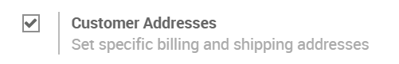
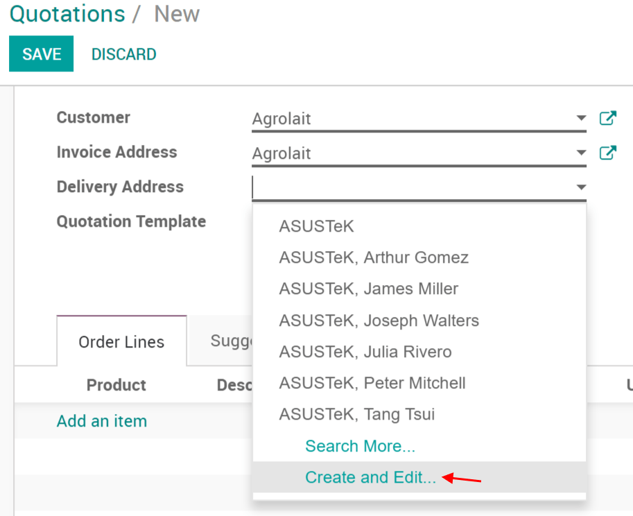
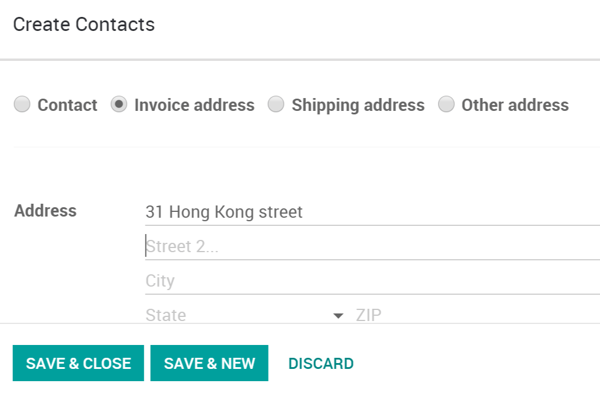
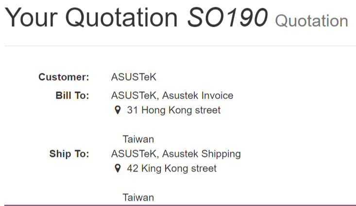

==========================================
Deliver and invoice to different addresses
==========================================

In Odoo you can configure different addresses for delivery and
invoicing. This is key, not everyone will have the same delivery
location as their invoice location.

Activate the feature
====================

Go to :menuselection:`SALES --> Configuration --> Settings` and activate
the *Customer Addresses* feature.

Add different addresses to a quotation or sales order
=====================================================

If you select a customer with an invoice and delivery address set, Odoo
will automatically use those. If there's only one, Odoo will use that
one for both but you can, of course, change it instantly and create a
new one right from the quotation or sales order.

Add invoice & delivery addresses to a customer
==============================================

If you want to add them to a customer before a quotation or sales order,
they are added to the customer form. Go to any customers form under
:menuselection:`SALES --> Orders --> Customers`.

From there you can add new addresses to the customer.

Various addresses on the quotation / sales orders
=================================================

These two addresses will then be used on the quotation or sales order
you send by email or print.

