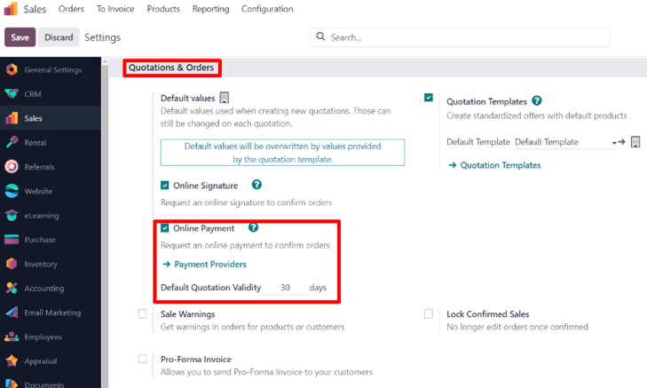
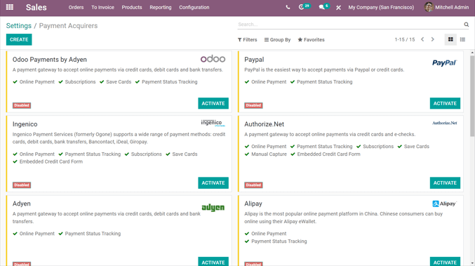
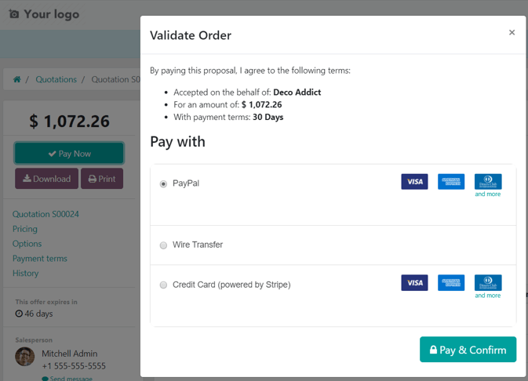

=================================
Online payment order confirmation
=================================

With Odoo *Sales*, online payments can be used to get automatic confirmation on orders.

Enable online payment
=====================

Go to :menuselection:`Sales app --> Configuration --> Settings`, scroll to the :guilabel:`Quotations
\& Orders` heading, and activate the :guilabel:`Online Payment` feature by checking the box next to
it, and clicking :guilabel:`Save`.

After checking the box beside the :guilabel:`Online Payment` feature, a link to the
:guilabel:`Payment Acquirers` appears beneath it. Click that link to reveal the entire
:guilabel:`Payment Acquirers` page.

On the :guilabel:`Payment Acquirers` page, payment acquirers can be selected and configured. Before
creating (or modifying) a payment acquirer, be sure to review the documentation related to the ways
payment acquirers can be used with Odoo, such as:

- :doc:`../../../finance/payment_acquirers/paypal`
- :doc:`../../../finance/payment_acquirers/authorize`
- :doc:`../../../finance/payment_acquirers`

.. note::
   On quotation templates, the :guilabel:`Online Payment` feature is located under the
   :guilabel:`Confirmation` tab.

   On standard quotations, the :guilabel:`Online Payment` feature is located under the
   :guilabel:`Other Info` tab.

Register a payment
==================

After opening quotations from the email they receive, customers are presented with different options
to make online payments, in the :guilabel:`Pay with` section.

.. tip::
   Clicking the :guilabel:`Customer Preview` smart button on the quotation form provides a preview
   of the quotation as the customer sees it, along with the various online payment options they can
   choose from.

.. seealso::
   :doc:`quote_template`
