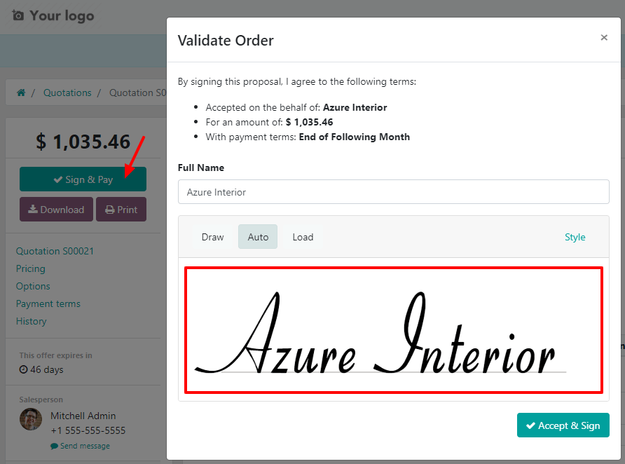

===================================
Get a signature to confirm an order
===================================

Online signatures are like electronic "fingerprints". By using them on Odoo, you will get
automatic orders confirmation. You and your customers will save a lot of time by using this
feature compared to a traditional process.

Activate online signature
=========================

Go to :menuselection:`Sales --> Configuration --> Settings` and activate the **Online Signature**
feature.

.. image:: get_signature_to_validate/signature_1.png
   :align: center
   :class: img-thumbnail
   :alt: How to enable online signature on Odoo Sales?

.. note::
   If you are familiar with this documentation: :doc:`quote_template`, you can activate or not the
   **Online Signature** feature for each quotation template you use, under their confirmation tab.
   Example:

   .. image:: get_signature_to_validate/signature_2.png
      :align: center
      :class: img-thumbnail
      :alt: How to enable online signature on Odoo Sales?

Confirm an order with a signature
=================================

When you send quotations to clients, they can instantly accept and sign it online. When they
click on **Sign & Pay**, they have the choice to draw their own signature, automatically fill in the
field with an automated signature or load a file from their computer. Here below, it is an example
of an automated signature:

Once signed, you will have the possibility to choose your payment methods. Then, when the quotation
will be paid and confirmed, a delivery order will be created automatically by Odoo.

.. tip::
   Be careful that delivery orders are only generated for storable products and if the
   **Inventory app** is already installed.

.. seealso::
   - :doc:`quote_template`
