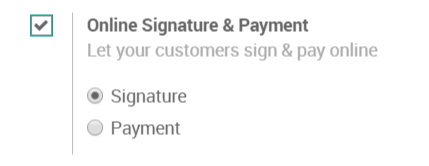
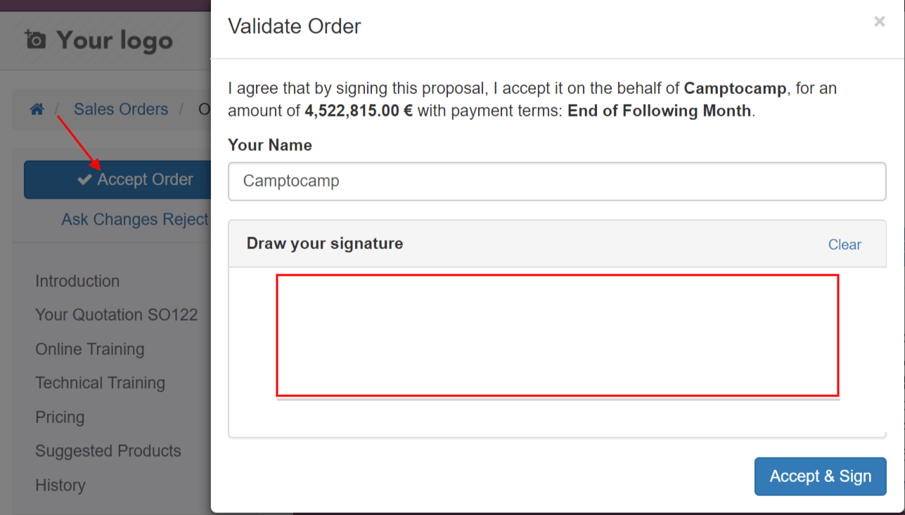

===================================
Get a signature to confirm an order
===================================

You can use online signature to get orders automatically confirmed. Both
you and your customer will save time by using this feature compared to a
traditional process.

Activate online signature
=========================

Go to :menuselection:`SALES --> Configuration --> Settings` and activate
the *Online Signature & Payment* feature.

.. note:: 
 If you are using `quotation templates <https://drive.google.com/open?id=11UaYJ0k67dA2p-ExPAYqZkBNaRcpnItCyIdO6udgyOY>`_,
 you can also pick a default setting for each template.

Validate an order with a signature
==================================

When you sent a quotation to your client, they can accept it and sign online instantly.

Once signed the quotation will be confirmed and delivery will start.

