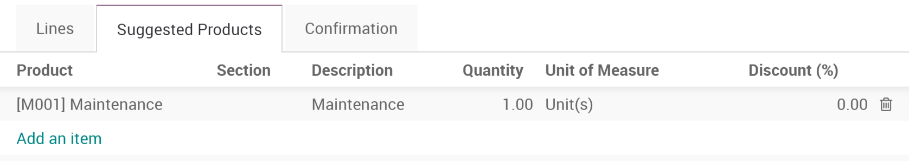
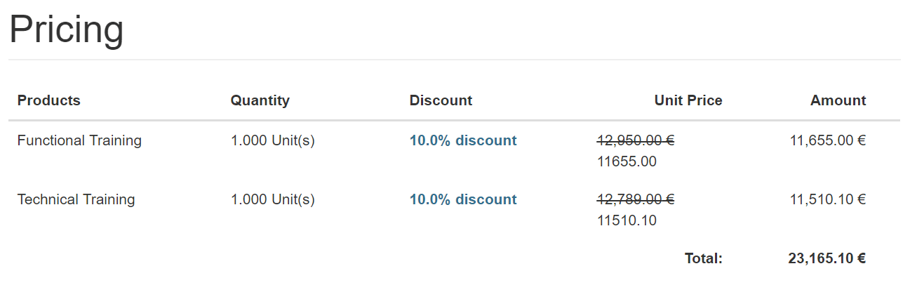
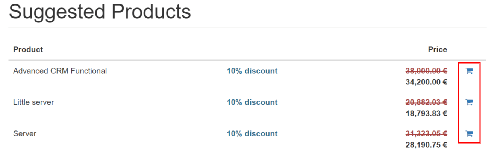
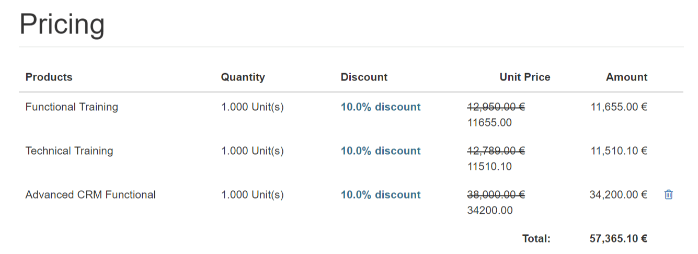
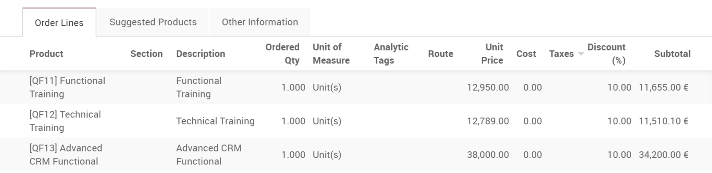

===========================================
Increase your sales with suggested products
===========================================

The use of suggested products is an attempt to offer related and useful
products to your client. For instance, a client purchasing a cellphone
could be shown accessories like a protective case, a screen cover, and
headset.

Add suggested products to your quotation templates
==================================================

Suggested products can be set on *Quotation Templates*.

.. TODO You can find documentation about it here https://docs.google.com/document/u/1/d/11UaYJ0k67dA2p-ExPAYqZkBNaRcpnItCyIdO6udgyOY/edit?usp=drive_web&ouid=104638657716670524342

Once on a template, you can see a *Suggested Products* tab where you
can add related products or services.

You can also add or modify suggested products on the quotation.

Add suggested products to the quotation
=======================================

When opening the quotation from the received email, the customer can add
the suggested products to the order.

The product(s) will be instantly added to their quotation when clicking
on any of the little carts.

Depending on your confirmation process, they can either digitally sign
or pay to confirm the quotation.

Each move done by the customer to the quotation will be tracked in the
sales order, letting the salesperson see it.

