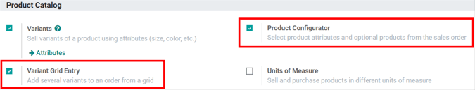
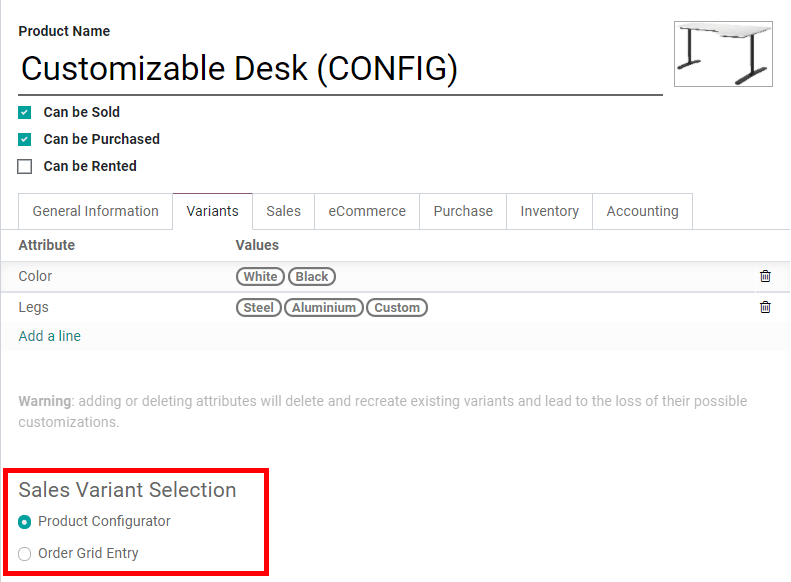
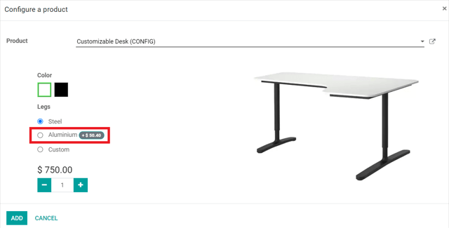
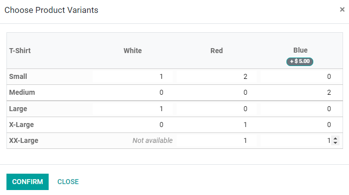
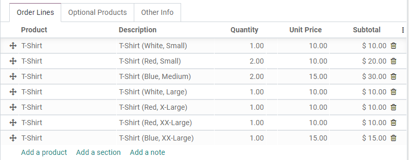

===================================================
Use product variants on quotations and sales orders
===================================================

Product variants can be added to quotations and sales orders using the Product Configurator,
Variant Grid Entry, or both.

Configuration
=============

To enable product variants on quotations and sales orders, go to :menuselection:`Sales -->
Configuration --> Settings --> Product Catalog` and activate one or both of the
:guilabel:`Product Configurator` and :guilabel:`Variant Grid Entry` settings. Finally, click
:guilabel:`Save` to apply the settings.

After saving the settings, configure the product form. Head over to :menuselection:`Sales -->
Products --> Products` and select any product (or click :guilabel:`Create` to create a new one).
On the product form, click :guilabel:`Edit`, and then click on the :guilabel:`Variants` tab. Under
:guilabel:`Sales Variant Selection`, choose either :guilabel:`Product Configurator` or
:guilabel:`Order Grid Entry`. This selection determines which method is used to add the product to
quotations or sales orders. Finally, click :guilabel:`Save` to apply the setting.

.. note::
   The product must have at least two variants (one attribute with two values) created in order for
   the :guilabel:`Sales Variant Selection` option to appear. Click :guilabel:`Add a line` under
   :guilabel:`Attribute` to add attributes and values to this product and create product variants.

Use the Product Configurator
============================

The :guilabel:`Product Configurator` appears on a quotation or sales order when products are added
that have both variants configured and the :guilabel:`Product Configurator` option selected.

The :guilabel:`Product Configurator` lets salespeople choose exactly which product variant to add
to the quotation or sales order using a format similar to online shopping. Color options display
any HTML color codes set up in the :guilabel:`Color` attribute. Features with an additional cost
will display the additional cost next to their name. Once the desired product variant attributes
are selected, click :guilabel:`Add` to add the product variant to the quotation or sales order.

By default, the product variant attributes are displayed on the quotation or sales order in the
:guilabel:`Description` column, but the :guilabel:`Product Variant` column can be added through the
additional options menu (3 vertical dots icon).

Use Variant Grid Entries
========================

:guilabel:`Variant Grid Entries` appear on a quotation or sales order when products are added that
have both variants configured and the :guilabel:`Order Grid Entry` option selected. Grid entry can
streamline the process of creating large, varied quotations by letting salespeople enter exact
quantities of each product variant all at once.

:guilabel:`Variant Grid Entry` displays a grid of every variant available for the selected product.
Choose the exact quantities of each product variant for a quotation or sales order by typing in the
number or using the arrows. :guilabel:`Not Available` is displayed when a particular variant has
been deactivated in the database. Once all the product variants and their quantities have been set,
click :guilabel:`Confirm` to add them to the quotation or sales order.

Each product variant appears as an individual line item on the quotation or sales order, because
each of these items has its own stock.

