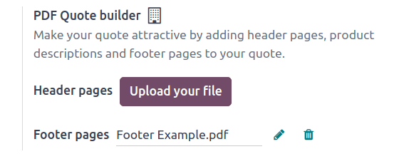
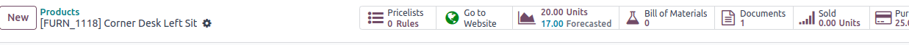

=================
PDF quote builder
=================

The *PDF Quote Builder* in Odoo *Sales* provides the opportunity to send customers a fully
customized PDF file for quotes, showcasing the company and products, with various information and
design elements, instead of just showing the price and total.

The PDF Quote Builder groups header pages, product descriptions, the price(s), and footer pages to
create a detailed quote. It can also inject dynamic texts in the PDF to personalize the offer for
the customer.

Having a customized PDF in quotes provides a heightened conclusion to the shopping experience for
customers, and adds an elegant level of professionalism to a company.

.. seealso::
   `Odoo Quick Tips - Create a PDF quote [video] <https://www.youtube.com/watch?v=tQNydBZt-VI>`_

.. note::
   It is recommended to edit PDF forms with Adobe software. The form fields on the header and footer
   PDF templates are necessary to get dynamic values with Odoo.

Configuration
=============

In order to add custom PDF files for quotes, the :guilabel:`PDF Quote builder` feature *must* be
configured.

To do that, navigate to :menuselection:`Sales app --> Configuration --> Settings`. Then, on the
:guilabel:`Settings` page, scroll to the :guilabel:`Quotations & Orders` section, and locate the
:guilabel:`PDF Quote builder` feature.

Here, custom :guilabel:`Header pages` and :guilabel:`Footer pages` can be uploaded. To upload
either, click the :guilabel:`Upload your file` button, or the :guilabel:`✏️ (pencil)` icon to the
right of the desired field, and proceed to locate, select, and upload the desired PDF file.

.. note::
   Headers and footers can also be added directly in a quotation template, so it's possible to have
   different variations per template.

Clicking the :guilabel:`🗑️ (trash)` icon deletes the current PDF file and replaces the blank field
with an :guilabel:`Upload your file` button.

Once the desired PDF file(s) are uploaded in the appropriate fields in the :guilabel:`PDF Quote
builder` section of the *Sales* :guilabel:`Settings` page, be sure to click :guilabel:`Save`.

The files uploaded here will be the default PDF used for all quotes.

.. note::
   Values set in the PDF Quote Builder settings are company-specific.

Dynamic text in PDFs
====================

While creating custom PDFs for quotes, use *dynamic text* for Odoo to auto-fill the PDF content with
information related to the quote from the Odoo database, like names, prices, etc.

Dynamic text values are form components (text inputs) that can be added in a PDF file, and Odoo
automatically fills those values in with information related to the quote.

Dynamic text values
-------------------

Below are common dynamic text values used in custom PDFs, and what they represent:

- :guilabel:`name`: Sales Order Reference
- :guilabel:`partner_id__name`: Customer Name
- :guilabel:`user_id__name`: Salesperson Name
- :guilabel:`amount_untaxed`: Untaxed Amount
- :guilabel:`amount_total`: Total Amount
- :guilabel:`delivery_date`: Delivery Date
- :guilabel:`validity_date`: Expiration Date
- :guilabel:`client_order_ref`: Customer Reference

.. note::
   Double underscore notation for :guilabel:`partner_id__name` and :guilabel:`user_id__name` values
   are used in place of the typically used `.` symbol because the library currently does not support
   the `.` symbol.

Product-specific dynamic text values are as follows:

- :guilabel:`description`: Product Description
- :guilabel:`quantity`: Quantity
- :guilabel:`uom`: Unit of Measure (UoM)
- :guilabel:`price_unit`: Price Unit
- :guilabel:`discount`: Discount
- :guilabel:`product_sale_price`: Product List Price
- :guilabel:`taxes`: Taxes name joined by a comma (`,`)
- :guilabel:`tax_excl_price`: Tax Excluded Price
- :guilabel:`tax_incl_price`: Tax Included Price

.. example::
   When a PDF is built, it's best practice to use common dynamic text values (:guilabel:`name` and
   :guilabel:`partner_id_name`). When uploaded into the database, Odoo auto-populates those fields
   with the information from their respective fields.

   In this case, Odoo would auto-populate the Sales Order Reference in the :guilabel:`name` dynamic
   text field, and the Customer Name in the :guilabel:`partner_id_name` field.

   .. image:: pdf_quote_builder/pdf-quote-builder-sample.png
      :align: center
      :alt: PDF quote being built using common dynamic placeholders.

Once the PDF file(s) are complete, save them to the computer's hard drive, and proceed to upload
them to Odoo via :menuselection:`Sales app --> Configuration --> Settings --> PDF Quote builder`.

Upload the created PDF in the :guilabel:`Header pages` or :guilabel:`Footer pages` field.

Once the upload(s) are complete, click :guilabel:`Save`.

Add PDF to product
==================

In Odoo *Sales*, it's also possible to add a custom PDF to a product form. When a PDF is added to a
product, and that product is used in a quotation, that PDF is also inserted in the final PDF.

To add a custom PDF to a product, start by navigating to :menuselection:`Sales app --> Products -->
Products`, and select the desired product to which a custom PDF should be added.

.. note::
   A document could also be added to a product variant, instead of a product. If there are documents
   on a product *and* on its variant, **only** the documents in the variant are shown.

   To add a custom document to a product variant, navigate to :menuselection:`Sales app --> Products
   --> Product Variants`. Select the desired variant, click the :guilabel:`Documents` smart button,
   and proceed to upload the custom document(s) to the specific product variant.

On the product page, click the :guilabel:`Documents` smart button at the top of the page.

Doing so reveals a separate :guilabel:`Documents` page for that product, wherein files related to
that product can be uploaded. From this page, either click :guilabel:`New` or :guilabel:`Upload`.

Clicking :guilabel:`Upload` instantly provides the opportunity to upload the desired document. Then,
the document can be further configured on the document card, or by clicking the three dots icon in
the top right corner of the document card, and then clicking :guilabel:`Edit`.

Clicking :guilabel:`New` reveals a blank documents form, in which the desired PDF can be uploaded
via the :guilabel:`Upload your file` button on the form, located in the :guilabel:`File Content`
field.

.. image:: pdf_quote_builder/blank-document-form.png
   :align: center
   :alt: A standard document form with various fields for a specific product in Odoo Sales.

Various information and configurations related to the uploaded document can be modified here.

The first field on the documents form is for the :guilabel:`Name` of the document, and it is
grayed-out (not clickable) until a document is uploaded. Once a PDF has been uploaded, the
:guilabel:`Name` field is auto-populated with the name of the PDF, and it can then be edited.

Prior to uploading a document, there's the option to designate whether the document is a
:guilabel:`File` or :guilabel:`URL` from the :guilabel:`Type` drop-down field menu.

.. image:: pdf_quote_builder/document-form-uploaded-pdf.png
   :align: center
   :alt: A standard document form with an uploaded pdf in Odoo Sales.

.. note::
    If a PDF is uploaded, the :guilabel:`Type` field is auto-populated to :guilabel:`File`, and it
    cannot be modified.

Then, in the :guilabel:`Sales` section, in the :guilabel:`Visible at` field, click the drop-down
menu, and select either: :guilabel:`Quotation`, :guilabel:`Confirmed order`, or :guilabel:`Inside
quote`.

- :guilabel:`Quotation`: the document is sent to (and accessible by) customers at any time.

- :guilabel:`Confirmed order`: the document is sent to customers upon the confirmation of an order.
  This is best for user manuals and other supplemental documents.

- :guilabel:`Inside quote`: the document is included in the PDF of the quotation, between the header
  pages and the :guilabel:`Pricing` section of the quote.

.. example::
   When the :guilabel:`Inside quote` option for the :guilabel:`Visible at` field is chosen, and the
   custom PDF file, `Sample Builder.pdf` is uploaded, the PDF is visible on the quotation the in the
   *customer portal* under the :guilabel:`Documents` field.

    .. image:: pdf_quote_builder/pdf-inside-quote-sample.png
       :align: center
       :alt: Sample of an uploaded pdf with the inside quote option chosen in Odoo Sales.

Lastly, in the :guilabel:`E-Commerce` section, decide whether or not to :guilabel:`Show on product
page` on the front-end (in the online store).

.. example::
   When the :guilabel:`Show on product page` option is enabled, a link to the uploaded document,
   `Sample Builder.pdf`, appears on the product's page, located on the frontend in the online store.

   It appears beneath a :guilabel:`Documents` heading, with a link showcasing the name of the
   uploaded document.

    .. image:: pdf_quote_builder/show-product-page.png
       :align: center
       :alt: Showing a link to an uploaded document on a product page using Odoo Sales.

PDF quote
=========

Once a quote with a pre-configured PDF has been confirmed, Odoo provides the option to print the
confirmed quote to check for errors, or to keep for records.

To print the PDF quote, navigate to the confirmed quote, and click the :guilabel:`⚙️ (gear)` icon to
reveal a drop-down menu. From this drop-down menu, select :guilabel:`Print`, then select
:guilabel:`PDF Quote`.

.. image:: pdf_quote_builder/drop-down-print-pdf.png
   :align: center
   :alt: Print pdf quote option on drop-down menu located on confirmed sales order in Odoo Sales.

Doing so instantly downloads the PDF quote. When opened, the PDF quote, along with the configured
product PDF that was set to be visible inside the quote, can be viewed and printed.

.. note::
   Download these :download:`PDF quote builder examples
   <pdf_quote_builder/pdfquotebuilderexamples.zip>` for added reference.

.. seealso::
   - :doc:`/applications/sales/sales/send_quotations/quote_template`
