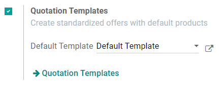

=======================
Use quotation templates
=======================

By creating custom quotation templates, you will save a lot of time. Indeed, with the use of
templates, you will be able to send complete quotations at a fast pace.

Configuration
=============

To enable this feature, go to :menuselection:`Sales --> Configuration --> Settings` and activate
**Quotation Templates**.

For even more convenience, it is also recommended to add the **Quotation Builder** feature which
will help you design your quotation templates very easily. This option will automatically install
the Odoo Website App.

.. image:: quote_template/quotations_templates_2.png
   :align: center
   :class: img-thumbnail
   :alt: How to enable quotation builder on Odoo Sales?

Create your first template
==========================

Quotation templates are under :menuselection:`Sales --> Configuration`.

You can create a new template or edit an existing one. Once named, you will be able to select
products and quantities as well as the expiration time of the quotation.

.. image:: quote_template/quotations_templates_3.png
   :align: center
   :class: img-thumbnail
   :alt: Create a new quotation template on Odoo Sales

Design your template
====================

You will have the possibility to design your template and edit the customer interface in order
to manage what clients will see before accepting and paying the quotation. For example, you will
be able to describe your company, your services and your products. To do so, you can click on
**Edit** and you will be brought to the quotation builder.

.. image:: quote_template/quotations_templates_4.png
   :align: center
   :class: img-thumbnail
   :alt: Design your quotation template on Odoo Sales

You can easily edit the content of your template by dragging & dropping different building blocks
to organize your quotation. For example, you can add a content block to describe your products.

.. image:: quote_template/quotations_templates_5.png
   :align: center
   :class: img-thumbnail
   :alt: Drag & drop building blocks to create your quotation template on Odoo Sales

Use a quotation template
========================

When creating a quotation, you can choose a specific template.

.. image:: quote_template/quotations_templates_6.png
   :align: center
   :class: img-thumbnail
   :alt: Select a specific template on Odoo Sales

.. tip::
   You can select any template of your choice and suggest it as the default template in
   the **Sales** settings.

Confirm the quotation
=====================

Templates facilitate the confirmation process by allowing customers to sign electronically or to
pay online. You can activate these two options directly in the quotation template itself.

.. image:: quote_template/quotations_templates_7.png
   :align: center
   :class: img-thumbnail
   :alt: Allow your customers to sign electronically or to pay online on Odoo Sales

.. note::
   Every quotation will now have this setting. Of course you can always change it and make it
   specific for each quotation.

.. seealso::
   - :doc:`get_signature_to_validate`
   - :doc:`get_paid_to_validate`
