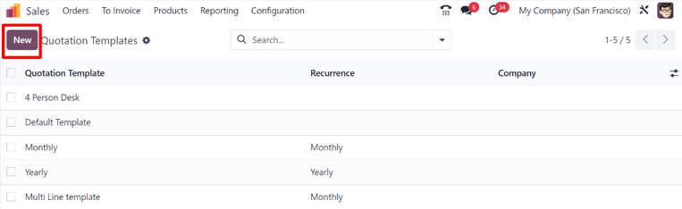
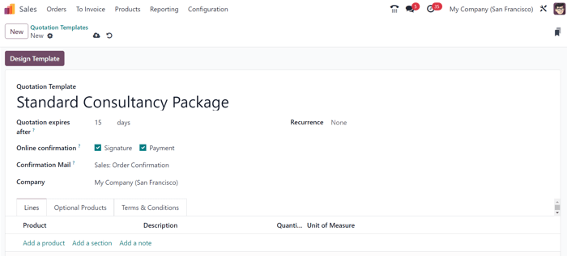
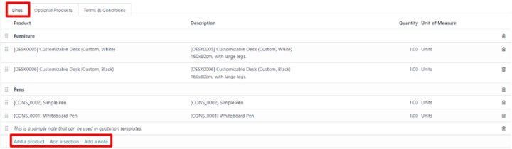
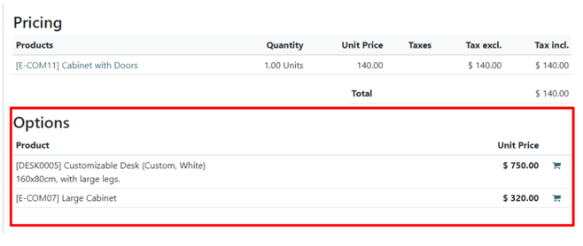
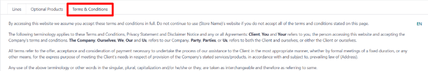
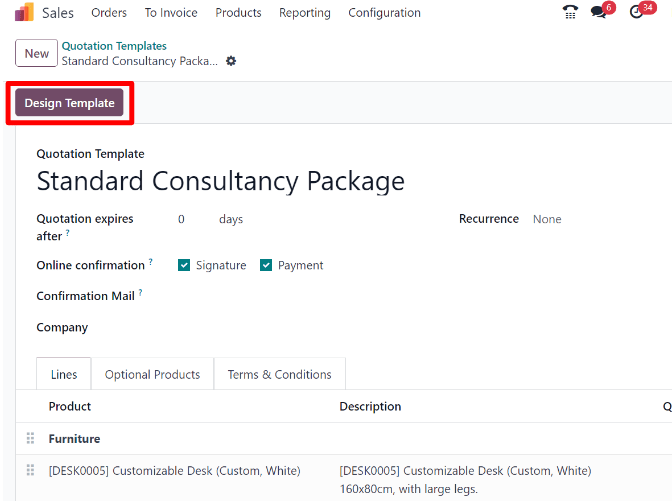
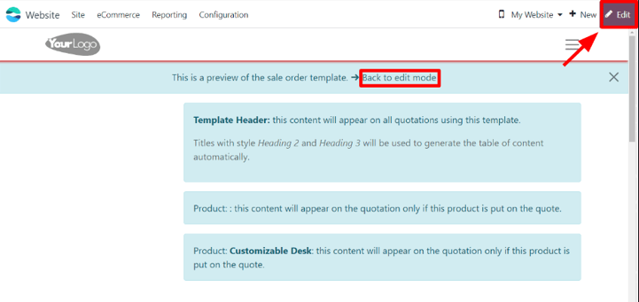
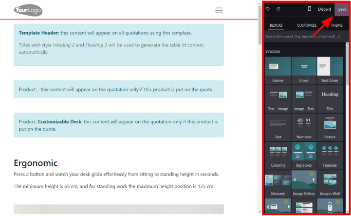
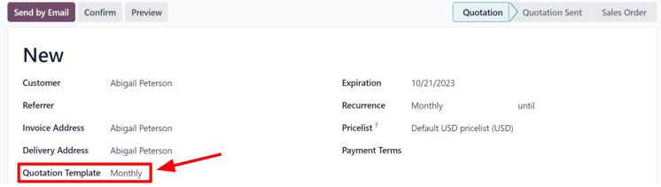
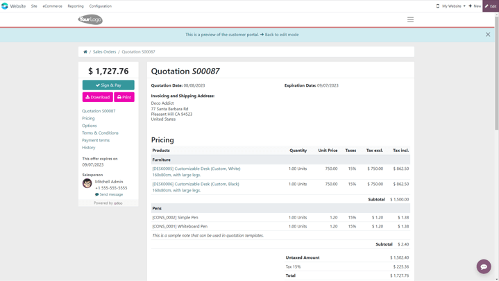

===================
Quotation templates
===================

In Odoo *Sales*, salespeople have the ability to create reusable quotation templates for common
products or services that the business offers.

By using these templates, quotations can be tailored and sent to customers at a much faster pace,
without having to create new quotations from scratch every time a sales negotiation occurs.

.. _sales/send_quotations/templates:

Configuration
=============

Begin by activating the setting in :menuselection:`Sales app --> Configuration --> Settings`, and
scroll to the :guilabel:`Quotations \& Orders` heading.

In that section, check the box beside the :guilabel:`Quotation Templates` option. Doing so reveals a
new :guilabel:`Default Template` field, in which a default quotation template can be chosen from a
drop-down menu.

.. image:: quote_template/quotations-templates-setting.png
   :align: center
   :alt: How to enable quotation templates on Odoo Sales.

Also, upon activating the :guilabel:`Quotation Template` feature, an internal :guilabel:`➡️
Quotation Templates` link appears beneath the :guilabel:`Default Template` field.

Clicking that link reveals the :guilabel:`Quotation Templates` page, from which templates can be
created, viewed, and edited.

Before leaving the :guilabel:`Settings` page, don't forget to click the :guilabel:`Save` button to
save all changes made during the session.

Create quotation templates
==========================

Click the :guilabel:`Quotation Templates` link on the :guilabel:`Settings` page, or navigate to
:menuselection:`Sales app --> Configuration --> Quotation Templates`. Both options reveal the
:guilabel:`Quotation Templates` page, where quotation templates can be created, viewed, and edited.

To create a new quotation template, click the :guilabel:`New` button, located in the upper-left
corner. Doing so reveals a blank quotation template form that can be customized in a number of ways.

Start by entering a name for the template in the :guilabel:`Quotation Template` field.

Then, in the :guilabel:`Quotation expires after` field, designate how many days the quotation
template will remain valid for, or leave the field on the default `0` to keep the template valid
indefinitely.

If the :guilabel:`Online Signature` and/or :guilabel:`Online Payment` features are activated in the
:guilabel:`Settings` (:menuselection:`Sales app --> Configuration --> Settings`), those options are
available in the :guilabel:`Online confirmation` field.

In the :guilabel:`Online confirmation` field, check the box beside :guilabel:`Signature` to request
an online signature from the customer to confirm an order. Check the box beside :guilabel:`Payment`
to request an online payment from the customer to confirm an order.

Both options can be enabled simultaneously, in which case the customer must provide **both** a
signature **and** a payment to confirm an order.

Next, in the :guilabel:`Confirmation Mail` field, click the blank field to reveal a drop-down menu.
From the drop-down menu, select a pre-configured email template to be sent to customers upon
confirmation of an order.

.. tip::
   To create a new email template directly from the :guilabel:`Confirmation Mail` field, start
   typing the name of the new email template in the field, and select either: :guilabel:`Create` or
   :guilabel:`Create and edit...` from the drop-down menu that appears.

   Selecting :guilabel:`Create` creates the email template, which can be edited later. Selecting
   :guilabel:`Create and edit...` creates the email template, and a :guilabel:`Create Confirmation
   Mail` pop-up window appears, in which the email template can be customized and configured right
   away.

   .. image:: quote_template/create-confirmation-mail-popup.png
      :align: center
      :alt: Create confirmation mail pop-up window from the quotation template form in Odoo Sales.

   When all modifications are complete, click :guilabel:`Save \& Close` to save the email template
   and return to the quotation form.

If working in a multi-company environment, use the :guilabel:`Company` field to designate to which
company this quotation template applies.

In the :guilabel:`Recurrence` field, choose from a variety of pre-configured amounts of time (e.g.
:guilabel:`Monthly`, :guilabel:`Quarterly`) to designate how often this quotation template should
occur.

.. note::
   The :guilabel:`Recurrence` field **only** applies to subscription plans. For more information,
   check out the documentation on :doc:`../../subscriptions/plans`.

Lines tab
---------

In the :guilabel:`Lines` tab, products can be added to the quotation template by clicking
:guilabel:`Add a product`, organized by clicking :guilabel:`Add a section` (and dragging/dropping
section headers), and further explained with discretionary information (such as warranty details,
terms, etc.) by clicking :guilabel:`Add a note`.

To add a product to a quotation template, click :guilabel:`Add a product` in the :guilabel:`Lines`
tab of a quotation template form. Doing so reveals a blank field in the :guilabel:`Product` column.

When clicked, a drop-down menu with existing products in the database appear. Select the desired
product from the drop-down menu to add it to the quotation template.

.. tip::
   If the desired product isn't readily visible, type the name of the desired product in the
   :guilabel:`Product` field, and the option appears in the drop-down menu. Products can also be
   found by clicking :guilabel:`Search More...` from the drop-down menu.

.. note::
   When a product is added to a quotation template, the default :guilabel:`Quantity` is `1`, but
   that can be edited at any time.

Then, drag-and-drop the product to the desired position, via the :guilabel:`six squares` icon,
located to the left of each line item.

To add a *section*, which serves as a header to organize the lines of a sales order, click
:guilabel:`Add a section` in the :guilabel:`Lines` tab. When clicked, a blank field appears, in
which the desired name of the section can be typed. When the name has been entered, click away to
secure the section name.

Then, drag-and-drop the section name to the desired position, via the :guilabel:`six squares` icon,
located to the left of each line item.

To add a note, which would appear as a piece of text for the customer on the quotation, click
:guilabel:`Add a note` in the :guilabel:`Lines` tab. When clicked, a blank field appears, in which
the desired note can be typed. When the note has been entered, click away to secure the note.

Then, drag-and-drop the note to the desired position, via the :guilabel:`six squares` icon.

To delete any line item from the :guilabel:`Lines` tab (product, section, and/or note), click the
:guilabel:`🗑️ (trash can)` icon on the far-right side of the line.

Optional Products tab
---------------------

The use of *optional products* is a marketing strategy that involves the cross-selling of products
along with a core product. The aim is to offer useful and related products to customers, which may
result in an increased sale.

For instance, if a customer wants to buy a car, they have the choice to order massaging seats, as
well, or ignore the offer and simply buy the car. Presenting the choice to purchase optional
products enhances the customer experience.

Optional products appear as a section on the bottom of sales orders and eCommerce pages. Customers
can immediately add them to their online sales orders themselves, if desired.

In the :guilabel:`Optional Products` tab, :guilabel:`Add a line` for each cross-selling product
related to the original items in the :guilabel:`Lines` tab, if applicable. The products added here
ideally complement the original offering as added value for the prospective buyer.

.. image:: quote_template/optional-products-tab-quotation-template.png
   :align: center
   :alt: Populated optional products tab on a quotation template in Odoo Sales.

Clicking :guilabel:`Add a line` reveals a blank field in the :guilabel:`Product` column.

When clicked, a drop-down menu with products from the database appear. Select the desired product
from the drop-down menu to add it as an optional product to the quotation template.

To delete any line item from the :guilabel:`Optional Products` tab, click the :guilabel:`🗑️ (trash
can)` icon.

.. note::
   Optional products are **not** required to create a quotation template.

Terms \& Conditions tab
-----------------------

The :guilabel:`Terms \& Conditions` tab provides the opportunity to add terms and conditions to the
quotation template. To add terms and conditions, simply type (or copy/paste) the desired terms and
conditions in this tab.

.. seealso::
   :doc:`../../../finance/accounting/customer_invoices/terms_conditions`

.. note::
   Terms and conditions are **not** required to create a quotation template.

Design quotation templates
==========================

In the upper-left corner of the quotation template form, there's a :guilabel:`Design Template`
button.

When clicked, Odoo reveals a preview of the quotation template, through the Odoo *Website*
application, as it will appear on the front-end of the website to the customer.

.. note::
   This feature is **only** available if the *Website* application is installed.

Odoo uses numerous blue placeholder blocks to signify where certain elements appear, and what they
contain (e.g. :guilabel:`Template Header`, :guilabel:`Product`).

To edit the content, appearance, and overall design of the quotation template via the *Website*
application, click the :guilabel:`Edit` button in the upper-right corner.

When :guilabel:`Edit` is clicked, Odoo reveals a sidebar filled with a variety of design elements
and feature-rich building blocks. These building blocks can be dragged-and-dropped anywhere on the
quotation template design.

After a block has been dropped in the desired position, it can be customized and configured to fit
any unique need, look, or style.

.. tip::
   Quotation template design uses the same methodology and functionality with design building blocks
   as a typical web page design with Odoo *Website*. Be sure to check out the
   :doc:`../../../websites/website` documentation to learn more.

When all blocks and customizations are complete, click the :guilabel:`Save` button to put those
configurations into place.

There is also a blue banner at the top of the quotation template design with a link to quickly
return :guilabel:`Back to edit mode`. When clicked, Odoo returns to the quotation template form in
the back-end of the *Sales* application.

Use quotation templates
=======================

When creating a quotation (:menuselection:`Sales app --> New`), choose a pre-configured template in
the :guilabel:`Quotation Template` field.

To view what the customer will see, click the :guilabel:`Preview` button at the top of the page to
see how the quotation template appears on the front-end of the website through Odoo's customer
portal.

.. seealso::
   - :doc:`get_signature_to_validate`
   - :doc:`get_paid_to_validate`
