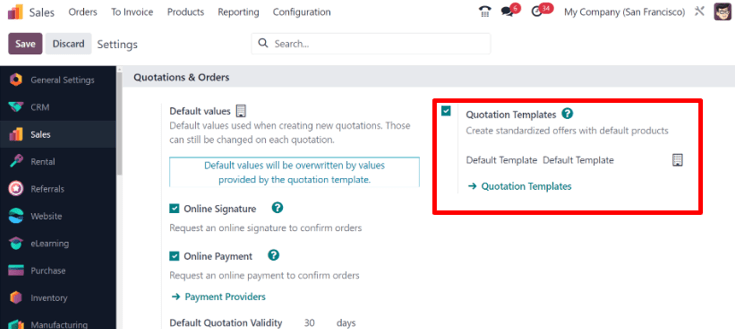
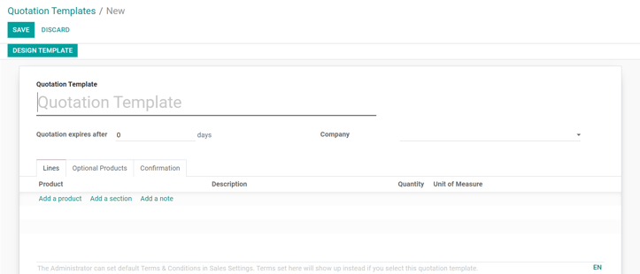
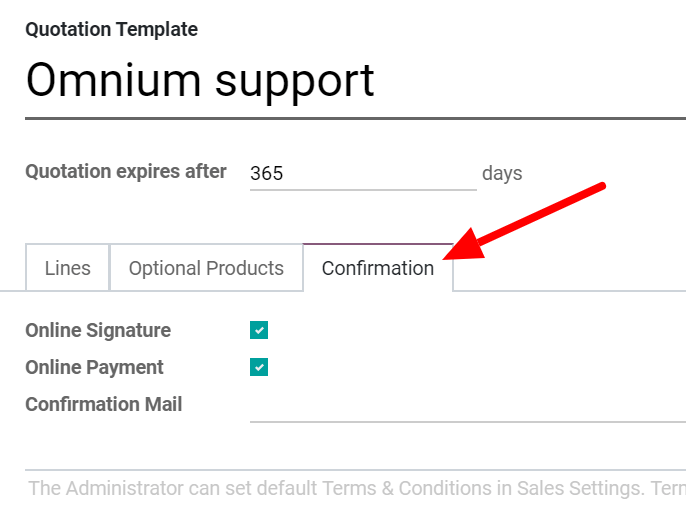
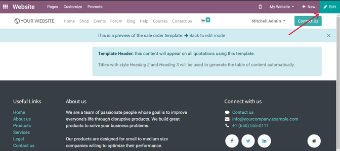
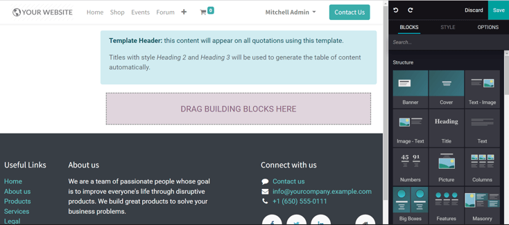
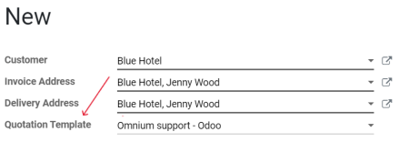

===================
Quotation templates
===================

In Odoo *Sales*, salespeople have the ability to create reusable quotation templates for common
product or service offerings that the business offers. By using these templates, quotations can be
tailored and sent to customers at a much faster pace, without having to create new quotations from
scratch every time a sales negotiation occurs.

.. _sales/send_quotations/templates:

Configuration
=============

Begin by activating the setting in :menuselection:`Sales app --> Configuration --> Settings`, and
scroll to the :guilabel:`Quotations & Orders` heading.

In that section, check the box beside the :guilabel:`Quotation Templates` option. Doing so reveals
a new :guilabel:`Default Template` field, in which a default quotation template can be chosen from a
drop-down menu.

Also, upon activating the :guilabel:`Quotation Template` feature, an internal :guilabel:`➡️
Quotation Templates` link appears beneath the :guilabel:`Default Template` field. Clicking that link
reveals the :guilabel:`Quotation Templates` page, from which templates can be created, viewed, and
edited.

.. tip::
   Consider activating the :guilabel:`Quotation Builder` option in the :guilabel:`Settings`, as
   well, which is located in the right column beside the :guilabel:`Quotation Templates` option.
   This feature aides in the design and customization of quotation templates.

   **Note:** enabling this feature also automatically installs the Odoo *Website* application.

.. image:: quote_template/quotations-builder-setting.png
   :align: center
   :alt: How to enable quotation builder on Odoo Sales.

Before leaving the :guilabel:`Settings` page, don't forget to click the :guilabel:`Save` button to
activate the feature(s) and save all changes made during the session.

Create quotation templates
==========================

Click the :guilabel:`Quotation Templates` link on the :guilabel:`Settings` page, or navigate to
:menuselection:`Sales app --> Configuration --> Quotation Templates`. Both options reveal the
:guilabel:`Quotation Templates` page, where quotation templates can be created, viewed, and edited.

To create a new quotation template, click the :guilabel:`Create` button, located in the upper-left
corner. Doing so reveals a blank quotation template form that can be customized in a number of ways.

Start by entering a name for the template in the :guilabel:`Quotation Template` field. Then, in the
:guilabel:`Quotation expires after` field, designate how many days the quotation template will
remain valid for, or leave the field on the default `0` to keep the template valid indefinitely.

In the :guilabel:`Company` field, designate to which company this quotation template applies, if
working in a multi-company environment.

Beneath those fields are three tabs: :guilabel:`Lines`, :guilabel:`Optional Products`,
:guilabel:`Confirmation`.

In the :guilabel:`Lines` tab, products can be added to the quotation template by clicking
:guilabel:`Add a product`, organized by clicking `Add a section` (and dragging/dropping section
headers accordingly), and further explained with discretionary information (such as warranty
details, terms, etc.) by clicking :guilabel:`Add a note`.

In the :guilabel:`Optional Products` tab, :guilabel:`Add a line` for each compatible cross-selling
product related to the original items in the :guilabel:`Lines` tab, if applicable. The products
added here ideally compliment the original offering as added value for the prospective buyer.

Lastly, in the :guilabel:`Confirmation` tab, enable options, as needed, to require an
:guilabel:`Online Signature` and/or an :guilabel:`Online Payment`, which each allow buyers to
confirm orders automatically using the web portal view after the required action is taken.

There's also an option to add a :guilabel:`Confirmation Mail` to the quotation template, as well -
meaning whenever this template is used, and an order is confirmed, an email is sent to the customer
informing them that their order has been confirmed.

Design quotation templates
==========================

.. note::
   The following section on designing quotation templates only applies to databases that have the
   *Quotation Builder* feature enabled, which is accessible by following the :ref:`configuration
   steps above <sales/send_quotations/templates>`.

In the upper-left corner of the quotation template form, there's a :guilabel:`Design Template`
button. When clicked, Odoo reveals a preview of the quotation template, as it will appear on the
front-end of the website, with a :guilabel:`Template Header` specifying that this content will
appear on all quotations using this specific template.

To edit the content, look, and overall design of the quotation template, click the :guilabel:`Edit`
button in the upper-right corner. Doing so reveals a variety of design elements and feature-filled
building blocks.

Drag and drop any desired building blocks onto the blank quotation template, and proceed to further
customize the content to fit any business need. When all blocks and customizations are complete,
click the :guilabel:`Save` button to put those configurations into place.

Use quotation templates
=======================

When creating a quotation (:menuselection:`Sales app --> Create`), choose a preconfigured template
in the :guilabel:`Quotation Template` field drop-down menu.

To view what the customer will see, click the :guilabel:`Customer Preview` smart button to see how
the quotation template will look on the front-end of the website.

.. tip::
   Go to :menuselection:`Sales --> Configuration --> Settings` to select a :guilabel:`Default
   Template`.

.. seealso::
   - :doc:`/applications/sales/sales/send_quotations/get_signature_to_validate`
   - :doc:`/applications/sales/sales/send_quotations/get_paid_to_validate`
