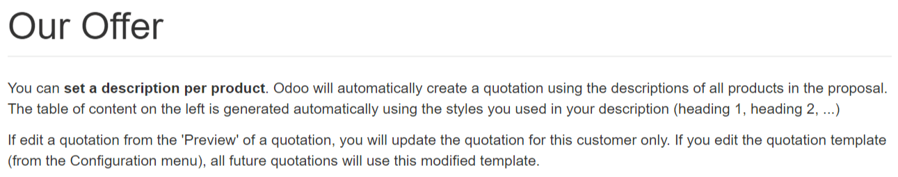
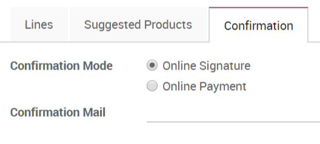

=======================
Use quotation templates
=======================

If you often sell the same products or services, you can save a lot of
time by creating custom quotation templates. By using a template you can
send a complete quotation in no time.

Configuration
=============

For this feature to work, go to :menuselection:`Sales --> Configuration
--> Settings` and activate *Quotations Templates*.

.. image:: media/quote_template01.png
  :align: center

Create your first template
==========================

You will find the templates menu under :menuselection:`Sales -->
Configuration`.

You can then create or edit an existing one. Once named, you will be
able to select the product(s) and their quantity as well as the
expiration time for the quotation.

.. image:: media/quote_template02.png
  :align: center

On each template, you can also specify discounts if the option is
activated in the *Sales* settings. The base price is set in the
product configuration and can be alterated by customer pricelists.

.. TODO (TO LINK DOC LATER WHEN DONE based on this https://www.odoo.com/documentation/user/12.0/sales/products_prices/prices/pricing.html

Edit your template
==================

You can edit the customer interface of the template that they see to
accept or pay the quotation. This lets you describe your company,
services and products. When you click on *Edit Template* you will be
brought to the quotation editor.

.. image:: media/quote_template03.png
  :align: center

This lets you edit the description content thanks to drag & drop of
building blocks. To describe your products add a content block in the
zone dedicated to each product.

.. image:: media/quote_template05.png
  :align: center

.. note::
  The description set for the products will be used in all
  quotations templates containing those products.

Use a quotation template
========================

When creating a quotation, you can select a template.

.. image:: media/quote_template06.png
  :align: center

Each product in that template will be added to your quotation.

.. tip::
  You can select a template to be suggested by default in the
  *Sales* settings.

Confirm the quotation
=====================

Templates also ease the confirmation process for customers with a
digital signature or online payment. You can select that in the template
itself.

Every quotation will now have this setting added to it.

Of course you can still change it and make it specific for each
quotation.

.. todo  seealso
..    `*https://docs.google.com/document/d/1OkC9MVvuDvzz2b9gZjfzMPzep7qdbOyZZxE0ZZj2K7E/edit* <https://docs.google.com/document/d/1OkC9MVvuDvzz2b9gZjfzMPzep7qdbOyZZxE0ZZj2K7E/edit>`__..
..    `*https://docs.google.com/document/d/1LZC5C8dZY2gvP6QHx2w5BlakIxgcHIP6GeEuBBfsRNc/edit* <https://docs.google.com/document/d/1LZC5C8dZY2gvP6QHx2w5BlakIxgcHIP6GeEuBBfsRNc/edit>`__
