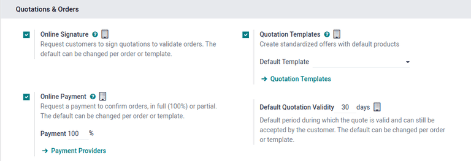

===================
Quotation templates
===================

In Odoo *Sales*, salespeople have the ability to create reusable quotation templates for common
product or service offerings that the business offers. By using these templates, quotations can be
tailored and sent to customers at a much faster pace, without having to create new quotations
from scratch every time a sales negotiation occurs.

Configuration
=============

Begin by activating the setting in :menuselection:`Sales app --> Configuration --> Settings`, and
scroll to the :guilabel:`Quotations & Orders` heading.

In that section, check the box beside the :guilabel:`Quotation Templates` option. Doing so reveals a
new :guilabel:`Default Template` field, in which a default quotation template can be chosen from a
drop-down menu.

Also, upon activating the :guilabel:`Quotation Template` feature, an internal :guilabel:`➡️
Quotation Templates` link appears beneath the :guilabel:`Default Template` field. Clicking that link
reveals the :guilabel:`Quotation Templates` page, from which templates can be created, viewed, and
edited.

Before leaving the :guilabel:`Settings` page, don't forget to click the :guilabel:`Save` button to
activate the feature(s) and save all changes made during the session.

.. _sales/send_quotations/templates:

Create quotation templates
==========================

Click the :guilabel:`Quotation Templates` link on the :guilabel:`Settings` page, or navigate to
:menuselection:`Sales app --> Configuration --> Quotation Templates`. Both options reveal the
:guilabel:`Quotation Templates` page, where quotation templates can be created, viewed, and edited.

.. tip::
   Consider activating the :guilabel:`Quotation Builder` option in the :guilabel:`Settings`, as
   well, which is located in the right column beside the :guilabel:`Quotation Templates` option.
   This feature aides in the design and customization of quotation templates.

   **Note:** enabling this feature also automatically installs the Odoo *Website* application.

.. image:: quote_template/quotations-builder-setting.png
   :align: center
   :alt: How to enable quotation builder on Odoo Sales.

Before leaving the :guilabel:`Settings` page, don't forget to click the :guilabel:`Save` button to
activate the feature(s) and save all changes made during the session.

Create quotation templates
==========================

Click the :guilabel:`Quotation Templates` link on the :guilabel:`Settings` page, or navigate to
:menuselection:`Sales app --> Configuration --> Quotation Templates`. Both options reveal the
:guilabel:`Quotation Templates` page, where quotation templates can be created, viewed, and edited.

To create a new quotation template, click the :guilabel:`Create` button, located in the upper-left
corner. Doing so reveals a blank quotation template form that can be customized in a number of ways.

.. image:: quote_template/blank-quotation-template.png
   :align: center
   :alt: Create a new quotation template on Odoo Sales.

Start by entering a name for the template in the :guilabel:`Quotation Template` field. Then, in the
:guilabel:`Quotation expires after` field, designate how many days the quotation template will
remain valid for, or leave the field on the default `0` to keep the template valid indefinitely.

In the :guilabel:`Company` field, designate to which company this quotation template applies, if
working in a multi-company environment.

Beneath those fields are three tabs: :guilabel:`Lines`, :guilabel:`Optional Products`,
:guilabel:`Confirmation`.

In the :guilabel:`Lines` tab, products can be added to the quotation template by clicking
:guilabel:`Add a product`, organized by clicking `Add a section` (and dragging/dropping section
headers accordingly), and further explained with discretionary information (such as warranty
details, terms, etc.) by clicking :guilabel:`Add a note`.

In the :guilabel:`Optional Products` tab, :guilabel:`Add a line` for each compatible cross-selling
product related to the original items in the :guilabel:`Lines` tab, if applicable. The products
added here ideally compliment the original offering as added value for the prospective buyer.

Lastly, in the :guilabel:`Confirmation` tab, enable options, as needed, to require an
:guilabel:`Online Signature` and/or an :guilabel:`Online Payment`, which each allow buyers to
confirm orders automatically using the web portal view after the required action is taken.

There's also an option to add a :guilabel:`Confirmation Mail` to the quotation template, as well -
meaning whenever this template is used, and an order is confirmed, an email is sent to the customer
informing them that their order has been confirmed.

.. image:: quote_template/quotations-templates-confirmation-tab.png
   :align: center
   :alt: Allow customers to sign electronically or to pay online on Odoo Sales.

Design quotation templates
==========================

.. note::
   The following section on designing quotation templates only applies to databases that have the
   *Quotation Builder* feature enabled, which is accessible by following the :ref:`configuration
   steps above <sales/send_quotations/templates>`.

In the upper-left corner of the quotation template form, there's a :guilabel:`Design Template`
button. When clicked, Odoo reveals a preview of the quotation template, as it will appear on the
front-end of the website, with a :guilabel:`Template Header` specifying that this content will
appear on all quotations using this specific template.

To edit the content, look, and overall design of the quotation template, click the :guilabel:`Edit`
button in the upper-right corner. Doing so reveals a variety of design elements and feature-filled
building blocks.

.. image:: quote_template/design-quotation-edit.png
   :align: center
   :alt: Design quotation template on Odoo Sales.

Drag and drop any desired building blocks onto the blank quotation template, and proceed to further
customize the content to fit any business need. When all blocks and customizations are complete,
click the :guilabel:`Save` button to put those configurations into place.

.. image:: quote_template/quotations-building-blocks.png
   :align: center
   :alt: Drag and drop building blocks to create your quotation template on Odoo Sales.

Use quotation templates
=======================

When creating a quotation (:menuselection:`Sales app --> Create`), choose a preconfigured template
in the :guilabel:`Quotation Template` field drop-down menu.

.. image:: quote_template/quotations-templates-field.png
   :align: center
   :alt: Select a specific template on Odoo Sales.

To view what the customer will see, click the :guilabel:`Customer Preview` smart button to see how
the quotation template will look on the front-end of the website.

.. tip::
   Go to :menuselection:`Sales --> Configuration --> Settings` to select a :guilabel:`Default
   Template`.
   **Note:** enabling this feature *also* automatically installs the Odoo *Website* application.

To create a new quotation template, click the :guilabel:`New` button, located in the upper-left
corner.

.. image:: quote_template/quotation-templates-page.png
   :align: center
   :alt: Quotation templates page in the Odoo Sales application.

Doing so reveals a blank quotation template form that can be customized in a number of ways.

.. image:: quote_template/blank-quotation-form.png
   :align: center
   :alt: Create a new quotation on a blank quotation form on Odoo Sales.

Start by entering a name for the template in the :guilabel:`Quotation Template` field. Then, in the
:guilabel:`Quotation expires after` field, designate how many days the quotation template will
remain valid for, or leave the field on the default `0` to keep the template valid indefinitely.

If the :guilabel:`Online Signature` and/or :guilabel:`Online Payment` feature is activated in the
:guilabel:`Settings` page (:menuselection:`Sales app --> Configuration --> Settings`), there is an
:guilabel:`Online confirmation` field, with both of those options available.

In this field, check the box beside :guilabel:`Signature` to request an online signature from the
customer to confirm an order. Check the box beside :guilabel:`Payment` in the :guilabel:`Online
confirmation` field to request an online payment from the customer to confirm an order. Both options
can be enabled simultaneously, if desired.

Next, in the :guilabel:`Confirmation Mail` field, click the blank field to reveal a drop-down menu.
From the drop-down menu, select a pre-configured email template to be sent upon confirmation of an
order.

.. tip::
   To create a new email template directly from the :guilabel:`Confirmation Mail` field, start
   typing the name of the new email template in the field, and select either: :guilabel:`Create` or
   :guilabel:`Create and edit...` from the drop-down menu that appears.

   Selecting :guilabel:`New` creates the email template, which can be edited later. Selecting
   :guilabel:`Create and edit...` creates the email template, and a :guilabel:`Create Confirmation
   Mail` pop-up window appears, in which the email template can be customized and configured right
   away.

   .. image:: quote_template/create-confirmation-mail-popup.png
      :align: center
      :alt: Create confirmation mail pop-up window from the quotation template form in Odoo Sales.

   When all modifications are complete, click :guilabel:`Save & Close` to save the email template,
   and return to the quotation form.

In the :guilabel:`Company` field, if working in a multi-company environment, designate to which
company this quotation template applies.

And, in the :guilabel:`Recurrence` field, click the blank field to reveal a drop-down menu, and
choose from a variety of pre-configured amounts of time (e.g. :guilabel:`Monthly`,
:guilabel:`Quarterly`, etc.) to designate how often this quotation template should occur.

Recurrence options
------------------

If a :guilabel:`Recurrence` option is chosen, a new series of options appear beneath the
:guilabel:`Recurrence` field. Also, the initial :guilabel:`Quotation Template` field, where
the name of the template is entered, changes to :guilabel:`Subscription Plan`.

.. image:: quote_template/quotation-form-recurrence-options.png
   :align: center
   :alt: Quotation template options that appear when a recurrence option is chosen.

.. note::
   The :guilabel:`Quotation Template` field changes to :guilabel:`Subscription Plan` because the
   configuration of a :guilabel:`Recurrence` indicates that this quotation template will be used on
   subscription-based products.

The first recurrence-related option is the :guilabel:`Duration` field, where it's possible to choose
to have the recurrence last :guilabel:`Forever` or for a :guilabel:`Fixed` period of time.

.. note::
   If the :guilabel:`Fixed` option is chosen in the :guilabel:`Duration` field, the :guilabel:`End
   After` field appears. In the :guilabel:`End After` field, designate how long the fixed period of
   time the duration should be. This can be a number of :guilabel:`Months` or :guilabel:`Years`.

Then, there is the option to make the template :guilabel:`Self closable`. By checking the box in
this field means the user will be able to close their account from the front-end.

Next, is the :guilabel:`Automatic Closing` field. In this field, designate how many days after the
due date the subscription will be closed if the subscription hasn't been paid for. It should be
noted that, if the chosen payment method has failed to renew the subscription after this time, the
subscription is automatically closed.

Lastly, there is the option to select an :guilabel:`Invoicing Journal`. If sete, subscriptions using
this specific template will invoice in the chosen journal. Otherwise, the sales journal with the
lowest sequence is used.

Beneath those fields on the template from are three tabs: :guilabel:`Lines`, :guilabel:`Optional
Products`, :guilabel:`Terms & Conditions`.

Lines tab
---------

In the :guilabel:`Lines` tab, products can be added to the quotation template by clicking
:guilabel:`Add a product`, organized by clicking `Add a section` (and dragging/dropping section
headers accordingly), and further explained with discretionary information (such as warranty
details, terms, etc.) by clicking :guilabel:`Add a note`.

.. image:: quote_template/lines-tab-quotation-template.png
   :align: center
   :alt: Populated lines tab on a quotation template form in Odoo Sales.

To add a product to a quotation template, click :guilabel:`Add a product` in the :guilabel:`Lines`
tab of a quotation template form. Doing so reveals a blank field in the :guilabel:`Product` column.

When clicked, a drop-down menu with products from the database appear. Select the desired product
from the drop-down menu to add it to the quotation template.

.. tip::
   If the desired product isn't readily visible, type the name of the desired product in the field,
   and the option appears in the drop-down menu. Then, select that desired product to add it to the
   quotation template.

.. note::
   When a product is added, the default :guilabel:`Quantity` is `1`, but that can be edited at any
   time.

Then, drag-and-drop the product to the desired position, via the :guilabel:`six squares` icon,
located to the left of each line item.

To add a section, click :guilabel:`Add a section` in the :guilabel:`Lines` tab. When clicked, a
blank field appears, in which the desired name of the section can be typed. When the name has been
entered, click away to secure the section name.

Then, drag-and-drop the section name to the desired position, via the :guilabel:`six squares` icon,
located to the left of each line item.

To add a note, which would appear as a piece of helpful (or informative) text for the customer on
the quotation, click :guilabel:`Add a note` in the :guilabel:`Lines` tab. When clicked, a blank
field appears, in which the desired note can be typed. When the note has been entered, click away to
secure the note.

Then, drag-and-drop the note to the desired position, via the :guilabel:`six squares` icon, located
to the left of each line item.

To delete any line item from the :guilabel:`Lines` tab (product, section, and/or note), click the
:guilabel:`trash can 🗑️` icon.

Optional products tab
---------------------

In the :guilabel:`Optional Products` tab, :guilabel:`Add a line` for each compatible cross-selling
product related to the original items in the :guilabel:`Lines` tab, if applicable. The products
added here ideally compliment the original offering as added value for the prospective buyer.

.. image:: quote_template/optional-products-tab-quotation-template.png
   :align: center
   :alt: Populated optional products tab on a quotation template in Odoo Sales.

To add an optional product to a quotation template, click :guilabel:`Add a line` in the
:guilabel:`Optional Products` tab. Doing so reveals a blank field in the :guilabel:`Product` column.

When clicked, a drop-down menu with products from the database appear. Select the desired product
from the drop-down menu to add it as an optional product to the quotation template.

To delete any line item from the :guilabel:`Optional Products` tab, click the :guilabel:`trash can
🗑️` icon.

.. note::
   Optional products are **not** required.

Terms & conditions tab
----------------------

The :guilabel:`Terms & Conditions` tab provides the opportunity to add terms and conditions to the
quotation template. To add terms and conditions to the quotation template, simply type (or
copy/paste) the desired terms and conditions in this tab.

.. image:: quote_template/terms-and-conditions-tab.png
   :align: center
   :alt: Terms and conditions tab in a quotation template form in Odoo Sales.

.. note::
   Terms and conditions are **not** required.

Design quotation templates
==========================

.. note::
   The following section on designing quotation templates only applies to databases that have the
   *Quotation Builder* feature enabled, which is accessible by following the
   :ref:`configuration steps above <sales/send_quotations/templates>`.

In the upper-left corner of the quotation template form, there's a :guilabel:`Design Template`
button.

.. image:: quote_template/design-template-button.png
   :align: center
   :alt: Design template button in the upper-left corner of quotation template form.

When clicked, Odoo reveals a preview of the quotation template, through the Odoo *Website*
application, as it will appear on the front-end of the website to the customer.

Odoo uses numerous blue placeholder blocks to signify where certain elements will be, and what they
will contain (e.g. :guilabel:`Template Header`, :guilabel:`Product`, etc.).

There is also a blue banner at the top of the quotation template design with a link to quickly
return :guilabel:`Back to edit mode`. When clicked, Odoo returns to the quotation template form in
the back-end of the *Sales* application.

To edit the content, look, and overall design of the quotation template, via the *Website*
application, click the :guilabel:`Edit` button in the upper-right corner.

.. image:: quote_template/design-template-edit-button.png
   :align: center
   :alt: Design template edit button in the upper-right corner of quotation template design.

When :guilabel:`Edit` is clicked, Odoo reveals a sidebar filled with a variety of design elements
and feature-rich building blocks. These building blocks can be dragged-and-dropped anywhere on the
quotation template design.

.. image:: quote_template/design-quotation-building-blocks.png
   :align: center
   :alt: Design quotation template building blocks sidebar in Odoo Website.

After it's been dropped in the desired position, it can be customized and configured to fit any
unique need, look, or style.

.. tip::
   Quotation template design uses the same methodology and functionality with design building blocks
   as a typical web page design with Odoo *Website*. Be sure to check out the
   :doc:`/applications/websites/website` documentation to learn more.

When all blocks and customizations are complete, click the :guilabel:`Save` button to put those
configurations into place.

Use quotation templates
=======================

When creating a quotation (:menuselection:`Sales app --> New`), choose a pre-configured template in
the :guilabel:`Quotation Template` field drop-down menu.

.. image:: quote_template/quotations-templates-field.png
   :align: center
   :alt: Quotation templates field on a standard quotation form in Odoo Sales.

To view what the customer will see, click the :guilabel:`Preview` button on the quotation form to
see how the quotation template appears on the front-end of the website.

.. image:: quote_template/quotations-templates-preview.png
   :align: center
   :alt: Customer preview of a quotation template in Odoo Sales.

.. seealso::
   - :doc:`/applications/sales/sales/send_quotations/get_signature_to_validate`
   - :doc:`/applications/sales/sales/send_quotations/get_paid_to_validate`
