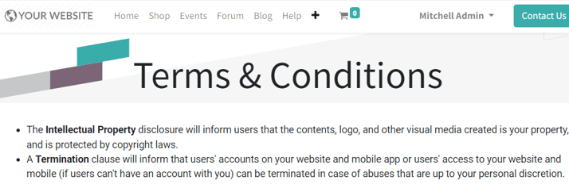
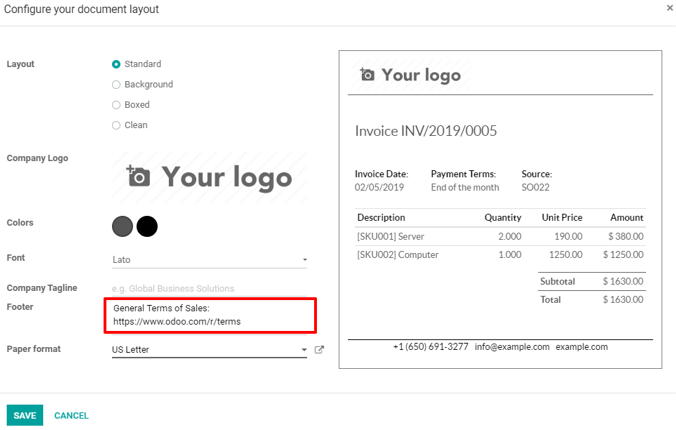

====================
Terms and conditions
====================

Specifying terms and conditions is essential to establish important contractual points, such as
payment terms, limitations of liability, and delivery terms between customers and sellers.

Sellers must declare all formal information concerning products and company policy. Conversely,
customers must take note of all these conditions before committing to a purchase.

With Odoo *Sales*, it's very easy to include default terms and conditions on every quotation, sales
order, and invoice.

Default terms and conditions
============================

Configuration
-------------

Go to :menuselection:`Accounting app --> Configuration --> Settings`, scroll to the
:guilabel:`Customer Invoices` heading, and check the box beside the :guilabel:`Default Terms &
Conditions` feature to activate it.

.. image:: terms_and_conditions/terms-conditions-setting.png
   :align: center
   :alt: How to enable Default Terms and Conditions on Odoo Sales.

.. note::
   Please note that this feature is activated via the settings of the *Accounting* app, and **not**
   in the settings of the *Sales* app.

In the :guilabel:`Settings` of the :menuselection:`Accounting` application, after activating the
:guilabel:`Default Terms & Conditions` feature, a field appears beneath the feature. In this field,
specific terms and conditions can be entered.

.. image:: terms_and_conditions/terms-conditions-setting-field.png
   :align: center
   :alt: Default Terms and Conditions on quotation on Odoo Sales.

Click :guilabel:`Save` to save the terms and conditions.

These terms and conditions appear on every quotation, sales order, and invoice.

Quotation templates
-------------------

Default terms and conditions can be applied to quotation templates, as well, depending on the
specific needs of the business. This is useful when various terms and conditions are used within a
company.

.. note::
   When a quotation template is used on a quotation, the quotation uses the terms and conditions
   specified on that template, over the terms and conditions specified in the settings.

First, navigate to the :menuselection:`Sales app --> Configuration --> Quotation Templates` to view
all the quotation templates. From here, either select a template or create a new one, via the
:guilabel:`Create` button.

Once on the desired quotation template form, click :guilabel:`Edit`, and enter in specific terms and
conditions that should be applied to this quotation template, at the bottom of the :guilabel:`Lines`
tab. Once done, click :guilabel:`Save` to save all changes.

.. image:: terms_and_conditions/terms-conditions-lines-tab.png
   :align: center
   :alt: Add Default Terms and Conditions to quotation templates on Odoo Sales.

.. seealso::
   :doc:`/applications/sales/sales/send_quotations/quote_template`

Attachment on confirmation emails
---------------------------------

Terms and conditions can also be sent as an attachment on the confirmation email of a quotation
template.

To do so, navigate to :menuselection:`Sales app --> Configuration --> Quotation Templates` and
create a new quotation template (via the :guilabel:`Create` button), or modify an existing one.

On the desired quotation template form, click :guilabel:`Edit`. Under the :guilabel:`Confirmation`
tab, there are options to activate an :guilabel:`Online Signature`, :guilabel:`Online Payment`, and
:guilabel:`Confirmation Mail`.

Click on the :guilabel:`Confirmation Mail` field to reveal a drop-down menu from which an email
template can be chosen or created. To create a new email template from here, start typing the name
of this new template, and then select :guilabel:`Create and Edit...`, which reveals a
:guilabel:`Create: Confirmation Mail` pop-up form.

On this pop-up form, customize the email message in a number of different ways, but be sure to click
:guilabel:`Attachments` at the bottom of the :guilabel:`Content` tab to add the desired terms and
conditions attachment to the mailing. Once done, click :guilabel:`Save` to save all changes.

.. image:: terms_and_conditions/terms-conditions-create-edit.png
   :align: center
   :alt: Terms and conditions as attachment in quotation templates.

Website page
============

Use the Odoo *Website* application to create a terms and conditions page. To do that, first navigate
to the front-end of the website, via :menuselection:`Website app --> Go to Website`. From here,
click :guilabel:`+ New` in the top right corner of the page, then select :guilabel:`Page`. Give the
terms and conditions page a title in the pop-up form that appears.

Then, decide if this page should be accessible via the main website header menu, using the
:guilabel:`Add to menu` toggle in the pop-up form, and click :guilabel:`Continue` to create the new
page.

Doing so reveals a blank page on the website that can be fully customized and edited with Odoo's
drag-and-drop building blocks. Use those building blocks to add the terms and conditions to the
page, and click :guilabel:`Save` to save all changes.

Don't forget to publish the page, via the :guilabel:`Unpublished` / :guilabel:`Published` toggle at
the top of the page. Unpublished pages will **not** be accessible to website visitors.

This terms and conditions page can be linked in the footer of all documents, if desired. To do that,
access the document layout by navigating to the :menuselection:`Settings` app. In the
:guilabel:`General Settings`, under the :guilabel:`Business Documents` heading, click
:guilabel:`Configure Document Layout` (located beneath :guilabel:`Document Layout`).

Doing so reveals a :guilabel:`Configure your document layout` pop-up form. On this form, in the
:guilabel:`Footer` field, enter the URL for the terms and conditions page on the website.

It's good practice to also provide a brief title prefacing the URL, so customers know what the link
leads to when they see it on the footer of documents.

Email attachments
=================

Odoo provides the ability to attach an external document, such as one containing terms and
conditions, when quotations are sent by email to customers.

On a quotation, sales order, or other document, click the :guilabel:`Send by Email` button to send
an email to the customer. Then, on the email form, click :guilabel:`Attach a File` to attach the
terms and conditions document.

.. image:: terms_and_conditions/terms-conditions-attach-file.png
   :align: center
   :alt: Terms and conditions as attachment in emails.

.. seealso::
   - :doc:`/applications/sales/sales/send_quotations/quote_template`
   - :doc:`/applications/sales/sales/send_quotations/get_signature_to_validate`
   - :doc:`/applications/sales/sales/send_quotations/get_paid_to_validate`
