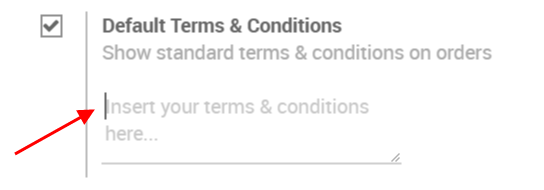
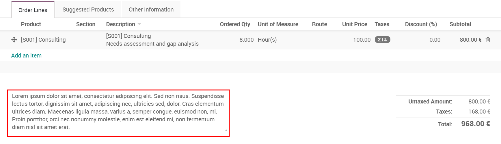
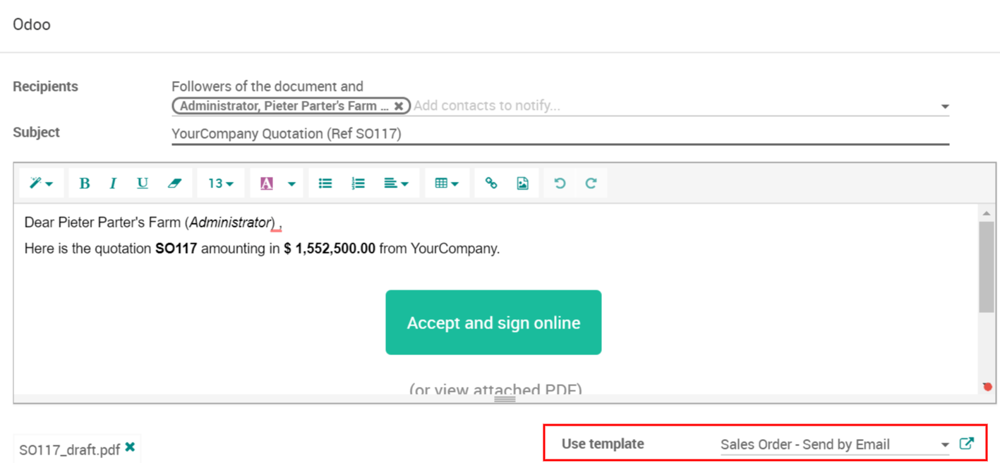

================================
Add terms & conditions on orders
================================

Specifying Terms and Conditions is essential to ensure a good
relationship between customers and sellers. Every seller has to declare
all the formal information which include products and company policy;
allowing the customer to read all those terms everything before
committing to anything.

Odoo lets you easily include your default terms and conditions on every
quotation, sales order and invoice.

Set up your default terms and conditions
========================================

Go to :menuselection:`SALES --> Configuration --> Settings` and activate
*Default Terms & Conditions*.

 
In that box you can add your default terms & conditions. They will then
appear on every quotation, SO and invoice.

.. image:: media/quote_template02.png
  :align: center
  
Set up more detailed terms & conditions
=======================================

A good idea is to share more detailed or structured conditions is to
publish on the web and to refer to that link in the terms & conditions
of Odoo.

You can also attach an external document with more detailed and
structured conditions to the email you send to the customer. You can
even set a default attachment for all quotation emails sent.

