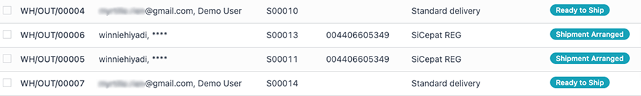
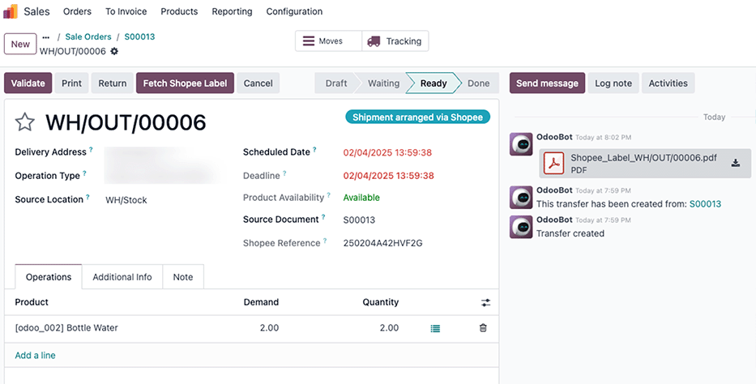

=======================
Shopee order management
=======================

Product catalog mapping
=======================

New Odoo customers with no existing products
--------------------------------------------

If you are starting a new Odoo database and your products are only on Shopee, you can import your
Shopee product catalog into Odoo.

#. **Export Shopee catalog:** Use the *Mass Function* drop-down to export the product catalog from
   Shopee, ensuring it includes the Shopee SKUs.

   .. image:: manage/shopee-seller-centre-product-extract.png
      :alt: Mass Function drop-down in Shopee.

#. **Import into Odoo:** :doc:`Import <../../../essentials/export_import_data>` the exported catalog
   into Odoo. During the import process, it is *crucial* to map the Shopee SKU to the
   *Internal Reference* field in Odoo. This field will serve as the link between your Shopee and
   Odoo products.

Existing Odoo customers with products already in Odoo
-----------------------------------------------------

If you already have products in your Odoo database, you'll need to map your Shopee listings to your
existing Odoo products.

#. **Export Shopee catalogs:** Use the *Mass Function* drop-down to export the product catalog from Shopee
   (including Shopee SKUs) and :doc:`export <../../../essentials/export_import_data>` your product
   catalog from Odoo (including *Internal References*).
#. **Map in a spreadsheet:** Use a spreadsheet to map the products. Match the Shopee SKU from the
   Shopee export with the corresponding *Internal Reference* from the Odoo export. Create a column
   that links the Shopee SKU with the Odoo *Internal Reference*.
#. **Update Odoo products:** Import the updated spreadsheet back into Odoo. Use the mapping you
   created in the spreadsheet to update the *Internal Reference* field of your existing Odoo
   products with the corresponding Shopee SKU. This establishes the link between your Odoo and
   Shopee products.

.. important::
   Product catalog synchronization between Odoo and Shopee is **not automatic**. It is a
   **manual operation** that you must initiate. The process differs depending on whether your
   products already exist in Odoo.

Order synchronization
=====================

Orders are automatically fetched from Shopee, and synchronized in Odoo, at **regular intervals**.

The synchronization is based on the Shopee orders status: only orders whose status has changed
since the last synchronization are fetched from Shopee. This includes changes on Shopee only.

When an order is canceled on Shopee, it will update the order's status in Odoo. On the other hand,
if an order is canceled on Odoo, the change won't be reflected on Shopee.

For every synchronized order, Odoo creates a sales order and a customer (contact), as long as the
customer hasn't been previously imported from Shopee or doesn't already exist in the database.

.. note::
   The principal of the synchronization is to *only fetch orders that needs to be shipped*
   (i.e., `SHIPPED`, `CANCEL`, `UNPAID`, `COMPLETED`).

Force synchronization
=====================

In order to force the synchronization of an order, whose status has **not** changed since the
previous synchronization:

Then, navigate to the Shopee account in Odoo :menuselection:`Sales app --> Configuration --> Shopee
--> Account --> Shop`. Modify the date for :guilabel:`Last Order Sync` under :guilabel:`Orders
Follow-up`.

Be sure to pick a date that occurs prior to the last status change of the desired order to
synchronize and save. This will ensure synchronization occurs correctly.

Manage deliveries in :abbr:`FBM (Fulfilled by Merchant)`
========================================================

Whenever an FBM (Fulfilled by Merchant) order is synchronized in Odoo, a picking is instantly
created in the **Inventory** app, along with a sales order and customer record.

When a picking related to the order is confirmed, you also have to click on :guilabel:`Arrange
Shipment` in your Shopee Seller Account in order to be able to generate and fetch the
:guilabel:`Shipping Label` and :guilabel:`Tracking Number`.

Shopee delivery statuses
------------------------

Understanding the different Shopee delivery statuses is crucial for managing your orders
effectively. Here's a breakdown:

- **Ready to ship:** The seller can now arrange shipment for this order.
- **Shipment arranged:** The seller has arranged shipment online and received a tracking number
  from the third-party logistics (3PL) provider.
- **Shipped:** The parcel has been dropped off at the 3PL location or picked up by the 3PL
  provider.
- **Cancelled:** The order has been canceled.
- **Pickup failed:** The 3PL parcel pickup attempt failed. The seller needs to rearrange shipment,
  and the rest of the order fulfillment content.

.. important::
   Unsupported for Non-Shopee Supported Logistics (NSSL)

   This feature is not available for :abbr:`NSSL (Non-Shopee Supported Logistics)`, you have to
   manually create shipping label and tracking number via the logistics provider's website/app.
   Check your region for list of supported logistics (e.g. `Malaysia
   <https://seller.shopee.com.my/edu/article/388>`_).

   Shopee requires users to provide a tracking reference with each delivery. This is needed to
   assign a carrier.

   If the carrier doesn't automatically provide a tracking reference, one must be set manually.
   This rule applies to all Shopee marketplaces.

Follow deliveries in Odoo
=========================

For :abbr:`FBM (Fulfilled by Merchant)` orders, the stock move is automatically created in Odoo by
the Shopee connector, thanks to the shipping status of Shopee.

Order fulfillment process
-------------------------

This section describes the process of fulfilling Shopee orders within Odoo, from order creation to
inventory updates.

#. **New order creation:** When a new order is placed on Shopee, it is automatically created in
   Odoo.
#. **Arrange shipment on Shopee:** Before the order can be shipped, you **must** arrange the
   shipment through the Shopee platform itself. This usually involves selecting a shipping
   provider, generating a shipping label, and scheduling pickup or drop-off. Odoo does *not*
   handle the physical shipping arrangements; this is managed entirely within Shopee.
#. **Fetch Shopee shipping label (delivery note):** Once the shipment is arranged on Shopee,
   Odoo fetches the generated shipping label (which serves as the delivery note). This label
   contains crucial information like the tracking number and is essential for printing and
   attaching to the package. The shipping label is imported into Odoo and associated with the
   corresponding sales order.
#. **Validate stock out in Odoo:** After the shipping label is retrieved, you need to validate the
   stock movement in Odoo. This confirms that the ordered items have left your warehouse or
   inventory. Validating the stock out will decrease the stock levels in Odoo.
#. **Inventory update on Shopee:** Finally, Odoo pushes the updated stock levels back to Shopee.
   This ensures that your Shopee listings reflect the current inventory, preventing overselling and
   keeping your product availability accurate. This synchronization keeps your Shopee storefront
   up-to-date with your Odoo inventory.

Register payments
=================

Since customers pay Shopee as an intermediary, creating a dedicated *Bank* journal (e.g. named
`Shopee Payments`), with a dedicated *Bank and Cash* intermediary account is recommended.

Additionally, as Shopee makes a single weekly or monthly payment, selecting all the invoices linked
to a single payment is necessary when registering payments.

To do that, use the appropriate :guilabel:`Journal` dedicated to Shopee payments, and select
:guilabel:`Batch Deposit` as the :guilabel:`Payment Method`.

Then, select all the generated payments, and click :menuselection:`Actions --> Create batch payment
--> Validate`.

.. tip::
   This same action can be performed with vendor bills from Shopee dedicated to fees/commissions.

   When the balance is received in the bank account at the end of the week/month, and the bank
   statements are recorded, credit the Shopee intermediary account by the amount received.

Analyzing Shopee sales with Odoo's reporting
============================================

Odoo's dashboard consolidates sales data from all your connected sales channels, providing a
comprehensive overview of your business performance. To specifically analyze your Shopee sales, you
will need to configure sales teams for your Shopee shops. This setup enables you to filter and
isolate Shopee sales data within the Odoo dashboard.

Setting up sales teams for Shopee reporting
-------------------------------------------

By default, the Shopee account's sales team is shared across all of your company's accounts. To
generate separate reports for specific Shopee shops or marketplaces, you'll need to assign dedicated
sales teams.

#. **Assign a sales team to your Shopee shop:** Navigate to the Shopee account configuration
   (typically found under :menuselection:`Sales --> Configuration --> Accounts`).  Within the
   account details, assign a specific sales team to your Shopee shop.
#. **Filtering Shopee sales on the dashboard:** Once sales teams are assigned, you can use the
   dashboard filters to view sales data specifically for your Shopee shops. Select the appropriate
   sales team to isolate and analyze your Shopee performance.

.. seealso::
   - :doc:`Shopee supported features and marketplaces <../shopee_connector>`
   - :doc:`setup`
