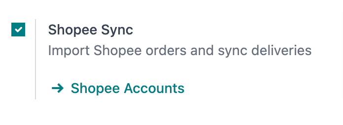
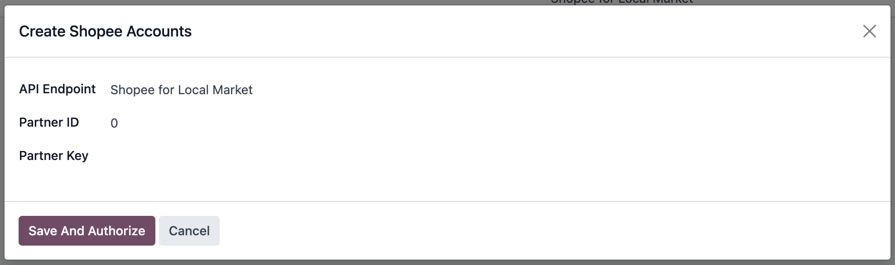
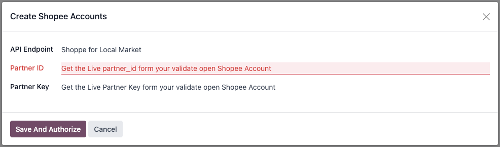
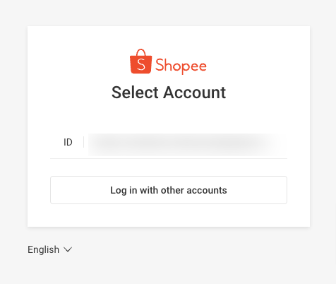
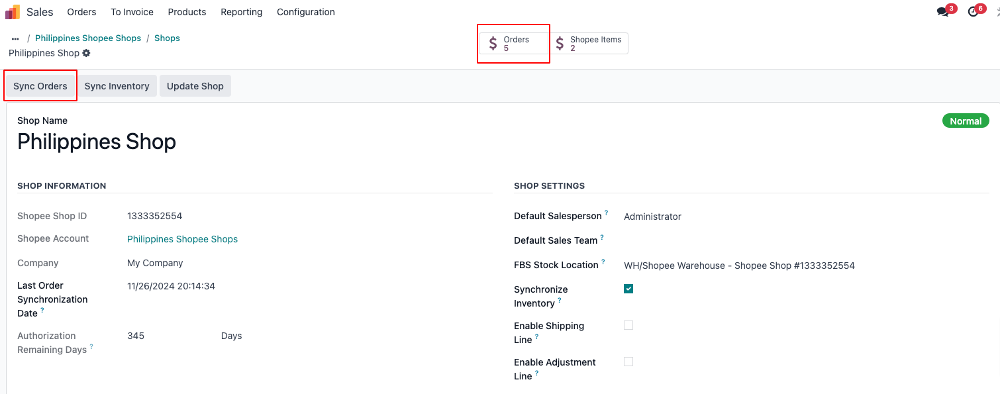

==============================
Shopee Connector configuration
==============================

Odoo allows users to register a Shopee Seller account in the database, but the user **must** have
a registered **Shopee Seller account** and **Shopee Open account** prior to completing the configuration.

Set up an Open Shopee account by first going into the `Open Shopee Plateform <https://open.shopee.com/>`_, and navigating to
:menuselection:`Get Access (Now)` located in the middle of the page.

Use the :guilabel:`Open Shopee Developer Guide`, and follow the registration process. Once all done, proceed to
follow the instructions below to register and link that Open Shopee account in Odoo.

.. seealso::
   `Open Shopee Developer Guide <https://open.shopee.com/developer-guide/12>`_

Connect Shopee Seller account to Odoo
=====================================

.. _shopee/setup:

To connect a Shopee Seller account in Odoo, navigate to :menuselection:`Sales app -->
Configuration --> Settings --> Connectors section`, activate the :guilabel:`Shopee Sync` feature,
and click :guilabel:`Save`.

Then, return to :menuselection:`Sales app --> Configuration --> Settings --> Connectors section`,
and click on the :guilabel:`Shopee Accounts` link under the :guilabel:`Shopee Sync` setting.

Doing so reveals a separate :guilabel:`Shopee Accounts` page. From here, click :guilabel:`New` to
create and link a new Shopee account.

On the blank :guilabel:`Shopee Account` form page, start by choosing a name for the account (e.g.
`
Philippines Shopee Shops`). Then, in the :guilabel:`Credentials` tab, select in 
the :guilabel:`API Endpoint` drop-down menu **Shopee for Local Market**

.. note::
   3 differents API Endpoint:

      **Shopee for Mainland China**: This endpoint is specifically for sellers operating within mainland China, 
      supporting local regulations and business practices.
      
      **Shopee for Local Market**: This endpoint is intended for sellers targeting specific local markets outside of China, accommodating local languages and currencies.
      
      **Shopee (Test API)**: This endpoint is designed for developers and testers to simulate interactions with Shopee's API without affecting live data, allowing for safe testing and integration.

After selecting the correct API Endpoint in the :guilabel:`Credentials` form, 
input your Open Shopee :guilabel:`Partner ID and Partner Key` in the corresponding fields. 
Then Click :guilabel:`Save And Authorize`. 

Clicking that button redirects to either the Shopee seller login page.

On the login page, log in to the desired Shopee seller account.

On the Authorization page, confirm that Shopee is allowed to give Odoo access to the account and related
data.

.. image:: setup/shopee-authorization-odoo.png
   :align: center
   :alt: A form with Shopee Seller Account credentials.

Upon confirmation, Shopee returns the user to Odoo, and the account has been registered.

With the Shopee account successfully registered, the marketplaces available with this specific account
can later be synchronized the exact same way, and listed under the :guilabel:`Shops` button.

.. note::
   If you need to remove a shop, you must remove ALL the Shopee items previously created.

Shopee orders in Odoo
=====================

When a Shopee order is synchronized, up to three line items are created on the sales order in Odoo.
Each one represents: one for the product that was sold on Shopee
Shops, one for the shipping charges (if any), and one for the price adjustment to match Shopee Amount.

.. note::
   **Disabling Shipping and Price Adjustment Lines**
   You can choose not to include shipping information and price adjustment details when fetching orders 
   from Shopee into Odoo. This means that, instead of bringing in all the complexities associated with 
   shipping costs and any adjustments made to the product prices, you can simplify the data retrieval by 
   focusing solely on the product details. 
   
   Any necessary price reconciliation related to income versus fees can be managed later using 
   Shopee’s weekly or monthly financial reports, which can then be imported into the Odoo's Accounting App.

   .. image:: setup/shopee-shop-optional-settings.png
      :align: center
      :alt: A typical Shopee shop form page and optional settings fields in Odoo Sales.

.. _shopee/matching:

The selection of a database product for a sales order item is done by matching its
:guilabel:`Internal Reference` (a customizable product reference idenifier in Odoo, like `FURN001`)
with the Shopee *SKU*.

If a product cannot be matched (for example Shopee-only products), pairings are saved as default *Shopee Items*.

Orders are automatically created when the pairing is established, and they're used for subsequent
orders to lookup SKUs. If no offer with a matching SKU is found, :ref:`the internal reference is
used instead <Shopee/matching>`.

.. tip::
   It's possible to force the pairing of a Shopee item with a specific product, by changing
   either the product or the SKU of an offer to ensure they match. The Order can be manually created
   if it was not automatically done yet.

   This is useful if the internal reference is not used as the SKU, or if the product sells under
   different conditions.

If no database product with a matching internal reference is found for a given Shopee SKU or gift
wrapping code, then a default database product, *Shopee Sale*, is used. The same is done with the
default product *Shopee Shipping* if no database product is found for a given Shopee shipping code.

.. note::
   To modify default products, activate the :ref:`developer mode <developer-mode>`, and navigate to
   :menuselection:`Sales app --> Configuration --> Settings --> Connectors --> shopee Sync -->
   Default Products`.

Product tax configuration
=========================

To allow for tax reporting of Shopee sales with Odoo, the taxes applied to the sales order items are
those set on the product, or determined by the fiscal position.

Make sure to have the correct taxes set on your products in Odoo, or have it done by a fiscal
position, to avoid discrepancies in the subtotals between *Shopee Seller Central* and Odoo.

.. note::
   As shopee does not necessarily apply the same taxes as those configured in Odoo, it may happen
   that order totals differ by a few cents between Odoo and *Shopee Seller Central*. Those
   differences can be resolved with a write-off when reconciling the payments in Odoo.

.. _shopee/add-new-marketplace:

Add a new marketplace
=====================

All APAC marketplaces are supported by the Shopee Connector. To add a new marketplace, proceed as
follows:

#. Activate the :ref:`developer mode <developer-mode>`.
#. Go to :menuselection:`Sales app --> Configuration --> Settings --> Connectors --> Shopee Sync -->
   Shopee accounts`.
#. Click :guilabel:`New` to create a new Shopee marketplace account.
#. Select the API endpoint: Shopee for Local Market
#. Partner_id and Partner are the same as it is linked to your unique Open Shopee Account.
#. Set the Name of the new Shop to easily retrieve it (e.g. Shopee Philippines). 
#. Also make sure you assign a Salesteam (e.g. Shopee Sales Philippines) to be able to do advanced reporting.
#. If none of your existing marketplaces are in the list, click on log in with other account to synchronize 
   a new one.

Newly added marketplaces are automatically added to the list of synchronized marketplaces. If the new 
marketplace is not added to the list, it means that it is either incompatible or unavailable for the seller account.

.. important::
   Avoid synchronizing the same shop multiple times, as this will result in duplicated sales orders being 
   created in Odoo. To maintain data integrity and prevent confusion in your order management, ensure that 
   each shop is only synchronized once. If you need to update or refresh the connection, it's better to first 
   try to manually fetch the orders before setting it up again.

.. seealso::
   - :doc:`features`
   - :doc:`manage`
