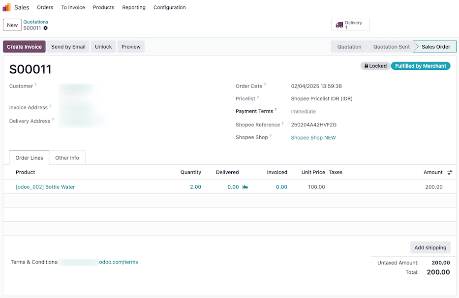

==============================
Shopee Connector configuration
==============================

Odoo allows users to synchronize with Shopee Seller account in the database, but users **must**
have a registered **Shopee Seller account** and a **Shopee Open account** prior to completing the
configuration.

Set up an Open Shopee account by first going to the `Shopee Open Platform
<https://open.shopee.com/>`_, and click the :guilabel:`Get Access (Now)` button located in the
middle of the page.

Use the `Open Shopee Developer Guide <https://open.shopee.com/developer-guide/12>`_, and follow the
registration process. Once all done, proceed to follow the instructions below to register and link
the Open Shopee account in Odoo.

.. important::
   Shopee Open Platform access and seller account requirements are **regionally specific**. This
   means the rules, qualifications, and processes differ from country to country. Before proceeding
   with Odoo's Shopee Connector setup, verify the requirements for *your* specific Shopee region.

   **Key Considerations:**

   - **Shopee Seller Status & Business Type:** You must have an active Shopee seller account
     (Individual or Registered Business). Your eligibility depends on your region and business
     registration.
   - **Order Volume/Seller Tier (If Applicable):** Many regions require a minimum number of orders
     within a specific time frame or a certain seller tier (e.g., Mall, Preferred, Managed) to
     access the Open Platform.

   **Action Required:**

   #. Identify your Shopee region.
   #. Locate the official Shopee documentation for your region.
      `Open Shopee Developer Guide <https://open.shopee.com/developer-guide/12>`_
   #. Carefully review the requirements for seller accounts and Open Platform access in your
      region.
   #. Ensure your Shopee account meets all the necessary criteria *before* proceeding with the
      Odoo Shopee Connector configuration.

.. _shopee/setup:

Connect Shopee seller account to Odoo
=====================================

:ref:`Install <general/install>` the :guilabel:`Shopee Connector` (`sale_shoppe`) by going to
:menuselection:`Apps`.

Then connect your Shopee Open account by navigating to :menuselection:`Sales app --> Configuration
--> Shopee --> Accounts`.

From here, click :guilabel:`New` to create to link a new Shopee account.

Then, in the :guilabel:`Credentials` tab, select the appropriate :guilabel:`API Endpoint` from the
drop-down menu.

.. note::
   Shopee offers several API endpoints for production and testing. Selecting the correct endpoint
   is crucial for successful integration. Choose the endpoint that corresponds to your marketplace
   location.

   - :guilabel:`Shopee Production Endpoint (Singapore)`: This is the primary endpoint for sellers in
     most APAC countries. Select this option unless you are specifically operating within mainland
     China or Brazil.
   - :guilabel:`Shopee Production Endpoint (China)`: This endpoint is exclusively for sellers
     operating within mainland China. It is designed to comply with local regulations and business
     practices.
   - :guilabel:`Shopee Production Endpoint (Brazil)`: This endpoint is dedicated to sellers
     operating within Brazil. Select this option if your Shopee store is based in Brazil.
   - :guilabel:`Shopee Testing Endpoint`: This endpoint is for development and testing purposes
     only. Use it to simulate interactions with the Shopee API without affecting your live data.
     **Do not use this endpoint for production.**
   - :guilabel:`Shopee Testing Endpoint (China)`:  Similar to the general testing endpoint, this one
     is specifically for testing integrations related to the China-specific production endpoint.
     **Do not use this endpoint for production.**

After selecting the correct API Endpoint in the :guilabel:`Credentials` form, input your Open
Shopee :guilabel:`Partner ID` and :guilabel:`Partner Key` in the corresponding fields. Then click
:guilabel:`Save And Authorize`.

.. important::
   You'll need your Open Shopee :guilabel:`Partner ID` and :guilabel:`Partner Key` to complete this
   step. Here's how to find them in the Shopee Open Platform:

   #. **Log in to the Shopee Open Platform:** `Log in <https://open.shopee.com/>`_ with the
      credentials you used to register your Open Shopee account.
   #. **Navigate to App Management:** Go to the :guilabel:`App Management` section, then select
      :guilabel:`App List`.
   #. **Select your app:** Choose the specific app you want to synchronize with Odoo (either your
      test app or your production app).
   #. **Find your credentials:** Within the app details, you'll find your Partner ID and Partner
      Key. These are the values you'll need to copy and paste into the corresponding fields in
      Odoo.

.. note::
   - **Copy carefully:** Copy the Partner ID and Partner Key accurately, without any extra spaces
     or characters. These are case-sensitive.
   - **Keep your key secure:** Your Partner Key is sensitive information. Do not share it with
     anyone. Treat it like a password.

Authorization and account registration
======================================

After entering connecting the :ref:`Shoppe Seller account to Odoo <shopee/setup>`, the authorization
process begins.

Shopee seller account selection/login
-------------------------------------

Upon clicking :guilabel:`Save and Authorize`, Odoo redirects to the Shopee seller account selection
page.

- **Already logged in:** If you are already logged in to a Shopee account, your email address or
  username will be displayed. Click on your account to proceed.
- **Not logged in:** If you are not logged in, you will be prompted to enter the credentials
  (email/username and password) of the Shopee seller account you wish to connect to Odoo.

Granting access to Odoo
-----------------------

After selecting or logging into your Shopee seller account, you will be directed to the
authorization (or consent) page. Here, confirm that you allow Shopee to grant Odoo access to your
account and related data. This step is essential for the integration to function correctly.

Account registration and Shopee shop creation
=============================================

Upon confirming access, Shopee redirects you back to Odoo. An indicator appears, confirming that
your Shopee account has been successfully registered.

Post-synchronization configuration
----------------------------------

After the redirection, you should perform the following steps within Odoo:

#. **Rename the Shopee Account (Optional):** The newly created Shopee account in Odoo will likely
   have a default name. You can rename it to something more descriptive (e.g., the name of your
   Shopee shop) for easier management.
#. **Set the Last Order Synchronization Date:** This setting determines the starting point for
   fetching orders from Shopee. Choose a date from which you want Odoo to retrieve past orders.
#. **Configure Inventory Synchronization:**  Decide whether you want to synchronize your product
   inventory between Odoo and Shopee. Enable the :guilabel:`Synchronize Inventory` option to
   automatically push stock updates from Odoo to Shopee. Disabling this option prevents automatic
   inventory updates.
#. **Assign a Default Sales Team:** Assign a default sales team to your Shopee account in Odoo.
   This helps with reporting and order management.

With the Shopee account successfully registered, the marketplaces available with this specific
account can later be synchronized the exact same way, and listed under the :guilabel:`Shops`
button.

Shopee orders in Odoo
=====================

When a Shopee order is synchronized, only lines for items are created on the sales order in Odoo.
Each one represents one for the product that was sold on Shopee.

Any necessary price reconciliation related to shipping or income versus fees can be managed later
using Shopee's weekly / monthly financial reports, which can then be imported into the Odoo
**Accounting** app.

The selection of a database product for a sales order item is done by matching its
:guilabel:`Internal Reference` (a customizable product reference identifier in Odoo, like `FURN001`)
with the Shopee *SKU*.

If no database product with a matching internal reference is found for a given
:guilabel:`Shopee SKU`, then a default database product, *Shopee Item*.

.. note::
   To modify default products, activate the :ref:`developer mode <developer-mode>`, and navigate to
   :menuselection:`Sales app --> Configuration --> Settings`. In the :guilabel:`Connectors` section,
   under :guilabel:`Shopee Sync`, find the :guilabel:`Default Products`.

Product tax configuration
=========================

To allow for tax reporting of Shopee sales with Odoo, the taxes applied to the sales order items are
those set on the product, or determined by the :doc:`fiscal position
<../../../finance/fiscal_localizations>`.

Make sure to have the correct taxes set on your products in Odoo, or have it done by a fiscal
position, to avoid discrepancies in the subtotals between *Shopee Seller Central* and Odoo.

.. note::
   As shopee does not necessarily apply the same taxes as those configured in Odoo, it may happen
   that order totals differ by a few cents between Odoo and *Shopee Seller Central*. Those
   differences can be resolved with a write-off when reconciling the payments in Odoo.

.. _shopee/add-new-marketplace:

Add a new marketplace
=====================

To add a new marketplace, follow these steps:

#. **Navigate to Shopee Accounts:** Go to :menuselection:`Sales --> Configuration --> Accounts`.
#. **Create a New Shopee Account:** Click :guilabel:`New` to create a new Shopee marketplace
   account.
#. **Select the API Endpoint:** Choose the appropriate API endpoint for your local market.
   (Typically, this will be :guilabel:`Shopee Production Endpoint (Singapore)` unless you are
   operating in mainland China or Brazil. Refer to the documentation for details on endpoint
   selection).
#. **Enter Credentials:** Your :guilabel:`Partner ID` and :guilabel:`Partner Key` are the same as
   those linked to your unique Open Shopee account. Enter these values in the corresponding fields.
#. **Name Your Shop:** Give the new shop a descriptive name (e.g., `Shopee Philippines`) to identify
   it later.
#. **Assign a Sales Team:** Assign a relevant sales team (e.g., `Shopee Sales Philippines`) to
   enable advanced reporting capabilities.
#. **Synchronize Your Account:** If none of your existing marketplaces are listed, click
   :guilabel:`Log in with another account` to synchronize a new one. This will initiate the Shopee
   authorization process.

Automatic synchronization
-------------------------

Newly added marketplaces are automatically added to the list of synchronized marketplaces. If a new
marketplace does *not* appear in the list after synchronization, it indicates that the marketplace
is either incompatible with the Shopee Open Platform or unavailable for your specific seller
account. Consult the Shopee Open Platform documentation or contact their support for further
assistance.

.. important::
   While Odoo allows creating the same Shopee shop multiple times, only one instance will function
   due to token limitations. To avoid order management issues, synchronize each shop only once. For
   connection updates, manually fetch orders first before re-establishing the connection.

.. seealso::
   - :doc:`Shopee supported features and marketplaces <../shopee_connector>`
   - :doc:`manage`
