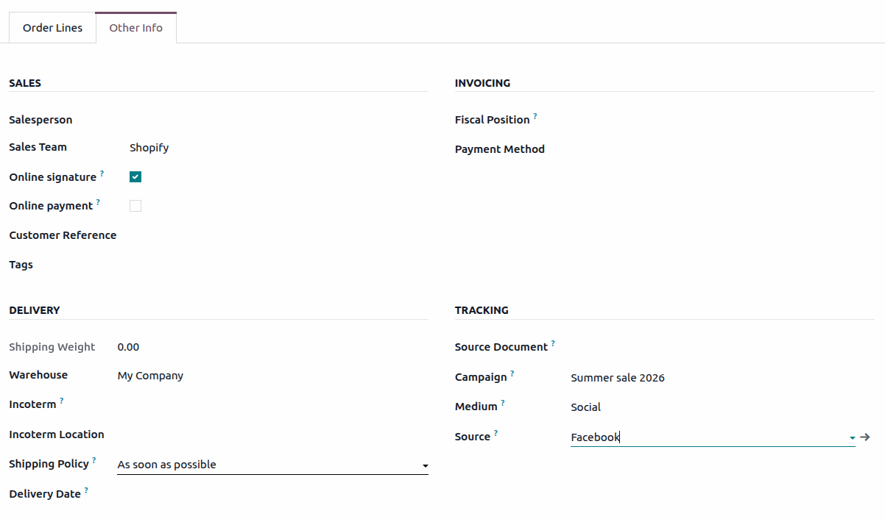

:nosearch:
:orphan:

=================
Shopify Connector
=================

The *Shopify Connector* synchronizes orders, products, inventory, deliveries, returns, and refunds
between a Shopify store and Odoo. This considerably reduces the amount of time spent manually
entering Shopify orders into Odoo and helps keep track of Shopify sales, stock, and accounting in
Odoo.

.. cards::
   .. card:: Setup
      :target: shopify_connector/setup

      Connect your Shopify store to Odoo.

   .. card:: Order management
      :target: shopify_connector/manage

      Sync products, orders, available stock, prices and taxes.

   .. card:: Fulfillment
      :target: shopify_connector/fulfillment

      Sync deliveries, shipping information, invoices, payments, returns, and refunds.

Supported features
==================

The Shopify Connector synchronizes the following data between Shopify and Odoo:

.. list-table::
   :header-rows: 1
   :widths: 45 30

   * - Data
     - Direction
   * - Orders
     - Shopify → Odoo
   * - Products
     - Shopify → Odoo
   * - Inventory
     - Both ways
   * - Fulfillments / Deliveries
     - Both ways
   * - Returns
     - Shopify → Odoo
   * - Refunds / Credit Notes
     - Shopify → Odoo
   * - Invoices & Payments
     - Odoo (auto-created)
   * - Customers
     - Shopify → Odoo

The following table lists the main capabilities provided by Odoo depending on where deliveries are
handled:

+---------------------------+-------------------------------------+-------------------------------------+
|                           | Deliveries handled in Odoo          | Deliveries handled in Shopify       |
+===========================+=====================================+=====================================+
| **Orders**                | Confirmed Shopify orders are        | Confirmed Shopify orders are        |
|                           | created as confirmed sales orders   | created as confirmed sales orders   |
|                           | in Odoo.                            | in Odoo.                            |
+---------------------------+-------------------------------------+-------------------------------------+
| **Fulfillment**           | A delivery order is created in Odoo | Fulfillment is created in Shopify,  |
|                           | and validated by the user. The      | then pulled into Odoo with carrier, |
|                           | shipment is then pushed to Shopify. | tracking number, and quantities.    |
+---------------------------+-------------------------------------+-------------------------------------+
| **Stock management**      | Managed in Odoo, and pushed to      | Managed in Odoo, and pushed to      |
|                           | Shopify after orders are pulled.    | Shopify after orders are pulled.    |
+---------------------------+-------------------------------------+-------------------------------------+
| **Delivery notifications**| Sent by Shopify, based on the       | Handled by Shopify.                 |
|                           | fulfillment synchronized from Odoo. |                                     |
+---------------------------+-------------------------------------+-------------------------------------+
| **Returns**               | Handled manually in Odoo. Returns   | Returns initiated in Shopify are    |
|                           | initiated in Shopify do **not**     | synchronized into Odoo.             |
|                           | sync automatically.                 |                                     |
+---------------------------+-------------------------------------+-------------------------------------+

.. note::
   The *Shopify Connector* is designed to synchronize the data of sales orders, inventory,
   deliveries, returns, and refunds. It relies on scheduled actions (cron) rather than webhooks or
   real-time synchronization.

.. _shopify/real-time-sync:

Real-time synchronization
=========================

The Shopify Connector does **not** perform real-time synchronization and does **not** rely on
webhooks. All synchronization is handled by *Scheduled Actions* (cron-based synchronization) that
run at regular intervals.

.. _shopify/sync-frequency:

Synchronization frequency
=========================

By default, the scheduled actions run at the following frequencies:

- **Orders**: Every 10 minutes.
- **Inventory (Odoo to Shopify)**: Every time orders are pulled. Stock is pushed from Odoo to
  Shopify after each order synchronization.
- **Deliveries handled in Odoo**: Every 10 minutes.

.. note::
   Pulling stock from Shopify to Odoo is not required every time. It is typically needed only when
   first setting up the connector or to correct a mismatch between the two platforms. Use the *Fetch
   Inventory* button in the account configuration when needed.

.. _shopify/marketing-attribution:

Marketing attribution tracking
==============================

The connector supports tracking marketing data, such as :guilabel:`UTM Campaign`,
:guilabel:`Source`, and :guilabel:`Medium`, from Shopify orders.

- Attributes are fetched during order synchronization and stored on the sales order in Odoo.
- This helps identify the source of each order (ads, email, social, etc.).
- It is useful for campaign performance and ROI analysis.

.. note::
   This data is available only if UTM parameters are present in the Shopify order.

.. seealso::
   - :doc:`shopify_connector/setup`
   - :doc:`shopify_connector/manage`
   - :doc:`shopify_connector/fulfillment`

.. toctree::
   :hidden:

   shopify_connector/setup
   shopify_connector/manage
   shopify_connector/fulfillment
