:orphan:
:nosearch:

.. _shopify-delivery-flow: https://youtu.be/PYTLui2GWjY?si=_u30sfcHXzQnBD7m

======================================
Shopify delivery and return management
======================================

The Shopify Connector synchronizes deliveries and shipping information, creates invoices and
registers payments, and processes returns and refunds between Shopify and Odoo.

.. _shopify/fulfillment/delivery-modes:

Select a delivery mode
======================

The delivery mode is configured on the Shopify account form. Go to :menuselection:`Sales app -->
Configuration --> Shopify: Accounts` and either select an existing Shopify account form or click
:guilabel:`New`. Using the :guilabel:`Delivery Handled On` drop-down menu, users can configure which
platform handles the delivery: :ref:`Odoo <shopify/fulfillment/odoo-deliveries>` or :ref:`Shopify
(E-commerce Platform) <shopify/fulfillment/shopify-deliveries>`.

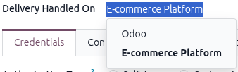

.. seealso::
   `Tutorial: Shopify connector delivery flow for Odoo 19 | Odoo.sh <shopify-delivery-flow_>`_

.. _shopify/fulfillment/odoo-deliveries:

Deliveries handled in Odoo
--------------------------

Configuring deliveries to be handled in Odoo is useful when a company's warehouse team are
transitioning or already operating within Odoo.

When the Shopify account form is set to *Delivery Handled On: Odoo*, the Shopify connector
automatically creates a warehouse delivery form during the order sync. To process a Shopify delivery
in Odoo, go to :menuselection:`Sales app --> Configuration --> Shopify: Accounts` and select the
desired Shopify account form.

Click the :icon:`fa-dollar` :guilabel:`Orders` smart button to see all the sales orders (SO) from
the Shopify store. Select the desired :abbr:`SO (sales order)` and click the :icon:`fa-truck`
:guilabel:`Delivery` smart button.

The warehouse delivery form is created in the :guilabel:`Ready` state in Odoo. Click
:guilabel:`Validate` to confirm the delivery. Once validated, a :guilabel:`Scheduled for
Synchronization with E-commerce Platform` badge displays on the form. A scheduled action running
every 10 minutes pushes the shipment to Shopify or click the :guilabel:`Update to E-commerce` to
manually push the update.

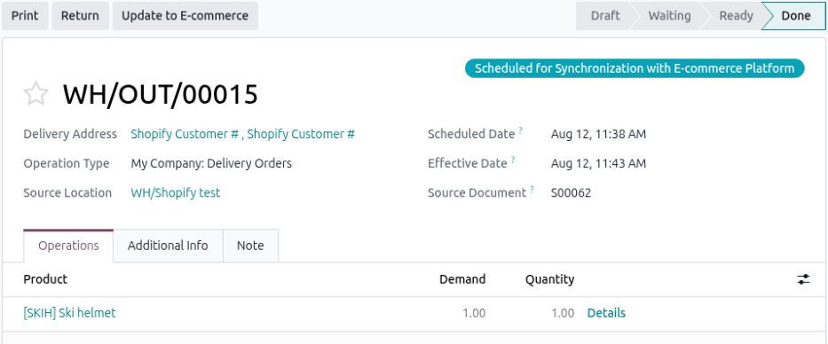

If the delivery successfully updates to Shopify, a green :guilabel:`Synchronized with E-commerce
Platform` badge displays and log note is added with success message on the delivery form. If the
delivery fails to update, then a red :guilabel:`Synchronization with E-commerce Platform failed`
badge displays and log note is added with failure message on the delivery form .

If successful, the order is marked as *Fulfilled* on Shopify, along with the carrier and tracking
number from Odoo. Shopify notifies the customer after the fulfillment is created.

.. note::
   If deliveries are handled in Odoo, returns initiated in Shopify do **not** sync automatically,
   and must be handled manually in Odoo.

.. _shopify/fulfillment/shopify-deliveries:

Deliveries handled in Shopify
-----------------------------

Configuring deliveries to be handled in Shopify is useful when the orders are fulfilled entirely
within Shopify or by a third-party logistic entity. When the Shopify account form is set to
*Delivery Handled On: E-commerce Platform*, the Shopify connector automatically creates a warehouse
delivery in Odoo for any pulled order tagged *Unfulfilled*. The form is created in the
:guilabel:`Ready` stage and lists the associated sales order's products and their quantities as
separate line items.

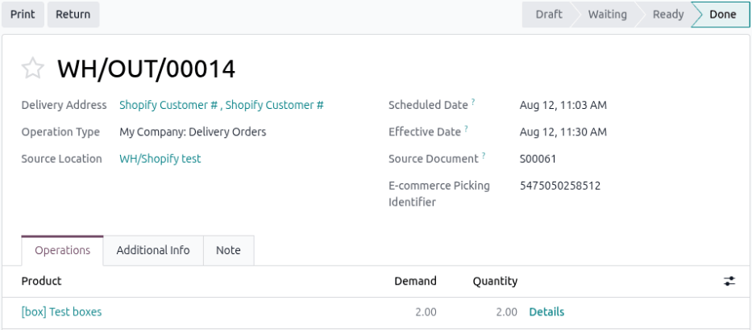

Although the entire delivery process takes place in Shopify, the delivery details (carrier, tracking
number, and quantities) are pulled into Odoo once an actual delivery is created on Shopify. When the
delivered order is then pulled into Odoo, its warehouse delivery form updates to :guilabel:`Done`
stage. Similarly, if a pulled order already has the *Fulfilled* tag, Odo creates its warehouse
delivery form directly in the :guilabel:`Done` stage.

Corresponding warehouse delivery forms are created as a back order of the default picking, to reduce
inventory if there is a difference between the actual :abbr:`SO (sales order)` request and the
delivered quantity.

.. note::
   If a delivery exists in Shopify but is not created in Odoo for any reason (including a
   discrepancy at the order or invoice level), an activity is scheduled for resolution.

Split fulfillments are fully supported and synchronized correctly. Multiple fulfillments can be
created for the same order, including:

- Fulfillment from different locations.
- Multiple fulfillments from the same location.
- Different carriers for different shipments.
- Partial quantity fulfillment across shipments.

All fulfillment details, including location, carrier, tracking numbers, and fulfilled quantities,
are synced accurately into Odoo, with corresponding stock moves and delivery updates.

.. _shopify/fulfillment/shipping:

Shipping synchronization
========================

When a Shopify order includes a shipping fee and carrier, Odoo adds the default product
:guilabel:`E-commerce Shipping` to the invoice. The amount and the actual name of the delivery
carrier selected by the customer (such as Sendcloud, Shiprocket, or FedEx) is added in the
description of that line.

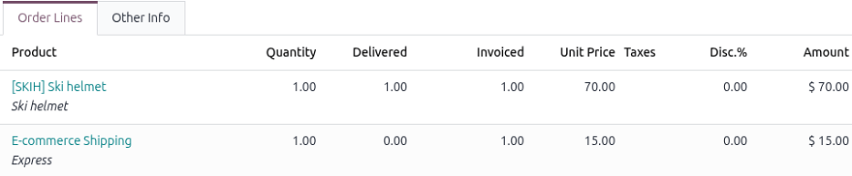

.. _shopify/fulfillment/delivery-location:

Manage stock locations
----------------------

The Shopify connector allows syncing Shopify stock locations to Odoo stock locations, ensuring
movements are recorded against the correct warehouse and inventory stays accurate across multiple
fulfillment centers. Once mapped, delivery pickings are automatically assigned to the corresponding
Odoo location during fulfillment synchronization.

To map a Shopify store's stock location to a Odoo stock location, refer to the
:ref:`shopify/manage/configure-multi-location` section of the *Shopify order management* page.

To view or edit mapped Shopify to Odoo stock locations, navigate to :menuselection:`Sales app -->
Configurations --> Shopify: Locations` or click the :icon:`fa-cubes` :guilabel:`Locations` smart
button on the Shopify account form. The :guilabel:`Locations` page displays the following:

- :guilabel:`Name`: Shopify stock location.
- :guilabel:`Stock Location`: Odoo stock location.
- :guilabel:`Stock Synchronization`: When enabled it syncs exactly which inventory is synced back to
  Shopify or pulled from Shopify.

To edit the stock location mapping, click in either the :guilabel:`Name` or :guilabel:`Stock
location` fields and select an option in the drop-down menu.

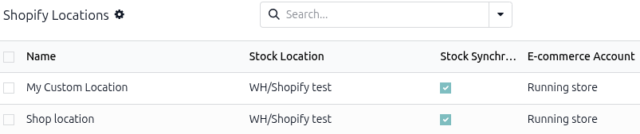

.. _shopify/fulfillment/inventory-sync:

Syncing inventory with deliveries
---------------------------------

Shopify connector uses scheduled actions to sync orders, deliveries, and stock between Shopify and
Odoo. Deliveries received from Shopify are processed using a backorder-based approach: partial
fulfillments automatically generate the required backorders in Odoo, so fulfilled and remaining
quantities are tracked correctly. Inventory syncs immediately after order syncing to minimize stock
discrepancies between the two platforms.

Refer to the :doc:`fulfillment` page for more information on order syncing. For information on
inventory syncing with returns refer to :ref:`shopify/fulfillment/returns` section.

.. _shopify/fulfillment/carrier-tracking-management:

Carrier and tracking management
-------------------------------

Carriers are mapped automatically during order synchronization. If a :ref:`carrier does not exist in
Odoo <inventory/shipping/third_party>`, it is created automatically. Tracking numbers are
synchronized both ways between Shopify and Odoo.

.. _shopify/fulfillment/accounting:

Accounting and payments
=======================

The Shopify connector offers a :guilabel:`Create Invoice` option is available on the
:ref:`Configuration tab <shopify/setup/administrative-settings>` of the Shopify account form. This
option controls whether invoices are automatically created when importing orders from Shopify.

When enabled:

- Odoo automatically creates and posts the invoice when an order is marked as paid in Shopify.
- The payment is automatically registered.
- The invoice is generated using the order details, including products, quantities, and pricing.
- If no journals are configured, the payment journal is split based on the payment provider.

When disabled, the invoice must be created manually from the sales order.

.. note::
   This feature applies only to orders marked as fully paid in Shopify.

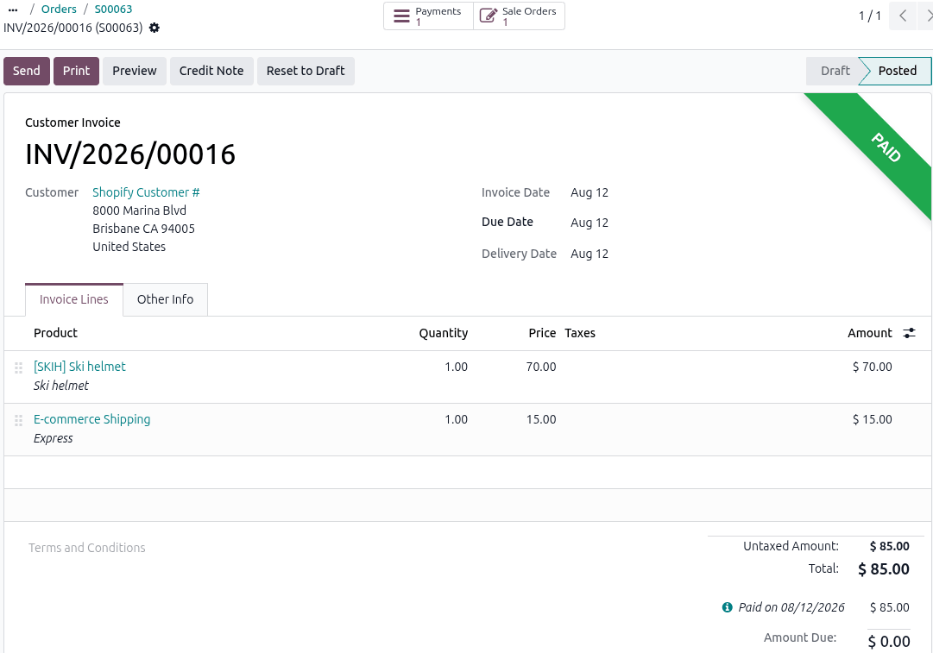

Also in the *Configuration* tab is the *Journals* section which allows configuration of accounting
journals for payments and sales. Refer to :ref:`shopify/setup/administrative-settings` for more
details.

.. _shopify/fulfillment/create-returns-refunds:

Creating returns and refunds
============================

.. important::
   If :ref:`deliveries are handled in Odoo <shopify/fulfillment/odoo-deliveries>`, returns initiated
   in Shopify do **not** sync automatically, and must be :doc:`done manually
   <../products_prices/returns>` in Odoo.

:ref:`Returns <shopify/fulfillment/returns>` and :ref:`refunds <shopify/fulfillment/refunds>` start
in the Shopify platform. When an order is pulled from Shopify using the scheduled action or *Fetch
Orders*, the return and refund are created in Odoo along with the associated delivery record (if
applicable). This sync is ongoing: if a return and refund is created on Shopify after the order has
already been fetched, it is still synced when the order is fetched again.

During the sync, Odoo first checks whether a return and refund already exists on the :abbr:`SO
(sales order)` using the unique refund identifier provided by Shopify. Only returns and refunds that
do not yet exist in Odoo are synced.

.. _shopify/fulfillment/returns:

Creating a return
-----------------

Go to the desired Shopify order and click :guilabel:`Return`. On the *Return and exchange* page,
enter the quantity of products to return for a single or multiple deliveries.

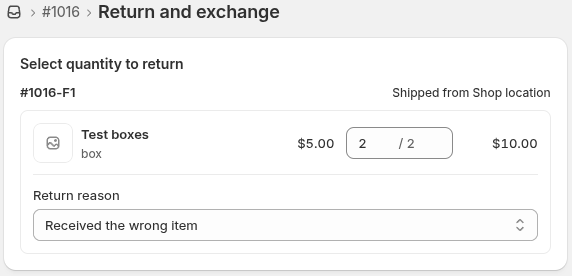

In the *Return shipping options* section, click :guilabel:`Add files` to upload a return label.
Enter a tracking number in the :guilabel:`Tracking number` field and select a carrier option in the
:guilabel:`Shipping carrier` drop-down menu. Click :guilabel:`Create return` to open a return.

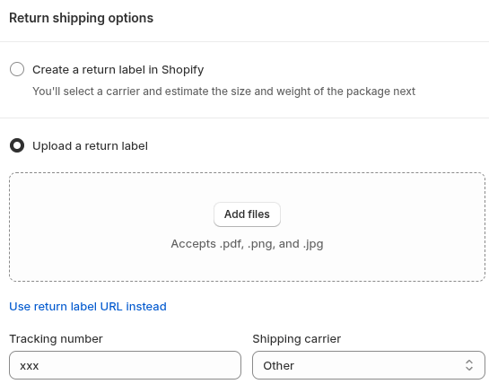

The return is initially set as *Return in progress*, and is not synced to Odoo in this state. The
return must be closed first to make it eligible for synchronization. Click :guilabel:`Process and
refund` to continue the process.

On the *Process return* page, verify the return item information and select :guilabel:`Restock at`
option. Then click :guilabel:`Process and refund` again to confirm and close the return in Shopify.

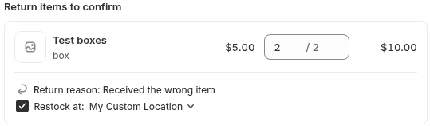

.. note::
   To keep stock consistent between the two platforms, always select :guilabel:`Restock at` when
   creating a return. If the option is not selected, Shopify's stock is not reduced, but Odoo's
   stock still is.

   Shopify allows creating one return for multiple fulfillments. Odoo splits the return into
   multiple deliveries or fulfillments accordingly.

Syncing and processing a return in Odoo
~~~~~~~~~~~~~~~~~~~~~~~~~~~~~~~~~~~~~~~

.. important::
   Returns with a :guilabel:`Canceled` status on Shopify are not synced. However, if a return was
   already synced before being canceled on Shopify, an activity is scheduled on the return,
   prompting the user to manually cancel it and adjust stock accordingly.

In the Odoo, go to :menuselection:`Sales app --> Configuration --> Shopify: Accounts` and select the
desired Shopify account. Click :icon:`fa-refresh` :guilabel:`Fetch Orders` to manually pull data
from Shopify. Click :guilabel:`Orders` and select the desired :abbr:`SO (sales order)`.

A return is created as a warehouse receipt form on the associated :abbr:`SO (sales order)`. Click
the :icon:`fa-truck` :guilabel:`Delivery` smart button, to view the *Transfer* page that lists all
the stock movements for the :abbr:`SO (sales order)`. Click on the warehouse receipt entry, it has
`Return of WH/OUT/reference number` in the :guilabel:`Source Document` column.

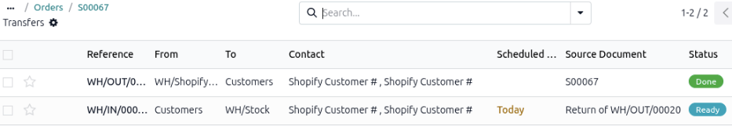

The warehouse receipt is always created in the :guilabel:`Ready` state, so the user can review it
before validation. On the form, the return date from Shopify is set as the :guilabel:`Scheduled
Date` and a the :guilabel:`E-commerce Return Identifier` field displays the unique refund identifier
number Shopify added for traceability and avoid duplication during synchronization. The warehouse
receipt form lists the return products and its quantities on their own order lines. Click
:guilabel:`Validate` when the return product is received. The status on the warehouse receipt form
changes to :guilabel:`Done`.

.. note::
   If Shopify creates a single return for multiple fulfillments, Odoo splits it into separate return
   records, one per fulfillment.

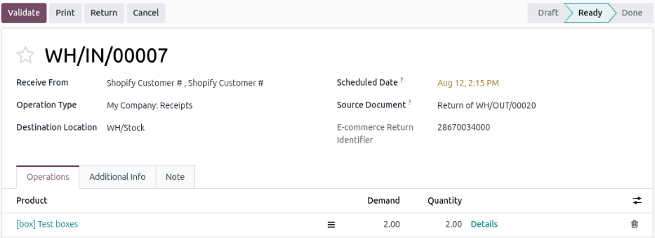

Processing the refund for the return
~~~~~~~~~~~~~~~~~~~~~~~~~~~~~~~~~~~~

Go back to the :abbr:`SO (sales order)` by clicking the SO number in the breadcrumbs. Click
:icon:`fa-pencil-square-o` :guilabel:`Invoices` and the credit note line item is highlighted in blue
and shows a negative amount in the :guilabel:`Total` column. Click the credit note to open the form.

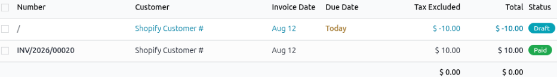

The credit note is always created in the :guilabel:`Draft` state to allow for user review. On the
create note form the :guilabel:`Invoice Date` and a the :guilabel:`E-commerce Return Identifier`
field displays the unique refund identifier number Shopify added for traceability and prevent
duplication during synchronization.

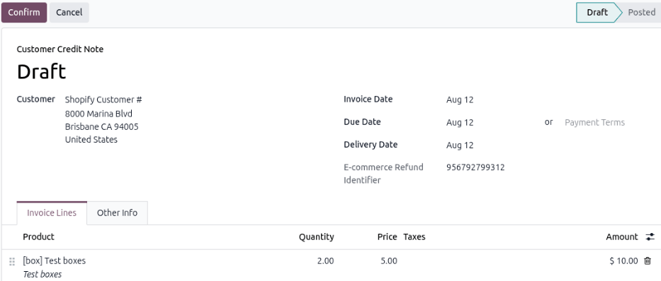

Verify the products and quantities are correct and click :guilabel:`Confirm` to process the credit
note. The status is updated to :guilabel:`Posted`, click :guilabel:`Pay` and in the *Pay* pop-up
window click :guilabel:`Create Payment` to complete the refund. The credit note form displays a
:guilabel:`Paid` banner.

.. note::
   When Shopify creates a refund without associated return lines, Odoo generates a credit note
   containing a single line using the configured *Refund Adjustment Product* found in the Shopify
   account form's *Default Products* tab as *E-commerce Refund Adjustment*.

.. _shopify/fulfillment/refunds:

Creating a refund
-----------------

.. warning::
   Refunds created using a refund adjustment product are not visible via the
   :icon:`fa-pencil-square-o` :guilabel:`Invoices` smart button on the sales order, since the button
   only shows credit notes made against a invoice line of the sales order. Refunds using the refund
   adjustment product apply to the whole invoice, rather than a specific invoice line. To view the
   refund, users must go :menuselection:`Invoicing app --> Customers --> Refunds`.

The Shopify connector automatically syncs refund data for orders for Shopify accounts with
:guilabel:`Create Invoice` enabled. It tracks refunds with returned products, or as manual refunds
on the whole order. Refunds can be created partially or fully, depending on the products and
quantities selected.

Refunds are created only when the associated order has one invoice, and that invoice is in the
*Posted* state. If these conditions are not met, the refund is skipped.

To create a refund without a product return, go to the desired order in Shopify and click
:guilabel:`Refund`. On the *Refund* page, verify the refund products and quantities, then click
:guilabel:`Refund` to confirm and close the refund.

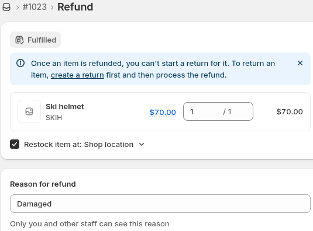

Syncing and processing a refund in Odoo
~~~~~~~~~~~~~~~~~~~~~~~~~~~~~~~~~~~~~~~

In the Odoo, go to :menuselection:`Sales app --> Configuration --> Shopify: Accounts` and select the
desired Shopify account. Click :icon:`fa-refresh` :guilabel:`Fetch Orders` to manually pull data
from Shopify. Click :icon:`fa-dollar` :guilabel:`Orders` and select the desired :abbr:`SO (sales
order)`.

On the :abbr:`SO (sales order)` there is a :icon:`fa-truck` :guilabel:`Delivery` and
:icon:`fa-pencil-square-o` :guilabel:`Invoices` smart button. The :doc:`fiscal position
<../../../finance/accounting/taxes/fiscal_positions>` from the original order is applied to both the
invoice and the generated credit note, to ensure consistent tax treatment.

Click the :icon:`fa-pencil-square-o` :guilabel:`Invoices` smart button and the credit note line item
is highlighted in blue and shows a negative amount in the :guilabel:`Total` column. Click the credit
note to open the form.

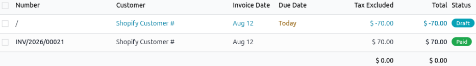

The credit note is always created in the :guilabel:`Draft` state to allow for user review. On the
create note form the :guilabel:`Invoice Date` and a the :guilabel:`E-commerce Return Identifier`
field displays the unique refund identifier number Shopify added for traceability and prevent
duplication during synchronization.

Verify the products and quantities are correct and click :guilabel:`Confirm` to process the credit
note. The status is updated to :guilabel:`Posted`, click :guilabel:`Pay` and in the *Pay* pop-up
window click :guilabel:`Create Payment` to complete the refund. The credit note form displays a
:guilabel:`Paid` banner.

.. note::
   When Shopify creates a refund without associated return lines, Odoo generates a credit note
   containing a single line using the configured *Refund Adjustment Product* found in the Shopify
   account form's *Default Products* tab as *E-commerce Refund Adjustment*.

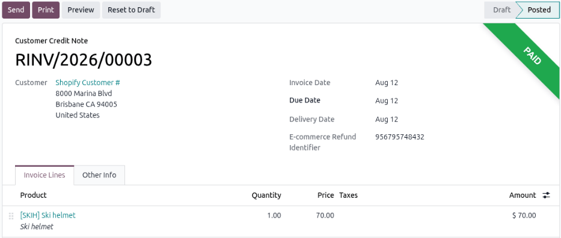

Optional: Canceling a delivery associated to a refund
~~~~~~~~~~~~~~~~~~~~~~~~~~~~~~~~~~~~~~~~~~~~~~~~~~~~~

When a customer requests a refund before the order is shipped for delivery, then the order sync
still generates a invoice and a warehouse delivery form in Odoo. Users must manually cancel the
delivery form when processing the refund.

Go to :menuselection:`Sales app --> Configuration -- > Accounts` and select the desired Shopify
account. Click the :icon:`fa-dollar` :guilabel:`Orders` smart button and select the desired
:abbr:`SO (sales order)`. Click the :icon:`fa-truck` :guilabel:`Delivery` smart button and on the
warehouse delivery form click :guilabel:`Cancel`.

The warehouse delivery form's status changes to :guilabel:`Cancelled`. Since the products were never
shipped to the customer, there is no need to do a manual stock adjustment.

Refund amount reconciliation
~~~~~~~~~~~~~~~~~~~~~~~~~~~~

Shopify and Odoo may calculate refund totals differently due to rounding, taxes, or other
adjustments. To maintain accounting accuracy:

- Odoo compares the refund total received from Shopify with the amount computed from the generated
  credit note.
- If a difference is detected, an additional adjustment line is automatically added using the
  configured *Adjustment Product*.
- This ensures that the final credit note total exactly matches the refund amount received from
  Shopify.

Special cases
-------------

- **Insufficient refund data**: If a refund does not contain enough information to be processed
  correctly, Odoo does not create the refund automatically. Instead, an activity is scheduled on the
  order to notify the user and allow manual review.
- **Restocked items but missing returns**: If Shopify reports restocked items as part of a refund,
  but no corresponding return exists in Odoo, Odoo schedules an activity on the order. This prompts
  the user to manually verify and synchronize inventory movements, to maintain stock consistency.
- **Refund deleted after synchronization**: If a refund that was previously fetched from Shopify is
  later deleted in Shopify, subsequent refunds for the same order are not synchronized, to avoid
  data inconsistency.
- **Fulfillment scope**: Refunds associated with unsupported fulfillment flows are not processed
  automatically.

.. seealso::
   - :doc:`../shopify_connector`
   - :doc:`setup`
   - :doc:`manage`
