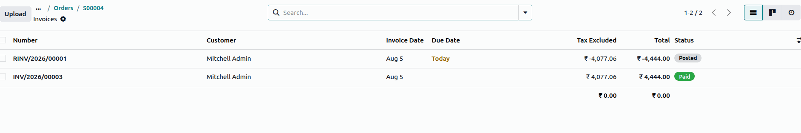

============================================
Shopify fulfillment, accounting, and returns
============================================

The Shopify Connector synchronizes fulfillments and shipping information, creates invoices and
registers payments, and processes returns and refunds between Shopify and Odoo.

.. _shopify/fulfillment:

Fulfillment and shipping
========================

A shipping line is added to the order with the default product :guilabel:`Ecommerce-shipping`. The
amount and the actual name of the delivery carrier selected by the customer on Shopify (such as
Sendcloud, Shiprocket, or FedEx) are added in the description of that line.

Fulfillment modes
-----------------

You can configure who handles the delivery: Odoo or Shopify.

Deliveries handled in Odoo
~~~~~~~~~~~~~~~~~~~~~~~~~~

When deliveries are handled in Odoo:

- The delivery is created in the :guilabel:`Assigned` state in Odoo.
- After the delivery order is validated in Odoo, a scheduled action running every 10 minutes pushes
  the shipment to Shopify. It can also be pushed manually using the :guilabel:`Update to Ecommerce`
  button on the delivery order.
- The order is marked as fulfilled on Shopify, along with the carrier and tracking number from Odoo.
- Shopify notifies the customer after the fulfillment is created.

.. note::
   If deliveries are handled in Odoo, returns initiated in Shopify do **not** sync automatically,
   and must be handled manually in Odoo.

Deliveries handled in Shopify
~~~~~~~~~~~~~~~~~~~~~~~~~~~~~

When deliveries are handled in Shopify:

- During synchronization, a default delivery is created together with the sales order, using the
  order's location, so that stock is reserved for the order.
- Fulfillment details (carrier, tracking number, and quantities) are pulled into Odoo when an actual
  fulfillment is created on Shopify. If the fulfillment is created from a location that differs from
  the one on the sales order, Odoo automatically updates the delivery order's location to match the
  fulfillment location.
- Corresponding pickings are created as a backorder of the default picking, to reduce inventory if
  there is a difference between the actual fulfillment and the delivered quantity.

.. note::
   If a fulfillment exists in Shopify but is not created in Odoo for any reason (including a
   discrepancy at the order or invoice level), an activity is scheduled for resolution.

Split fulfillments are fully supported and synchronized correctly.
Multiple fulfillments can be created for the same order, including:

- Fulfillment from different locations.
- Multiple fulfillments from the same location.
- Different carriers for different shipments.
- Partial quantity fulfillments across shipments.

All fulfillment details, including location, carrier, tracking numbers, and fulfilled quantities,
are synced accurately into Odoo, with corresponding stock moves and delivery updates.

Fulfillment location handling
-----------------------------

- Fulfillment locations from Shopify are mapped to the corresponding Odoo warehouse locations.
- During fulfillment synchronization, the delivery picking is automatically assigned to the mapped
  Odoo location.
- This ensures stock movements are recorded against the correct warehouse or location, and maintains
  inventory accuracy across multiple fulfillment centers.

Inventory synchronization
-------------------------

- Fulfillments received from Shopify are processed using a backorder-based approach.
- Partial fulfillments automatically generate the required backorders in Odoo, ensuring that
  fulfilled and remaining quantities are tracked correctly.
- Inventory is synchronized immediately after order synchronization, to minimize stock discrepancies
  between Shopify and Odoo.
- Scheduled actions for order sync, inventory sync, and picking sync are optimized to ensure faster
  synchronization of orders, fulfillments, and stock updates between Shopify and Odoo.

Carrier and tracking management
-------------------------------

- Carriers are mapped automatically.
- If a carrier does not exist in Odoo, it is created automatically.
- Tracking numbers are synchronized both ways.

.. _shopify/accounting:

Accounting and payments
=======================

A configuration option, :guilabel:`Create Invoice`, is available on the Shopify account. This option
controls whether invoices are automatically created when importing orders from Shopify.

When enabled:

- Odoo automatically creates and posts the invoice when an order is marked as paid in Shopify.
- The payment is automatically registered.
- The invoice is generated using the order details, including products, quantities, and pricing.
- All Shopify sales orders are linked to the single sales journal and payment journal configured on
  the Shopify account. If a Shopify payment uses a different method (for example, Razorpay, Stripe,
  or cash on delivery), a matching payment method line is automatically created on the payment
  journal, named after the Shopify payment method, for easy reconciliation.

When disabled, the invoice must be created manually from the sales order.

.. note::
   This feature applies only to orders marked as fully paid in Shopify.

.. image:: fulfillment/shopify-auto-invoice.png
   :alt: An invoice automatically created and paid for a Shopify order in Odoo.

.. _shopify/returns:

Returns
=======

.. important::
   Returns are synchronized only for orders whose deliveries are handled in Shopify. If deliveries
   are handled in Odoo, returns must be handled manually in Odoo.

To return items, open the Shopify order, click :guilabel:`Return`, select the quantities, and
**close** the return (a return still :guilabel:`In Progress` is not synced). Always select
:guilabel:`Restocked` to keep stock consistent between Shopify and Odoo.

On the next order fetch, Odoo creates the return on the related delivery in :guilabel:`Draft` state
for review, using the Shopify return date as the :guilabel:`Scheduled Date`. A return added after
the order was fetched syncs on the next fetch.

- Duplicate returns (identified by the Shopify return reference) are skipped.
- A single Shopify return covering multiple fulfillments is split into separate return records.
- If a synced return is later cancelled on Shopify, an activity is scheduled to cancel it manually
  and adjust the stock.

.. _shopify/refunds:

Refunds
=======

Shopify refunds (with returned products or as a manual refund on the whole order, partial or full)
are fetched together with the order. A refund added after the order was fetched syncs on the next
fetch.

For each eligible refund, Odoo creates a credit note linked to the original invoice, keeping the
order's fiscal position and using the Shopify refund date. A refund is processed only when the order
has exactly one invoice in the :guilabel:`Posted` state.

- Duplicate refunds (identified by the Shopify refund reference) are skipped.
- A refund without return lines produces a credit note with a single line using the configured
  :guilabel:`Refund Adjustment Product`.
- If the refund and credit note totals differ, an adjustment line using the configured
  :guilabel:`Adjustment Product` is added so they match exactly.
- If a refund lacks enough data, or reports restocked items without a matching return, Odoo skips
  automatic creation and schedules an activity for manual review.
- Refunds for unsupported fulfillment flows are not processed automatically. If a synced refund is
  later deleted on Shopify, subsequent refunds for that order are not synced, to avoid
  inconsistencies.

.. seealso::
   - :doc:`features`
   - :doc:`setup`
   - :doc:`manage`
