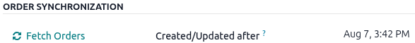
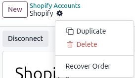
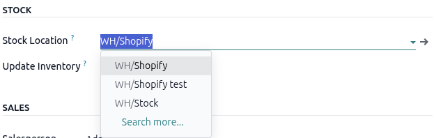

:orphan:
:nosearch:

.. _shopify-account-form-overview: https://youtu.be/xkinWzs6zA0?si=pxJ-wAU07yoMi58B
.. _shopify-export-products: https://help.shopify.com/en/manual/products/import-export/export-products
.. _create-location: https://youtu.be/SM0NBkX_V2s?si=3X-egnF9PQ-u5cww

========================
Shopify order management
========================

Once a :doc:`Shopify account is configured <setup>`, products, orders, and inventory can be
synchronized between Shopify and Odoo, either automatically through scheduled actions or manually
from the account's :guilabel:`Operations` tab.

.. seealso::
   `Tutorial: Shopify connector account form overview <shopify-account-form-overview_>`_

.. _shopify/manage/product-catalog-sync:

Product catalog mapping
=======================

It is recommended to create products, also referred to as *Offerings*, in Odoo externally (for
example, by importing the catalog, or using any other preferred method), and to make sure that
categories and sales taxes are properly configured for accurate results. Refer to the following
instructions for adding products to the **Sales** app if it's:

- :ref:`New Odoo users with no existing products <shopify/manage/new-odoo-users>`
- :ref:`Existing Odoo users with existing products in the database
  <shopify/manage/existing-odoo-users>`

.. _shopify/manage/product-matching:

Product matching logic
----------------------

When a order sync or a *Fetch Products* action is done, Odoo goes through the following logic to
match Shopify and Odoo products:

- When an offer is pulled with the same SKU as the internal reference, it is automatically mapped.
- If an SKU exists in Shopify but not in Odoo, it is linked to the default product Ecommerce-Sale
  (archived). The product's category and taxes must be configured manually afterward.
- Shopify product variants are **not** created using Odoo attribute lines; they are created as
  independent products.

  - Attribute values are **not** handled in this flow.

.. _shopify/manage/new-odoo-users:

New Odoo users with no existing products
----------------------------------------

To import a Shopify product catalog into an empty Odoo database, sign into the Shopify store admin
account. Go to the :menuselection:`Products` page and click :guilabel:`Export`. The *Export
products* pop-up window displays.

Refer to Shopify's `exporting products instructions <shopify-export-products_>`_ to complete the
export action and then edit the export document to comply with Odoo's recommended :ref:`import data
guidelines <essentials/export_import_data/import-data>`. Ensure that all product variants have their
own SKU. Refer to the :ref:`product matching logic <shopify/manage/product-matching>` the Shopify
connector uses for more guidance.

.. _shopify/manage/existing-odoo-users:

Existing Odoo users with existing products in the database
----------------------------------------------------------

Depending on the scenario, there are two methods to add Shopify products into an existing product
catalog in the **Sales** app:

- :ref:`Adding a new Shopify product that doesn't exist in the Sales app
  <shopify/manage/add-new-products>`.
- :ref:`Syncing existing products in Shopify and the Sales app
  <shopify/manage/sync-existing-products>`.

.. _shopify/manage/add-new-products:

Adding a new Shopify product that doesn't exist in the **Sales** app
~~~~~~~~~~~~~~~~~~~~~~~~~~~~~~~~~~~~~~~~~~~~~~~~~~~~~~~~~~~~~~~~~~~~

.. important::
   Refer to the :ref:`Shopify connectors product matching logic <shopify/manage/product-matching>`
   when adding Shopify products with variants.

To automatically add new Shopify products into the **Sales** app, enable the :guilabel:`Create
Products` feature. When enabled, a corresponding product is automatically created in Odoo whenever a
new offer is created during product synchronization.

All configuration options are on the *Configuration* tab on the Shopify account form. Go to
:menuselection:`Sales app --> Configuration --> Accounts` to select the desired Shopify account
form. If :guilabel:`Create Products` is disabled, click :guilabel:`Disconnect` and on the
*Configuration* tab, enable the checkbox. Also enable the :guilabel:`Create Taxes` checkbox to
import the product's configured taxes.

Then :ref:`reconnect the Shopify account form <shopify/setup/connect-shopify-to-odoo>` and either
wait for the scheduled order sync (occurs every 10 minutes) or manually sync products by clicking
:icon:`fa-refresh` :guilabel:`Fetch products` button on the *Operations* tab.

   .. image:: manage/fetch-products-action.png
      :alt: Example of the Fetch Products link on the Operations tab of a Shopify account form.

.. tip::
   In the calendar menu of the :guilabel:`Created/Updated between` field (also referred to as the
   *Last Products Sync*), select the next day from the present date to ensure the new products or
   updates are pulled.

.. seealso::
   :ref:`shopify/manage/auto-create-taxes`

.. _shopify/manage/sync-existing-products:

Syncing existing products in Shopify and the **Sales** app
~~~~~~~~~~~~~~~~~~~~~~~~~~~~~~~~~~~~~~~~~~~~~~~~~~~~~~~~~~

.. important::
   Refer to the :ref:`Shopify connector's product matching logic <shopify/manage/product-matching>`
   when matching existing **Sales** app products to Shopify products.

To manually map existing **Sales** app products to Shopify products, use the :guilabel:`Fetch
products` action. Go to :menuselection:`Sales app --> Configuration --> Accounts` to select the
desired Shopify account form.

In the *Operations* tab, ensure the timestamp of the *Last Products Sync* is set to the end of the
day or the next day. Only products created or updated after that timestamp are fetched. Click
:icon:`fa-refresh` :guilabel:`Fetch Products` button to pull product data from Shopify to Odoo.

.. note::
   Products are also synced during the scheduled order sync, which occurs every 10 minutes.

Then click the :guilabel:`Offers` smart button. The *Offers* page, displays the following product
matching information:

- :guilabel:`Title`: Shopify product
- :guilabel:`SKU`: Shopify internal refer number.
- :guilabel:`Matched Product`: Odoo product
- :guilabel:`E-commerce Account`: The Shopify store the product was pulled from.
- :guilabel:`Stock Synchronization`: When enabled it syncs exactly which inventory is synced back to
  Shopify or pulled from Shopify.

To edit a product mapping, click a :guilabel:`Matched product` entry and select a Odoo product from
the drop-down menu.

.. image:: manage/shopify-offer-mapping.png
   :alt: A Shopify offer is mapped to an Odoo product through SKU matching.

.. _shopify/order-sync:

Order synchronization
=====================

Orders are automatically fetched from Shopify and synchronized in the **Sales** app at regular
intervals (every 10 minutes). Go to :menuselection:`Sales app --> Configuration --> Accounts`,
select the desired Shopify account form, and click the *Operations* tab.

The :guilabel:`Created/Updated after` field displays the timestamp for the last order sync in the
*Order Synchronization* section. The Shopify connector relies on order syncs to pull the following
data into the **Sales** app:

- :ref:`Products <shopify/manage/sync-existing-products>`
- :ref:`Customer <shopify/manage/customer-matching>`
- :ref:`Pricing and taxes <shopify/manage/price-tax-mapping>`
- :ref:`Inventory <shopify/manage/inventory-sync>`

Only orders that have been confirmed in Shopify are imported into the **Sales** app. If an order is
canceled in Shopify, it's also canceled in the **Sales** app when the order sync occurs.

.. note::
   If cancellation occurs after the delivery has been created, a log note is added for manual
   review.

.. _shopify/manage/manual-sync:

Manual synchronization
----------------------

To manually pull orders into the **Sales** app, go to :menuselection:`Sales app --> Configuration
--> Accounts` and select the desired Shopify account form. In the *Operations* tab, click
:icon:`fa-refresh` :guilabel:`Fetch Orders` button in the *Actions* section. Users can customize the
date range by selecting dates in the :guilabel:`Created/Updated between` fields.

If an order import fails, recover the order manually using the :guilabel:`Recover Order` action from
the cog menu (:icon:`fa-cog` :guilabel:`Actions`). The :guilabel:`Recover Order` action fetches a
specific order using its Shopify order reference.

.. _shopify/manage/customer-matching:

Customer matching
-----------------

The **Sales** app matches Shopify customers with Odoo customers using the email and billing name
configured on the :ref:`contact form <contacts/contact-form>`. If no match is found, a new customer
is created. The billing and shipping addresses are created as child contacts.

.. note::
   If state or country mapping fails, an activity is created for manual correction.

.. _shopify/manage/price-tax-mapping:

Price and tax mapping
---------------------

The **Sales** app automatically detects a currency type from the Shopify order. :doc:`Fiscal
positions <../../../finance/accounting/taxes/fiscal_positions>` handle tax mapping from products in
Odoo.

Shipping is added as separate order lines using configurable default products. Discounts are
directly deducted from product or shipping prices before subtotal calculation, to reduce rounding
differences between Shopify and Odoo totals. Original Shopify product prices are shown in the line
description only when they differ from the final imported price (or when a discount is applied).

.. note::
   The discrepancy check is performed only on the final total of the sales order, regardless of
   which taxes are applied on the order lines. Since Shopify may use different rounding methods,
   differences of a few cents (for example, 0.01) can occur between Shopify and Odoo due to
   rounding. Such rounding discrepancies are resolved by adding an adjustment line for the
   difference amount.

.. important::
   If the auto-invoice configuration on the account is enabled, invoices are generally created
   automatically for paid orders. However, for orders where a discrepancy adjustment is added, the
   invoice is **not** created automatically, even if the order is marked as paid in Shopify.

.. _shopify/manage/auto-create-taxes:

Enable auto-create taxes
------------------------

The :guilabel:`Create Taxes` feature allows Odoo to create taxes when importing orders from Shopify
automatically. When enabled (default behavior), Odoo tries to find a matching tax and creates one if
no match exists. When disabled, taxes are determined using the order's fiscal position and the
product's configured taxes in Odoo.

To enable the :guilabel:`Create Taxes` feature, go to :menuselection:`Sales app --> Configuration
--> Accounts` to select the desired Shopify account form. Click :guilabel:`Disconnect` and on the
*Configuration* tab, enable the :guilabel:`Create Taxes` checkbox.

Then :ref:`reconnect the Shopify account form <shopify/setup/connect-shopify-to-odoo>` and either
wait for the scheduled order sync (occurs every 10 minutes) or manually sync products by clicking
:icon:`fa-refresh` :guilabel:`Fetch products` button on the *Operations* tab.

.. _shopify/manage/inventory-sync:

Inventory synchronization
=========================

.. _shopify/manage/push-inventory:

Push inventory to Shopify
-------------------------

When automatic stock updates are enabled, Odoo pushes stock to Shopify after orders are pulled
(manually or automatically).

- Only stock from the mapped Odoo location is pushed.
- The free quantity (*Quantity on Hand* minus *Reserved Quantity*) of the product at the mapped
  location is pushed to Shopify as the available quantity.
- Only products that satisfy all inventory synchronization settings are considered for
  synchronization.

.. note::
   Odoo does not push the inventory of all products every time. Only the stock updated after the
   last inventory sync is pushed. When a product's quantity changes at the mapped location, Odoo
   detects it and automatically pushes that product's updated inventory in the next scheduled
   action.

.. tip::
   Make sure the inventory levels on both platforms are in sync first, to avoid discrepancies during
   synchronization.

To push stock manually, go to :menuselection:`Sales app --> Configuration --> Accounts` to select
the desired Shopify account form. Click the :icon:`fa-refresh` :guilabel:`Push Inventory` button in
the *Operations* tab.

.. _shopify/manage/pull-inventory:

Pull inventory from Shopify
---------------------------

.. important::
   For a valid inventory sync, Odoo and Shopify must be fully synchronized with respect to products,
   locations, and the quantity of each product at the corresponding location.

To pull stock manually, go to :menuselection:`Sales app --> Configuration --> Accounts` to select
the desired Shopify account form. Click the :icon:`fa-refresh` :guilabel:`Fetch Inventory` button in
the *Operations* tab.

Odoo pulls inventory data from Shopify using the following logic:

- The stock is updated based on the mapped location and mapped offer.
- The on-hand quantity of a specific product at a specific location, fetched from Shopify, is
  updated in Odoo as the on-hand quantity.
- If the location or the offer related to the inventory is not found in Odoo, that inventory record
  is ignored and not updated.

.. _shopify/manage/configure-multi-location:

Configure multi-location support
--------------------------------

.. important::
   Multi-location support requires the **Inventory** app and enabling the *Storage Locations*
   feature.

The Shopify connector supports multi-location support from Odoo to Shopify. To do this, Shopify
locations must be mapped to Odoo stock locations. Odoo pushes the quantity available from the mapped
location to the corresponding Shopify location.

To configure Odoo locations to Shopify to keep track of stock, navigate to :menuselection:`Sales app
--> Configurations --> Account`. Select the desired Shopify account. If the account is connected,
click :guilabel:`Disconnect` and click the :guilabel:`Configuration` tab. In the *Stock* section,
select an existing location or click :guilabel:`Search more` and click :guilabel:`New` to create a
:ref:`new location <inventory/use_locations/create-new-locations>`.

:ref:`Reconnect to Shopify <shopify/setup/connect-shopify-to-odoo>`, and after the next scheduled
*Fetch Orders* action, a :guilabel:`Locations` smart button displays. To change the *Stock
Location*, click the :guilabel:`Locations` smart button and the *Locations* page displays all the
Shopify locations in the :guilabel:`Name` column and the **Inventory** app locations in the
:guilabel:`Stock Location` column.

To sync the two locations together, enable the :guilabel:`Stock Synchronization` checkbox. This
controls exactly which inventory is synced back to Shopify or pulled from Shopify. The
:guilabel:`Sync Stock` checkbox is available per offer, per location, per account, and on the
individual product (:guilabel:`Track Inventory`).

.. image:: manage/shopify-location-mapping.png
   :alt: Shopify locations mapped to Odoo stock locations with the Sync Stock toggle.

.. seealso::
   `Tutorial: Warehouses & Locations | Odoo Inventory <create-location_>`_

.. _shopify/manage/manual-operations:

Manual operations summary
=========================

The following manual operations are available under the :guilabel:`Operations` tab:

- :icon:`fa-refresh` :guilabel:`Fetch Products`
- :icon:`fa-refresh` :guilabel:`Fetch Orders` between any date range
- :icon:`fa-refresh` :guilabel:`Push Inventory`
- :icon:`fa-refresh` :guilabel:`Fetch Locations`
- :icon:`fa-refresh` :guilabel:`Fetch Inventory`
- :icon:`fa-refresh` :guilabel:`Update Pickings` (in case delivery is handled in Odoo)
- :guilabel:`Recover Order` (recover a specific order)

.. image:: manage/shopify-operations-tab.png
   :alt: The manual operations available under the Operations tab of a Shopify account.

.. _shopify/manage/monitoring:

Monitoring and troubleshooting
==============================

Logging system
--------------

The Shopify connector creates detailed API logs on the Shopify account form via the :guilabel:`Logs`
smart button. Users **must** be in :ref:`developer mode <developer-mode>` for the :guilabel:`Logs`
smart button to display.

The *Logs* page displays every log entry in list view and organizes them with the following columns:

- :guilabel:`Created on`: The date and time the log entry was created.
- :guilabel:`Created by`: OdooBot, which displays as `1`.
- :guilabel:`Database Name`: The name of the Odoo database where the entry was recorded.
- :guilabel:`Type`: Displays either :guilabel:`Server` or :guilabel:`Client`. :guilabel:`Server` is
  used for entries raised while Odoo is exchanging data with Shopify through the API (fetching
  orders or products, pushing inventory or fulfillments). :guilabel:`Client` is used for entries
  raised while Odoo processes data it has already received, and for entries where a synchronization
  step was skipped.
- :guilabel:`Name`: Identifies the e-commerce account the entry belongs to, in the form Account
  name-ID (for example, My Shopify Store-3), where ID is the database ID of the account.
- :guilabel:`Level`: Indicates whether the log is an :guilabel:`Error` or :guilabel:`Info`.
  :guilabel:`Error` means the action failed; the fetch, the record processing, or the update sent to
  Shopify did not complete. :guilabel:`Info` means the action completed without failing, but a step
  was deliberately skipped, for example an order ignored because of its Shopify status, or an
  invoice not created because the order has several payment transactions.
- :guilabel:`Path`: The origin of the entry. Connector entries always display as
  :guilabel:`E-Commerce`.
- :guilabel:`Line`: The line number of the entry. Connector entries always display `1`, since the
  line is not tracked.
- :guilabel:`Function`: Displays the function that is the source of the entry, such as
  `_sync_orders`, `_process_order_data`, or `_auto_create_credit_note`.

.. tip::
   Developer mode can be enabled using :kbd:`Ctrl` + :kbd:`K` and typing `debug`.

To view the log entry form, click an entry. The form is comprised of two sections: *Creation
Details* and *Logging Details*.

The *Creation Details* section lists the :guilabel:`Created On`, :guilabel:`Created by`, and
:guilabel:`Database Name`. The *Logging Details* section lists the :guilabel:`Type`,
:guilabel:`Name`, :guilabel:`Level`, :guilabel:`Path`, :guilabel:`Line`, :guilabel:`Function`, and
:guilabel:`Message`. The :guilabel:`Message` is a detailed description of the error.

Email notifications
-------------------

In case of critical failures (order import failure, stock update failure, or fulfillment failure),
automated email notifications are sent to the assigned salesperson or administrator. This ensures
immediate visibility and corrective action.

.. seealso::
   - :doc:`../shopify_connector`
   - :doc:`setup`
   - :doc:`fulfillment`
