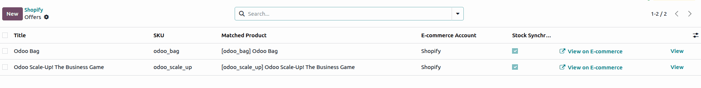
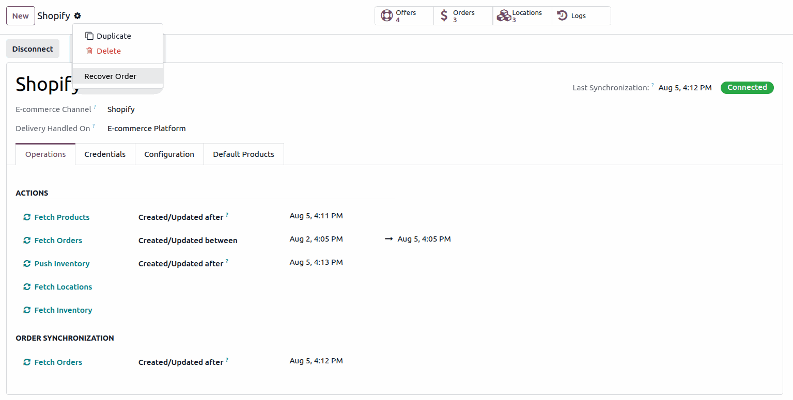
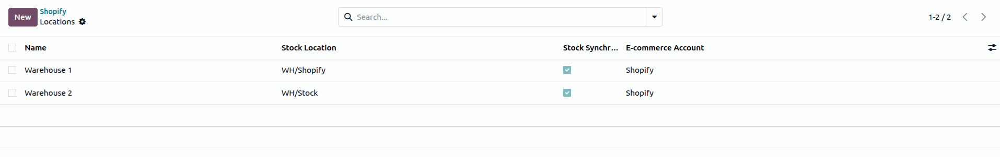
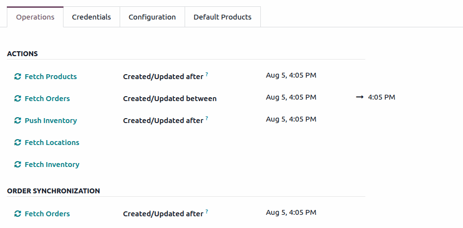

=========================================
Shopify product, order, and stock syncing
=========================================

Once a :doc:`Shopify account is configured <setup>`, products, orders, and inventory can be
synchronized between Shopify and Odoo, either automatically through scheduled actions or manually
from the :guilabel:`Operations` tab of the account.

.. _shopify/product-sync:

Product synchronization
=======================

It is recommended to create products in Odoo externally (for example, by importing the catalog, or
using any other preferred method), and to make sure that categories and sales taxes are properly
configured for accurate results. When an offer is pulled (using the :guilabel:`Fetch Products`
button) with the same SKU on Shopify as the internal reference in Odoo, it is automatically mapped.
Otherwise, products can be created automatically in Odoo when the :guilabel:`Create Products` option
is enabled on the Shopify account configuration.

Product matching
----------------

- Matching is based on the SKU.
- If an SKU exists in Shopify but not in Odoo, it is linked to the default product
  :guilabel:`Ecommerce-Sale` (archived).
- Shopify variants are treated as individual offers, and as individual products in Odoo.

Auto-create products in Odoo
----------------------------

A configuration option, :guilabel:`Create Products`, is available on the Shopify account. When
enabled, a corresponding product is automatically created in Odoo whenever a new offer is created
during product synchronization.

- Mapping is based on the offer SKU matching the Odoo product internal reference.
- Since each Shopify variant has a unique SKU, each variant is created as a separate standalone
  product in Odoo.
- Attribute values are **not** handled in this flow.
- Variants are **not** created using Odoo attribute lines; they are created as independent products.

Last sync tracking
------------------

Odoo stores a :guilabel:`Last Products Sync` date. Only products created or updated after that
timestamp are fetched.

.. _shopify/order-management:

Order management
================

Order import
------------

- **Automatic sync**: orders are fetched via a scheduled action every 10 minutes.
- **Manual fetch**: use the :guilabel:`Fetch Orders` button in the :guilabel:`Operations` tab.
- **Date range fetch**: the :guilabel:`Fetch Orders` action also supports importing orders created
  or updated within a specified date range.

If an order import fails, the reason is available in the logs. The order can then be recovered
manually using the :guilabel:`Recover Order` action from the cog menu (:icon:`fa-cog`
:guilabel:`Actions`), which fetches a specific order using its Shopify order reference.

Status mapping
--------------

- Orders in Shopify (except canceled ones) are created as confirmed sales orders in Odoo.
- Canceled orders in Shopify automatically cancel the corresponding Odoo sales order.

.. note::
   If cancellation occurs after the delivery has been created, a log note is added for manual
   review.

Customer matching
-----------------

When an order is imported, Odoo resolves the billing and shipping partners from the addresses
received from Shopify.

**Billing partner**

- Odoo searches for an existing contact using the customer's name and email (a match requires an
  email address).
- If no contact is found, a new contact is created from the billing address, and used as the billing
  partner.
- If a contact is found, all its address fields are compared with the received billing address.
  If they all match, the contact is used as the billing partner.
  Otherwise, Odoo reuses a matching child address of type *Invoice*, or creates one,
  and uses it as the billing partner.

**Shipping partner**

- The shipping address is compared (including name and email) with the contact linked to the billing
  partner. If they all match, that contact is used as the shipping partner. Otherwise, Odoo reuses a
  matching child address of type *Delivery*, or creates one, and uses it as the shipping partner.
- If no shipping address is provided, the billing partner is reused as the shipping partner.

.. note::
   If state or country mapping fails, an activity is created for manual correction.

Pricing and taxes
-----------------

- The currency is automatically detected from the Shopify order.
- Shipping is added as separate order lines using configurable default products.
- Discounts are directly deducted from product or shipping prices before subtotal calculation, to
  reduce rounding differences between Shopify and Odoo totals.
- Original Shopify product prices are shown in the line description only when they differ from the
  final imported price (or when a discount is applied).

Tax configuration and auto-create taxes
---------------------------------------

A configuration option, :guilabel:`Create Taxes`, is available on the Shopify account. This option
controls whether taxes are automatically created when importing orders from Shopify. When enabled
(default behavior), Odoo fetches the taxes from Shopify, tries to find a matching tax in Odoo, and
creates one if no match exists. When disabled, taxes are determined using the order's fiscal
position and the product's configured taxes in Odoo.

.. note::
   The discrepancy check is performed only on the final total of the sales order, regardless of
   the taxes applied to the order lines. Since Shopify may use different rounding methods, a
   difference of a few cents (for example, 0.01) can occur between Shopify and Odoo. Such rounding
   discrepancies are resolved by adding an adjustment line for the difference amount.

.. important::
   If the auto-invoice configuration on the account is enabled, invoices are generally created
   automatically for paid orders. However, for orders where a discrepancy adjustment is added, the
   invoice is **not** created automatically, even if the order is marked as paid in Shopify.

.. _shopify/inventory-sync:

Inventory synchronization
=========================

Push inventory to Shopify
-------------------------

When the :guilabel:`Update Inventory` setting is enabled, Odoo pushes stock to Shopify just after
orders are pulled (manually or automatically).

- Only stock from the mapped Odoo location is pushed.
- The free quantity (quantity on hand minus reserved quantity) of the product at the mapped location
  is pushed to Shopify as the available quantity.
- Only products that satisfy all inventory synchronization settings are considered for
  synchronization. These settings include the mapped location, the mapped offer, and the
  :guilabel:`Sync Stock` toggle on the offer and location.

.. note::
   Odoo does not push the inventory of all products every time. Only the stock updated since the
   last inventory sync is pushed. When a product's quantity changes at the mapped location, Odoo
   detects it and automatically pushes that product's updated inventory in the next scheduled
   action.

.. tip::
   Make sure the inventory levels on both platforms are in sync first, to avoid discrepancies during
   synchronization.

To push stock manually, use the :guilabel:`Push Inventory` button in the :guilabel:`Operations` tab.

Pull inventory from Shopify
---------------------------

When the :guilabel:`Fetch Inventory` button in the :guilabel:`Operations` tab is clicked, Odoo pulls
inventory data from Shopify.

- The stock is updated based on the mapped location and mapped offer.
- The on-hand quantity of a product at a specific location, fetched from Shopify, is set as the
  on-hand quantity in Odoo.
- If the location or the offer related to the inventory is not found in Odoo, that inventory record
  is ignored and not updated.

.. note::
   For a valid inventory sync, Odoo and Shopify must be fully synchronized with respect to products,
   locations, and the quantity of each product at the corresponding location.

Multi-location support
----------------------

- Shopify locations must be mapped to Odoo stock locations.
- Odoo pushes the quantity available from the mapped location to the corresponding Shopify location.
- A :guilabel:`Sync Stock` toggle is available per offer, per location, per account, and on the
  individual product (:guilabel:`Track Inventory`). This controls exactly which inventory is synced
  back to Shopify or pulled from Shopify.

.. _shopify/manual-operations:

Manual operations summary
=========================

The following manual operations are available under the :guilabel:`Operations` tab:

- :guilabel:`Fetch Products`
- :guilabel:`Fetch Orders` within any date range
- :guilabel:`Push Inventory`
- :guilabel:`Fetch Locations`
- :guilabel:`Fetch Inventory`
- :guilabel:`Update Pickings` (when deliveries are handled in Odoo)
- :guilabel:`Recover Order` (recover a specific order)

.. _shopify/monitoring:

Monitoring and troubleshooting
==============================

Logging system
--------------

- Detailed API logs are maintained.
- A :guilabel:`Logs` smart button is visible in :ref:`developer mode <developer-mode>`.

.. tip::
   Developer mode can be enabled using :kbd:`Ctrl` + :kbd:`K` and typing `debug`.

Email notifications
-------------------

In case of critical failures (order import failure, stock update failure, or fulfillment failure),
automated email notifications are sent to the assigned salesperson or administrator. This ensures
immediate visibility and corrective action.

.. seealso::
   - :doc:`features`
   - :doc:`setup`
   - :doc:`fulfillment`
